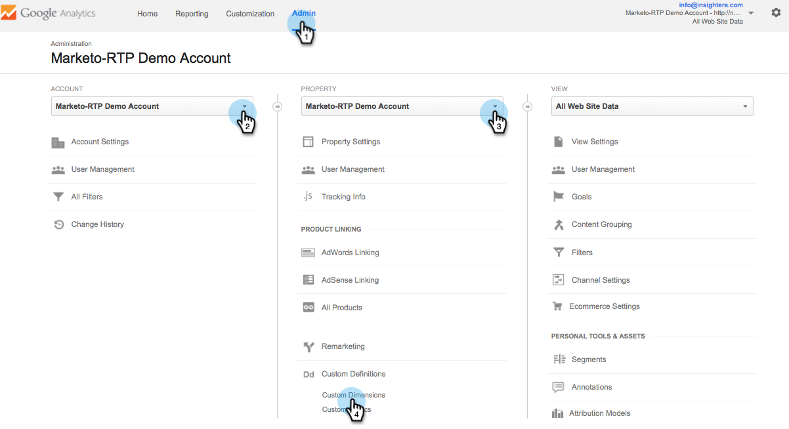

# RTPとGoogle Universal Analytics {#integrate-rtp-with-google-universal-analytics}の統合

## 導入{#intro}

Google Universal Analytics(GUA)とMarketo Real-Time Personalization(RTP)のファーストグラフィックおよびパーソナライゼーションデータを活用して、オンラインマーケティング活動をより良く測定および分析できます。

この投稿では、Marketto Real-Time Personalization(RTP)プラットフォームをGoogle Universal Analytics(GUA)アカウントと組み合わせる方法を説明します。 RTPデータをGUAアカウントに追加して、Webサイトを訪問する組織、業界、ファームグラフィック、RTPセグメントのパフォーマンスを表示し、確認できるようにすることができます。

**Google Universal Analytics**

Google Universal Analytics with RTP’s dataを使用すると、B2Bユーザーがオンラインコンテンツをどのように操作するかについてより深く理解し、パーソナライズキャンペーンからより良い結果を測定して得ることができます。 [Google Universal Analyticsについて詳しくは](https://support.google.com/analytics/answer/2790010/?hl=en&amp;authuser=1)、

>[!NOTE]
>
>**`For Google Tag Manager Users Only`**
>
>コーディングや特別な設定を行う必要はありません。 次のチェックリストを必ず完成させてください。
>
>* `RTP dimensions are created in Google Universal Analytics`
>* [RTPタグがGoogle Tag Managerに適切にインストールされている](https://docs.marketo.com/display/public/DOCS/Implementing+RTP+using+Google+Tag+Manager)
>* `Google Universal Analytics Integration is enabled in the RTP's Account Settings`
>* [Google Universal AnalyticsタグがGoogle Tag Managerで適切に設定されている](https://support.google.com/tagmanager/answer/6107124?hl=en)
>* [Google Tag ManagerタグがWebサイトに適切にインストールされている](https://developers.google.com/tag-manager/quickstart)

>

## GUAでのカスタムDimensionの設定{#set-up-custom-dimensions-in-gua}

1. Google Analyticsでは、

   1. **管理者**&#x200B;に移動
   1. **アカウントを選択します。**
   1. **プロパティを選択します。**
   1. 「**カスタムDimension」を選択します。 **と「**カスタム定義」を選択します。**

      

1. 追加新しいカスタムディメンション。 「**+新しいカスタムDimension**」をクリックします

   

1. 追加次の&#x200B;**カスタムDimension:**

<table> 
 <tbody> 
  <tr> 
   <td>
<strong>カスタムDimension名</strong>
</td> 
   <td>
<strong>範囲</strong>
</td> 
   <td>
<strong>アクティブ</strong>
</td> 
  </tr> 
  <tr> 
   <td>
<strong>RTP組織</strong>
</td> 
   <td>
セッション
</td> 
   <td>
kid
</td> 
  </tr> 
  <tr> 
   <td>
<strong>RTP-Industry</strong>
</td> 
   <td>
セッション
</td> 
   <td>
kid
</td> 
  </tr> 
  <tr> 
   <td>
<strong>RTPカテゴリ</strong>
</td> 
   <td>
セッション
</td> 
   <td>
kid
</td> 
  </tr> 
  <tr> 
   <td>
<strong>RTP-Group</strong>
</td> 
   <td>
セッション
</td> 
   <td>
kid
</td> 
  </tr> 
 </tbody> 
</table>

>[!NOTE]
>
>**カスタムDimension** 名は、上の表で定義したとおりにする必要があります(そうしないと、GUA内のカスタムRTPダッシュボードとレポートが正しく表示されません)。

1. *追加*Name。 **範囲を&#x200B;**セッションとして選択します。** 「 **作成」をクリックします。**

   

カスタムDimensionリストは、次のようになります。

GUAでカスタムDimensionをアクティブ化したら、RTPプラットフォームに移動し、RTP内でこれらのディメンションを有効にします。

## RTPアカウントでGUA統合をアクティブ化{#activate-the-gua-integration-in-your-rtp-account}

1. RTPプラットフォームで、**「アカウント設定」に移動します。**

   

1. 「**アカウント設定**」で、「**ドメイン」をクリックします。**
1. 「**Analytics」の下の「**」で、「**Google Universal Analytics**」をクリックします。
1. **関連するカスタムDimensionとイベントを**&#x200B;オンにして、RTPからのこのデータをGoogle Universal Analyticsに追加します。
1. GUAのインデックス番号と整列したディメンションの&#x200B;**インデックス番号**&#x200B;を入力します。
1. 「**保存**」をクリックします。

>[!NOTE]
>
>カスタムDimensionのインデックス番号は、GUAの「カスタムDimension」の下にあります。
>
>例：「RTP-Industry Index Number」は1、「RTP-Organization Index Number」は2です。

## Google Analyticsの古いダッシュボードを削除{#remove-old-dashboards-in-google-analytics}

1. Google Analytics。 **レポート**&#x200B;に移動
1. **ダッシュボードをクリックします。**
1. **ダッシュボード**（RTP B2BまたはRTPパフォーマンス）を選択
1. 「**ダッシュボード**&#x200B;を削除」をクリックします。

