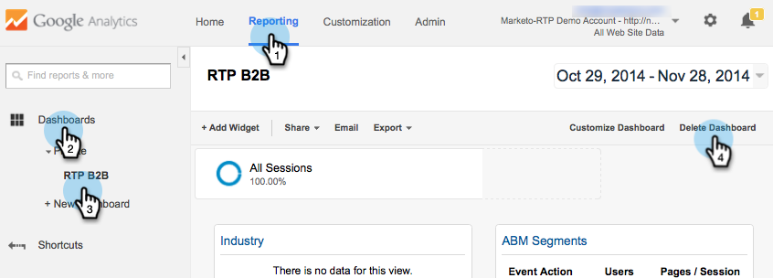

# RTP を Google ユニバーサルアナリティクスに連携する {#integrate-rtp-with-google-universal-analytics}

## はじめに {#intro}

Marketo リアルタイムパーソナライズ（RTP）の企業情報データやパーソナライズデータと Google ユニバーサルアナリティクス（GUA）を併用すると、オンラインマーケティングの取り組みについて、測定と分析の精度が向上します。

ここでは、Google ユニバーサルアナリティクス（GUA）アカウントを設定して Marketo リアルタイムパーソナライズ（RTP）プラットフォームと連携する方法について説明します。RTP データを GUA アカウントに追加すると、Web サイト訪問者のパフォーマンスを組織、業種、ファーモグラフィック、RTP セグメント別に確認することができます。

**Google ユニバーサルアナリティクス**

Google ユニバーサルアナリティクスと RTP のデータを見ると、B2B のユーザーがオンラインコンテンツをどう使っているかがよくわかり、パーソナライズキャンペーンを測定して有効に活用できます。Google ユニバーサルアナリティクスの詳細は、[こちら](https://support.google.com/analytics/answer/2790010/?hl=en&amp;authuser=1)をご覧ください。

>[!NOTE]
>
>**Google タグマネージャーユーザーのみ**
>
>コーディングや特殊な設定は必要ありません。次のチェックリストを確認してください。
>
>* RTP のディメンションが、Google ユニバーサルアナリティクスで作成されている
>* [RTP のタグが、Google タグマネージャーで正しくインストールされている](https://docs.marketo.com/display/public/DOCS/Implementing+RTP+using+Google+Tag+Manager)
>* Google ユニバーサルアナリティクスの連携が、RTP のアカウント設定で有効にされている
>* [Google ユニバーサルアナリティクスのタグが、Google タグマネージャーで適切に設定されている](https://support.google.com/tagmanager/answer/6107124?hl=ja)
>* [Google タグマネージャーのタグが、Web サイトに適切にインストールされている](https://developers.google.com/tag-manager/quickstart)

## GUA でカスタムディメンションを設定する {#set-up-custom-dimensions-in-gua}

1. Google Analytics で、以下の手順を実行します。

   1. 「**管理**」に移動します
   1. 「**アカウント**」を選択します
   1. 「**プロパティ**」を選択します
   1. 「**カスタム定義**」の「**カスタムディメンション**」を選択します。
      

1. 新しいカスタムディメンションを追加します。「**+新規カスタムフィールド**」をクリックします

   

1. 追加する&#x200B;**カスタムディメンション**&#x200B;は次のとおりです。

<table> 
 <tbody> 
  <tr> 
   <td>
<strong>カスタムディメンション名</strong>
</td> 
   <td>
<strong>範囲</strong>
</td> 
   <td>
<strong>アクティブ</strong>
</td> 
  </tr> 
  <tr> 
   <td>
<strong>RTP-Organization</strong>
</td> 
   <td>
セッション
</td> 
   <td>
✓
</td> 
  </tr> 
  <tr> 
   <td>
<strong>RTP-Industry</strong>
</td> 
   <td>
セッション
</td> 
   <td>
✓
</td> 
  </tr> 
  <tr> 
   <td>
<strong>RTP-Category</strong>
</td> 
   <td>
セッション
</td> 
   <td>
✓
</td> 
  </tr> 
  <tr> 
   <td>
<strong>RTP-Group</strong>
</td> 
   <td>
セッション
</td> 
   <td>
✓
</td> 
  </tr> 
 </tbody> 
</table>

>[!NOTE]
>
>**カスタムディメンション名**&#x200B;は、上の表のとおりに正確に指定してください（さもないと、GUA でカスタム RTP のダッシュボードとレポートが正しく表示されません）。

1. 「**名前**」に名前を入力します。「スコープ」で「**セッション**」を選択します。「**作成**」をクリックします。

   

カスタムディメンションのリストは次のようになります。

GUA でカスタムディメンションをアクティブにしたら、RTP プラットフォームに移動して、作成したディメンションを RTP で有効にします。

## RTP アカウントで、GUA 連携を有効にする {#activate-the-gua-integration-in-your-rtp-account}

1. RTP アカウントで、「**アカウント設定**」に移動します。

   

1. 「**アカウント設定**」で、「**ドメイン**」をクリックします。
1. 「**Analytics**」で、「**Google ユニバーサルアナリティクス**」をクリックします。
1. 該当する「カスタムディメンション」と「イベント」を&#x200B;**オン**&#x200B;にして、このデータを RTP から Google ユニバーサルアナリティクスに追加します。
1. GUA のインデックス番号に合わせたディメンションの&#x200B;**インデックス番号**&#x200B;を入力します。
1. 「**保存**」をクリックします。

>[!NOTE]
>
>カスタムディメンションのインデックス番号は、GUA の「カスタムディメンション」で確認できます。
>
>例：「RTP-Industry」のインデックス番号は 1、「RTP-Organization」のインデックス番号は 2 です。

## Google Analytics で古いダッシュボードを削除する {#remove-old-dashboards-in-google-analytics}

1. Google Analytics で、以下の手順を実行します。「**レポート**」に移動します。
1. 「**マイレポート**」をクリックします。
1. **マイレポート**&#x200B;を選択します（「RTP B2B」または「RTP Performance」）。
1. 「**マイレポートを削除**」をクリックします。

