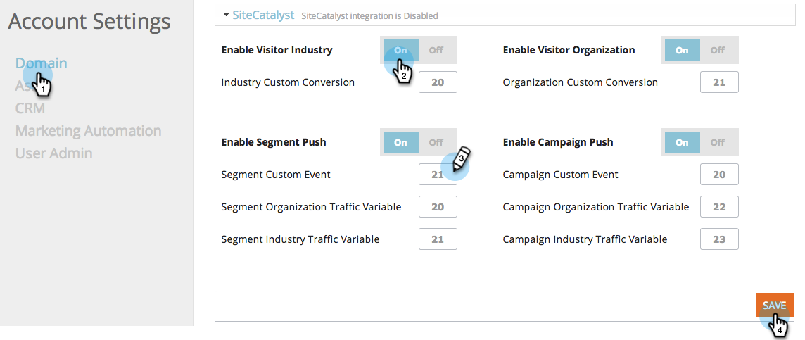

# Adobe Analyticsと統合{#integrate-with-adobe-analytics}

## 導入{#intro}

Adobe Analyticsアカウント内の組織、業界、およびMarketo Real-Time Personalization(RTP)キャンペーンデータを表示し、B2Bの観点からWeb解析を分析します。

このドキュメントにより、Marketo Real-Time Personalization(RTP)とAdobeAdobe Analyticsの統合が可能になります。 RTPからのデータを使用すると、サイトを訪問する業界セグメントや組織のトレンドをすべて検出および分析し、RTPキャンペーンの有効性を測定でき、最適な結果を得るためのインサイトと分析を提供できます。

これを達成するには、各セグメントの新規顧客数と再訪問者数などの指標を調べ、キャンペーンのクリック率を分析し、最もコンバージョン率の高いリードを生み出した業種やカスタマイズ済みセグメント、リアルタイムキャンペーンを特定します。 この機能を利用して、RTPアカウントから最大限のメリットを得ることができます。

## RTPAudience Analytics{#rtp-audience-analytics}

RTP - AA統合では、Web分析インターフェイスに新しいディメンションが存在します。 RTPは、次の機能を使用してWeb解析ダッシュボードを自動的に拡張します。

1. 組織と業界のデータ
1. RTPセグメントのカスタマイズ
1. 固有のアカウントリスト（アカウントベースのマーケティング）

これにより、B2Bデータが強化され、以下を最適化することで関連訪問者に焦点を当てることができます。

1. 送信チャネル
1. コンテンツ
1. 再ターゲット化

## チャネルレポート{#channel-report}

RTPダッシュボードは、垂直およびRTPセグメントに従った訪問者の分類を把握するのに役立ちます。 業種別、およびその業種に関連する様々なマーケティングキャンペーン（有料、オーガニック、ソーシャル）に従って訪問者のパフォーマンスを確認できます。 また、ダッシュボードでは、訪問者が業種別に従って閲覧しているサイトセクションの概要も提供されます。

## 行動レポート{#behavioral-report}

組織、産業、RTPセグメントデータに基づいて、Adobe Analyticsで異なる行動レポートを作成できます。 これらのフローレポートでは、訪問者がページやイベント間を移動するパスを視覚化します。 このレポートは、訪問者がサイトに関与し続けているコンテンツを特定するのに役立ちます。

## RTPパフォーマンス{#rtp-performance}

Adobe Analyticsのカスタムリンクでの表示RTPキャンペーンのインプレッションおよびコンバージョン。

このカスタムリンクレポートは、キャンペーンのインプレッション数とコンバージョン数を次の命名規則で表示します。

* Impression ISegment:[RTPセグメント名]、ICampaign:[RTPキャンペーン名]
* コンバージョンISegment:[RTPセグメント名]、ICampaign:[RTPキャンペーン名]

## Adobe Analytics{#set-up-in-adobe-analytics}にセットアップ

この統合では、Adobe Analyticsオファーが使用するJavaScript APIを使用します。 統合では、カスタムコンバージョン変数(eVar)、カスタムイベント(イベント)、トラフィック変数が使用されます。 すべてはAA管理者内で有効にする必要があります。 コンバージョン変数、カスタムイベント、トラフィック変数をA内に設定する必要があります。設定しないと、RTPで有効にした場合でも、スイート内のデータを表示できません。

AAでこれらの変数を設定するには、次の手順を実行します。

1. AAアカウントの&#x200B;**管理ツール**&#x200B;に移動します。
1. 統合で使用する&#x200B;**レポートスイート**&#x200B;を選択します。
1. 「**設定を編集」で、**「**コンバージョン**」に移動し、「** [コンバージョン変数](http://microsite.omniture.com/t2/help/en_US/reference/#Edit_conversion_variables)*」を選択します。\
   [コンバージョン変数](http://microsite.omniture.com/t2/help/en_US/reference/#Conversion_Variables_eVar)番号を選択します（推奨）。

   1. 

      1. 業界のカスタムコンバージョン用Evar # 20
      1. 組織のカスタムコンバージョン用Evar # 21

         >[!NOTE]
         >
         >これらの番号を使用する場合は、別の使用可能な番号を選択します。 この番号を、「RTPアカウントの設定」のスロット番号に合わせます。

      1. ステータスを有効にする*

         1. 「名前」を&#x200B;**業界**&#x200B;と&#x200B;**組織**&#x200B;に変更します。 （これはレポートスイートでの表示方法です）。

         1. 有効期限フィールドを&#x200B;**訪問に変更します。**

1. 「**設定を編集&#x200B;**」で「**&#x200B;コンバージョン&#x200B;**」に移動し、「** [成功イベント](http://microsite.omniture.com/t2/help/en_US/reference/#Configure_success_events)**」を選択します。

1. カスタム成功イベントイベント番号を選択します（推奨）。

   1. RTPキャンペーンのイベント20
   1. RTPセグメントのイベント21

      >[!NOTE]
      >
      >これらの番号を使用する場合は、別の使用可能な番号を選択します。 この番号を、「RTPアカウントの設定」のスロット番号に合わせます。

   1. 2つのイベント名を&#x200B;**RTPキャンペーン**&#x200B;と&#x200B;**RTPセグメント**&#x200B;に変更します。 これは、レポートスイートに表示される名前です。

1. [タイプ* *]フィールドを選択して、**カウンタ（下位関係なし）**&#x200B;にします。

1. 「**設定を編集**」の下の「** [トラフィック](http://microsite.omniture.com/t2/help/en_US/reference/#Traffic_Variable) **」に移動し、「** [トラフィック変数](http://microsite.omniture.com/t2/help/en_US/reference/#Enable_traffic_variable_reports)**」を選択します。

   1. トラフィック変数プロパティ#を選択します（推奨）。

      1. プロパティ# 20 — 名前：RTPセグメント組織
      1. プロパティ# 21 — 名前：RTPセグメント業界
      1. プロパティ# 25 — 名前：キャンペーン組織
      1. プロパティ# 26 — 名前：RTPキャンペーン業界

         >[!NOTE]
         >
         >これらの番号を使用する場合は、別の使用可能な番号を選択します。 この番号を、「RTPアカウント設定」のスロット番号に合わせる)

      1. 4つのプロパティ名を変更します。 これは、レポートスイートに表示される名前です。
   1. 「有効」フィールドを&#x200B;**有効**&#x200B;に選択
   1. [パスレポート]フィールドを&#x200B;**有効**&#x200B;に選択します。

## Marketo Real-Time Personalization(RTP)での設定{#set-up-in-marketo-real-time-personalization-rtp}

1. RTPプラットフォームで、**「アカウント設定**」に移動します。

   

1. 「**アカウント設定**」で、「**ドメイン**」をクリックします。
1. 「**解析」で、** **Adobe Analytics**&#x200B;をクリックします。
1. **オン**コンバージョン、カスタム、トラフィック変数が切り替わります。
1. コンバージョン、イベント、トラフィック変数&#x200B;**スロット番号**&#x200B;を、AAで作成されたスロット番号と一致するように割り当てます。
1. 「**保存**」をクリックします。

>[!NOTE]
>
>推奨されるスロット設定は次のとおりです。
>
>**コンバージョン変数**
>
>* 業界カスタムコンバージョン — スロット20
>* 組織のカスタムコンバージョン — スロット21

>
>
**カスタムイベント**
>
>* キャンペーンカスタムイベント — スロット20
>* セグメントカスタムイベント — スロット21

>
>
**トラフィック変数**
>
>* セグメント組織トラフィック変数 — スロット20
>* セグメント業界トラフィック変数 — スロット21
>* キャンペーン組織のトラフィック変数 — スロット22
>* キャンペーン業界のトラフィック変数 — スロット23

>
>
**これらのスロット番号が、AAで作成された変数およびイベント番号と一致していることを確認します。**

## レポート{#reports}

組織名、業種、RTPセグメントおよびリアルタイムキャンペーンデータに従って、拡張SiteAdobe Analyticsレポートを作成します。

AAのカスタマイズされたレポートやダッシュボードの例を以下に示します。

* 業界別または定義済みセグメント別のパフォーマンス(アカウントベースの名前付きリスト)
* KPIパフォーマンスごとの業界分類
* 組織ごとに表示されたページ数
* 組織、業界、セグメントに基づくマーケティングチャネルのパフォーマンス

**レポートの例**

**トップ業種レポート**

** 

**

**組織レポート**

**RTPダッシュボードの作成**

[RTPダッシュボード&#x200B;**と呼ばれる新しいダッシュボード](http://microsite.omniture.com/t2/help/en_US/sc/user/t_dashboard_add.html)を作成します。**&#x200B;このダッシュボードは、垂直およびRTPセグメントに基づく訪問者の分類を理解するのに役立ちます。

1. **ダッシュボード,**&#x200B;クリック**追加ダッシュボード**

1. ダッシュボードに&#x200B;**RTPダッシュボード**&#x200B;という名前を付けます。
1. **ダッシュボードサイズ** 3 x 2、2 x 2を選択
1. [レポートレット](http://microsite.omniture.com/t2/help/en_US/sc/user/t_dashboard_add_report.html#task_EC3AFBBAA51C45CEBAF632F841C305B3)を作成し、[コンテンツをダッシュボード](https://docs.marketo.com/Add%2520content%2520to%2520a%2520dashboard)に追加します

ダッシュボードへの業種レポートレットの追加

1. 「**カスタムコンバージョン**」に移動し、「**業界**」をクリックします。

1. グラフを&#x200B;**円グラフ**&#x200B;に設定
1. **ダッシュボード**&#x200B;をクリックし、**レポートレット**&#x200B;を追加します

1. レポートに&#x200B;**トップ業界**&#x200B;という名前を付けます。
1. ダッシュボード&#x200B;**RTPダッシュボード**&#x200B;に配置
1. **新しい**&#x200B;を作成します。

セグメントレポートレットのダッシュボードへの追加

1. 「**サイト指標」に移動、**「**カスタムイベント、セグメント**」をクリック

1. グラフを&#x200B;**縦棒**&#x200B;に設定
1. **ダッシュボード**&#x200B;をクリックし、**レポートレット**&#x200B;を追加します

1. レポートに&#x200B;**上位のセグメント**&#x200B;という名前を付けます。
1. ダッシュボード&#x200B;**RTPダッシュボード**&#x200B;に配置
1. **新規作成**

レポートレットがダッシュボードに表示されます。

## Adobe Analytics{#view-impressions-and-clicks-conversions-in-adobe-analytics}の表示インプレッション数とクリック数（コンバージョン）

1. 「カスタムリンク」をクリックします。

   

1. 表示セグメントに対するインプレッション数と、キャンペーンのインプレッション数を表すキャンペーン名を検索します。\
   

1. 「表示セグメントへのコンバージョン」と、キャンペーンのクリック数を表すキャンペーン名を検索します。

   

