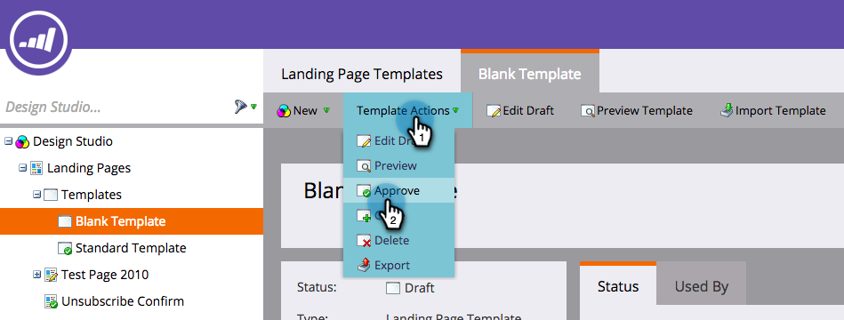

# Marketo ランディングページでの RTP の実装 {#implementing-rtp-on-marketo-landing-pages}

[!UICONTROL RTP タグ]を実装するには、次のインストール手順に従います。

1. **[!UICONTROL デザインスタジオ ]に移動します。** 編集する項目を開きます。 **[!UICONTROL テンプレートのアクション]**／**[!UICONTROL 下書きの編集]**&#x200B;を選択します。

   

1. 「**HTML ソース**」タブでテンプレートを変更します。

   

1. RTP アカウントで、「**[!UICONTROL アカウント設定]**」に移動します。

   a. サポートからJavaScript タグを既に受け取っている場合は、手順5に進みます。

   

1. 「[!UICONTROL ドメイン]」で、該当するドメインを選択し、「**[!UICONTROL タグを生成]**」をクリックします。

   

   

1. RTP JavaScript タグをコピーし、すべてのランディングページテンプレートに **`<head> </head>`** タグの間でペーストします。

1. 「**[!UICONTROL 保存]**」をクリックして、ウィンドウを&#x200B;**[!UICONTROL 閉じます]**。

1. **[!UICONTROL Design Studio]** で、**[!UICONTROL テンプレートのアクション]**&#x200B;からランディングページを承認して、「**[!UICONTROL 承認]**」をクリックします。

   

1. 最後に、テンプレートの変更を有効にするには、そのテンプレートを使用してランディングページを&#x200B;**再承認**&#x200B;する必要があります。 メインの「[!UICONTROL ランディングページ]」セクションから、一度にすべてのランディングページを再承認できます。

   

1. ランディングページとサブドメインも含めて、すべてのページにタグがあることを確認します。

   これは、web サイトのページを右クリックすることでおこなえます。 **[!UICONTROL ページを表示Source]に移動します。** タグを見つけるために&#x200B;**[!UICONTROL RTP]**&#x200B;を検索します。
