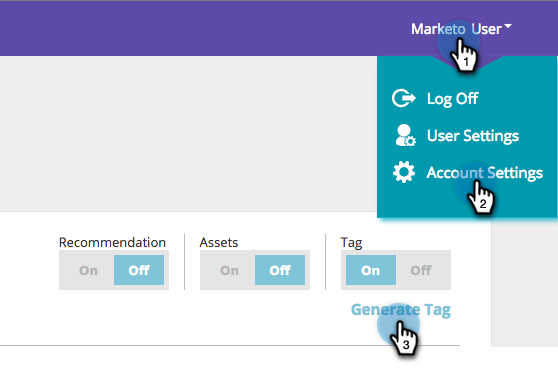

# MarketoランディングページでのRTPの実装{#implementing-rtp-on-marketo-landing-pages}

RTPタグを実装するには、次のインストール手順に従ってください。

1. **Design Studioに移動します。** 編集する項目を開きます。「**テンプレートアクション**」を選択し、「**ドラフトを編集**」を選択します。

   

1. 「**HTML Source**」タブでテンプレートに変更を加えます。

   

1. RTPアカウントで、**「アカウント設定**」に移動します。

   a.サポートからJavaScriptタグを既に受け取っている場合は、手順5に進みます。

   

1. 「Domain」で、関連するドメインを探し、「**Generate Tag**」をクリックします。

   

   

1. RTP JavaScriptタグをコピーし、**`<head> </head>`**&#x200B;タグ間のすべてのランディングページテンプレートに貼り付けます。

1. 「**保存**」をクリックし、「**閉じる**」をクリックします。

1. **Design Studio**&#x200B;に戻り、**テンプレートアクション**&#x200B;からランディングページを承認し、**承認**&#x200B;をクリックします。

   

1. 最後に、テンプレートの変更を有効にするには、そのテンプレートを使用しているすべてのランディングページを&#x200B;**再承認**&#x200B;する必要があります。 メインランディングページセクションから一度にすべての承認を再度行うことができます。

   

1. ランディングページとサブドメインを含むすべてのページに表示されることを確認します。

   これは、ウェブサイトのページを右クリックすると行えます。 **表示ページソースに移動します。** RTPを検索して、タグを探し **** ます。
