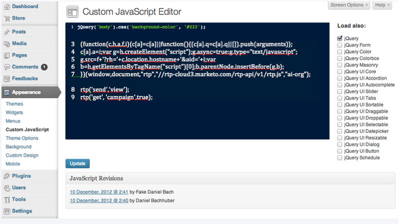

# Wordpress Enterprise での RTP の実装 {#implementing-rtp-on-wordpress-enterprise}

[!UICONTROL RTP タグ]を実装するには、次のインストール手順に従います。

1. 「**[!UICONTROL アカウント設定]**」に移動します。

   a. サポートからJavaScript タグを既に受け取っている場合は、手順3に進みます。

   

1. 「[!UICONTROL ドメイン]」で、該当するドメインを選択し、「**[!UICONTROL タグを生成]**」をクリックします。

   

1. RTP JavaScript タグをコピーします。

1. [!DNL WordPress] アカウントに管理者ユーザとしてログインします。

   a. **[!UICONTROL アピアランス]**&#x200B;で、**[!UICONTROL カスタム JavaScript]**に移動します。
b. 既存のコードの直後にRTP Javascript タグを貼り付けます。

   

   >[!CAUTION]
   >
   >コードをペーストすると、次のタグが除外されます。
   >
   >* `<!-- RTP tag -->`
   >* ``
   >* `<!-- End of RTP tag -->`
   >
   >スクリプト自体のみを挿入します。

1. 「**[!UICONTROL 更新]**」をクリックします。
