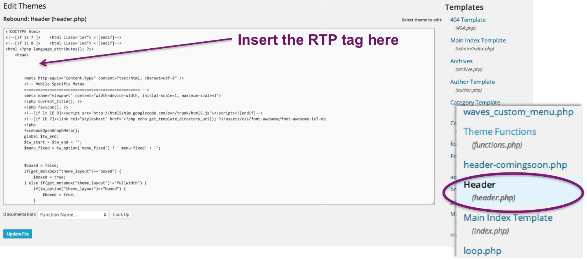

# [!DNL Wordpress] での RTP の実装 {#implementing-rtp-on-wordpress}

[!UICONTROL RTP タグ]を実装するには、次のインストール手順に従います。

1. **[!DNL WordPress]テーマ**&#x200B;の **header.php** ファイルを開きます。

   FTP クライアントを使用してサーバーにアクセスするか、[!DNL WordPress] のダッシュボードから直接テーマファイルを編集できます。 ファイルエディターは、サイドバーメニューの「**[!UICONTROL 外観]**」タブにあります。

   

1. テキストエディターの右側にあるテンプレートファイルのリストで、**header.php** を探して開きます。

1. 「**[!UICONTROL アカウント設定]**」に移動します。

   a. サポートからJavaScript タグを既に受け取っている場合は、手順5に進みます。

   

1. 「[!UICONTROL ドメイン]」で、該当するドメインを選択し、「**[!UICONTROL タグを生成]**」をクリックします。

   

1. RTP JavaScript タグをコピーして、Web サイトテンプレートにペーストします。

   a. ページのヘッダー（**`<head> </head>`** タグ間）にある最初のスクリプトであることを確認してください。

   

1. header.php ファイルの&#x200B;**[!UICONTROL ファイルの更新]**&#x200B;をクリックします。

1. ランディングページとサブドメインも含めて、すべてのページにタグがあることを確認します。

   a. これは、web サイトのページを右クリックすることでおこなえます。 **[!UICONTROL ページを表示Source]に移動します。** タグを見つけるために&#x200B;**RTP**&#x200B;を検索します。
