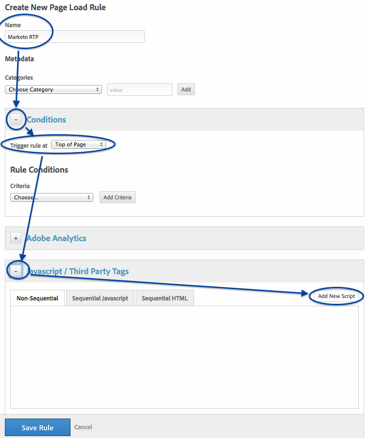
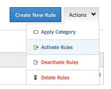

# Adobe Tag Manager を使用した RTP の実装 {#implementing-rtp-using-adobe-tag-manager}

RTP タグを実装するには、次のインストール手順に従います。

1. RTP アカウントにログインします。

1. 「**[!UICONTROL アカウント設定]**」に移動します。

   a. サポートからJavaScript タグを既に受け取っている場合は、手順4に進みます。

   

1. 「[!UICONTROL ドメイン]」で、該当するドメインを選択し、「**[!UICONTROL タグを生成]**」をクリックします。

   

1. [!DNL Dynamic Tag Manager] アカウント（[https://dtm.adobe.com/sign_in](https://dtm.adobe.com/sign_in)）にログインします。

1. **[!UICONTROL ダッシュボード &#x200B;]に移動します。** 関連するweb プロパティをクリックします。

   

1. **[!UICONTROL ルール]**&#x200B;に移動して、「**[!UICONTROL ルールを新規作成]**」をクリックします。

1. 次の情報を入力します。

   1. [!UICONTROL 名前]：**Marketo RTP**
   1. [!UICONTROL 条件]（折りたたみ）：トリガールール：**[!UICONTROL ページの先頭]**
   1. [!UICONTROL JavaScript]（折りたたみ）：「**[!UICONTROL 新しいスクリプトを追加]**」をクリック

   

1. 新しいタグを **MarketoRTP タグ**&#x200B;と呼びます

1. [!UICONTROL RTP タグ]から次のコードを削除します

   * ``

1. RTP JavaScript タグをペーストします。

   

   >[!CAUTION]
   >
   >すべてのタグを削除し、スクリプト自体のみを残します（`` なし）

1. スクリプトエディターで、「**[!UICONTROL コードを保存]**」をクリックして、ルールエディターで「**[!UICONTROL ルールを保存]**」をクリックします。

1. ルールパネルで、Marketo RTP ページ読み込みルールを見つけ、**[!UICONTROL アクション]** ドロップダウン内で「**[!UICONTROL ルールをアクティブ化]**」を選択します。

   

1. ランディングページとサブドメインも含めて、すべてのページにタグがあることを&#x200B;**[!UICONTROL 確認]**&#x200B;します。

   これは、web サイトのページで右クリックすることで可能です。 **[!UICONTROL 要素を検査]**&#x200B;に移動して、「**[!UICONTROL ネットワーク]**」をクリックして **RTP** を検索します。
