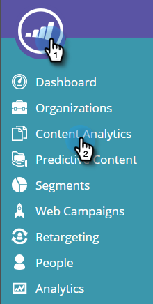
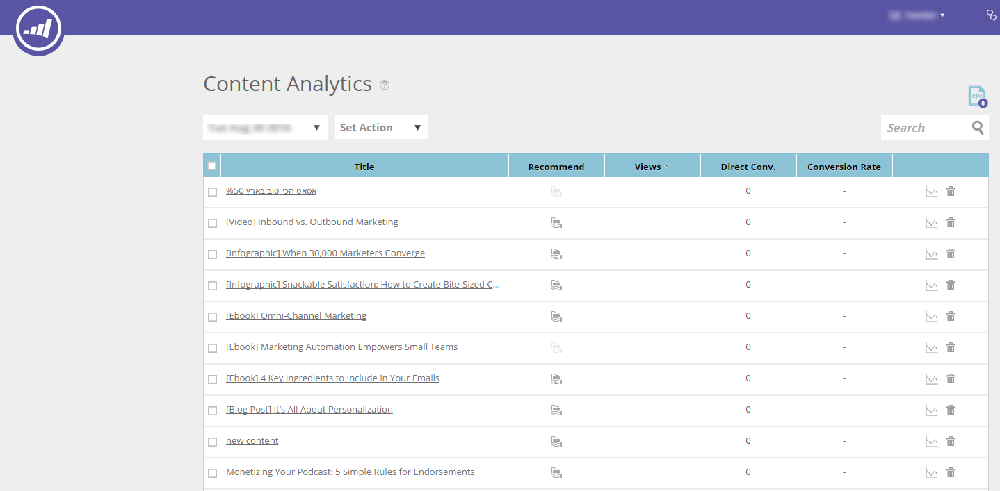
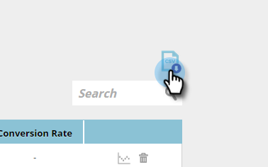
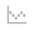
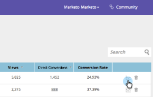
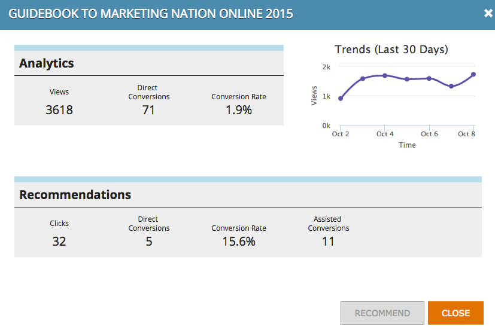
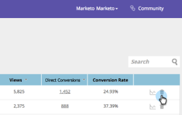

# コンテンツ分析について {#understanding-content-analytics}

Content Analytics ページには、web サイトで検出された既存のコンテンツ（事例、ブログ投稿、ビデオ、プレスリリースなど）が表示されます。 また、訪問者がコンテンツに関与したときに創出されたリードとコンテンツのパフォーマンスも表示されます。

## コンテンツ分析を表示 {#view-content-analytics}

「**[!UICONTROL コンテンツ分析]**」に移動します。

[!UICONTROL コンテンツ分析]ページでは、次の操作を実行できます。

* 時間範囲（日、週、月）でフィルターできます。
* コンテンツタイトルとコンテンツ URL で検索
* ビュー、ダイレクトコンバージョン、コンバージョン率の列タイトルをクリックして、降順または昇順に並べ替える

また、アイコンをクリックして CSV 形式でファイルを書き出すこともできます。

分析テーブルには、次の詳細が表示されます。

<table>
 <thead>
  <tr>
   <th colspan="1" rowspan="1">名前</th>
   <th colspan="1" rowspan="1">説明</th>
  </tr>
 </thead>
 <tbody>
  <tr>
   <td colspan="1" rowspan="1"><strong>[!UICONTROL タイトル]</strong></td>
   <td colspan="1" rowspan="1">デジタルコンテンツアセットの名前。 「<strong>タイトル</strong>」をクリックすると、コンテンツ URL が新しいタブで開きます。</td>
  </tr>
  <tr>
   <td colspan="1">
<strong>レコメンデーション</strong><strong>アイコン</strong>

</td>
   <td colspan="1">コンテンツが<a href="#">コンテンツレコメンデーション</a>に追加されたかどうかを示します。</td>
  </tr>
  <tr>
   <td colspan="1" rowspan="1">
<strong>[!UICONTROL 表示]</strong>
</td>
   <td colspan="1" rowspan="1">
コンテンツアセットに対する web 訪問者からの表示数。 表示、開封、視聴またはダウンロードされた回数。 「表示」列の数値をクリックしてドリルダウンし、コンテンツの閲覧者を確認します。
</td>
  </tr>
  <tr>
   <td colspan="1" rowspan="1"><strong>[!UICONTROL ダイレクトコンバージョン数]</strong></td>
   <td colspan="1" rowspan="1">同じ訪問でコンテンツを表示し、フォームに入力した web 訪問者。</td>
  </tr>
  <tr>
   <td colspan="1">
<strong>分析アイコン</strong>

</td>
   <td colspan="1">コンテンツの分析の詳細を表示します。</td>
  </tr>
  <tr>
   <td colspan="1">
<strong>削除アイコン</strong>

</td>
   <td colspan="1">Content Analytics からコンテンツを削除します。</td>
  </tr>
 </tbody>
</table>

## 追加の Content Analytics を表示 {#view-additional-content-analytics}

コンテンツの分析アイコンをクリックします。

特定のコンテンツに対する追加の Content Analytics を表示するダイアログが開きます。

その他のコンテンツ分析には、次のものが含まれます。

**分析**

* **[!UICONTROL ビュー]**：選択した時間範囲のコンテンツの表示数
* **[!UICONTROL ダイレクトコンバージョン]**：同じ訪問でコンテンツを表示し、フォームに入力した web 訪問者数
* **[!UICONTROL コンバージョン率]****：**ダイレクトコンバージョン数をクリック数で割って計算されたコンバージョン率

**[!UICONTROL トレンド]**

* 特定のコンテンツの過去 30 日間の視聴を示す&#x200B;**[!UICONTROL トレンド]**&#x200B;グラフ。 折れ線グラフ上のポイントにポインタを合わせると、特定の日のコンテンツの閲覧数が表示されます。

## コンテンツの削除 {#delete-content}

[!UICONTROL コンテンツ分析]ページで、削除するコンテンツの削除アイコンをクリックします。 コンテンツを削除するかどうかを確認するメッセージが表示されます。

>[!MORELIKETHIS]
>
>* [コンテンツレコメンデーションバーの有効化](/help/marketo/product-docs/predictive-content/enabling-predictive-content/enable-the-content-recommendation-bar.md)
>* [Web リッチメディアの予測コンテンツの有効化](/help/marketo/product-docs/predictive-content/enabling-predictive-content/enable-predictive-content-for-web-rich-media.md)
