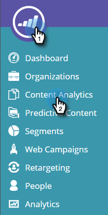
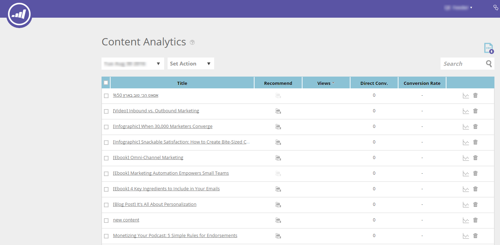

# コンテンツ分析について {#understanding-content-analytics}

コンテンツ分析ページには、web サイトで検出された既存のコンテンツ（事例、ブログ投稿、ビデオ、プレスリリースなど）が表示されます。また、訪問者がコンテンツに関与したときに創出されたリードとコンテンツのパフォーマンスも表示されます。

## コンテンツ分析を表示 {#view-content-analytics}

「**コンテンツ分析**」に移動します。

コンテンツ分析ページでは、次の操作を実行できます。

* 時間範囲（日、週、月）でフィルタリングする
* コンテンツのタイトルとコンテンツ URL で検索する
* ビュー、ダイレクトコンバージョン、コンバージョン率の列タイトルをクリックして、降順または昇順に並べ替える

また、アイコンをクリックして CSV 形式でファイルを書き出すこともできます。

分析テーブルには、次の詳細が表示されます。

<table> 
 <thead> 
  <tr> 
   <th colspan="1" rowspan="1">名前</th> 
   <th colspan="1" rowspan="1">説明</th> 
  </tr> 
 </thead> 
 <tbody> 
  <tr> 
   <td colspan="1" rowspan="1"><strong>職位</strong></td> 
   <td colspan="1" rowspan="1">デジタルコンテンツアセットの名前。「<strong>タイトル</strong>」をクリックすると、コンテンツ URL が新しいタブで開きます。</td> 
  </tr> 
  <tr> 
   <td colspan="1">
<strong>レコメンデーション</strong><strong>アイコン</strong>

<strong></strong>
</td> 
   <td colspan="1">コンテンツが<a href="#">コンテンツレコメンデーション</a>に追加されたかどうかを示します。</td> 
  </tr> 
  <tr> 
   <td colspan="1" rowspan="1">
<strong>参照</strong>
</td> 
   <td colspan="1" rowspan="1">
コンテンツアセットに対する web 訪問者からの表示数。表示、開封、視聴またはダウンロードされた回数。「表示」列の数をクリックしてドリルダウンし、コンテンツの閲覧者を確認します
</td> 
  </tr> 
  <tr> 
   <td colspan="1" rowspan="1"><strong>ダイレクトコンバージョン</strong></td> 
   <td colspan="1" rowspan="1">同じ訪問でコンテンツを表示し、フォームに入力した web 訪問者</td> 
  </tr> 
  <tr> 
   <td colspan="1">
<strong>分析アイコン</strong>

<strong></strong>
</td> 
   <td colspan="1">コンテンツの分析の詳細を見ます</td> 
  </tr> 
  <tr> 
   <td colspan="1">
<strong>削除アイコン</strong>

</td> 
   <td colspan="1">コンテンツ分析からコンテンツを削除</td> 
  </tr> 
 </tbody> 
</table>

## 追加のコンテンツ分析を表示 {#view-additional-content-analytics}

コンテンツの分析アイコンをクリックします。

ダイアログボックスが開き、その特定のコンテンツに対する追加のコンテンツ分析が表示されます。

その他のコンテンツ分析には、次のものが含まれます。

**分析**

* **ビュー**：選択した時間範囲のコンテンツの表示数
* **ダイレクトコンバージョン**：同じ訪問でコンテンツを表示し、フォームに入力した web 訪問者数
* **コンバージョン率****：** ダイレクトコンバージョン数をクリック数で割って計算されたコンバージョン率

**トレンド**

* 特定のコンテンツの過去 30 日間の視聴を示す&#x200B;**トレンド**&#x200B;グラフ。折れ線グラフにマウスポインタを合わせると、特定の日からのコンテンツ視聴回数が表示されます

## コンテンツの削除 {#delete-content}

コンテンツ分析ページで、削除するコンテンツの削除アイコンをクリックします。コンテンツを削除するかどうかを確認するメッセージが表示されます。

>[!MORELIKETHIS]
>
>* [コンテンツレコメンデーションバーの有効化](/help/marketo/product-docs/predictive-content/enabling-predictive-content/enable-the-content-recommendation-bar.md)
>* [Web リッチメディアの予測コンテンツの有効化](/help/marketo/product-docs/predictive-content/enabling-predictive-content/enable-predictive-content-for-web-rich-media.md)

