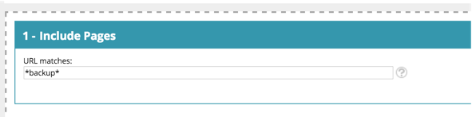

# [!DNL Web Personalization] 用語集 {#web-personalization-glossary}

[!DNL Marketo Web Personalization] の世界と言語に関するインサイトがいくつかあります。

| 用語 | 定義 |
|---|---|
| **匿名訪問者** | フォームに入力したことも web サイトに詳細を残したこともない web 訪問者。 |
| **Web キャンペーン** | 特定のセグメントに関連付けられたカスタマイズされたリアクション。 Web パーソナライゼーションでは、web キャンペーンには、ダイアログ、ゾーン内、ウィジェットが含まれます。 |
| **クリックストリーム** | サイト上での訪問者のアクティビティや URL パスおよび各ページでの滞在時間 |
| **ISP** | インターネットサービスプロバイダー |
| **既知の訪問者** | フォームに入力し、web サイトに詳細（メールアドレス）を残した、または Marketo のメールのリンクをクリックした web 訪問者。 |
| **顧客リスト** | 主要な顧客名／組織名のリスト。 アカウントベースドマーケティング（ABM）リストとも呼ばれます。 |
| **セグメント** | [セグメントを設定ページ](/help/marketo/product-docs/web-personalization/using-web-segments/web-segments.md)の指定した条件に一致する訪問者のコレクション。 |
| **分割テスト** | 2 つ以上のバリエーションを用いたテスト実験で、結果の違いを測定します。 目標は、関心のある結果を増加または最大化させる web ページへの変更を特定することです。 |
| **ワイルドカード** | 文字列内の他の文字または文字に置き換える、文字列の前後に使用するワイルドカード文字（&#42; を使用）。 以下の例を参照してください。 |

## ワイルドカードの例 {#wildcard-examples}

[!DNL Web Personalization] でワイルドカードを使用する方法は 3 つあります。

pricing で終わるページ URL（例：`www.marketo.com/pricing`）のすべての訪問者を一致させます

https:// で始まるページ URL（例：`https://www.marketo.com`）のすべての訪問者を一致させます

backup という単語を含むページ URL（例：`https://www.marketo.com/backup/pricing.html`）のすべての訪問者を一致させます

