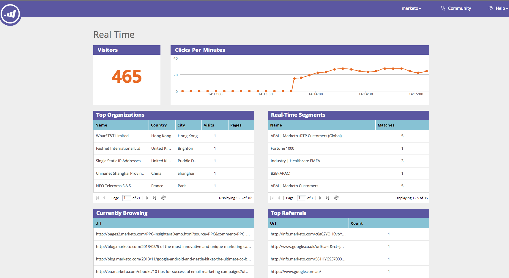

# Webパーソナライゼーションの概要{#web-personalization-overview}

## はじめに{#introduction}

新しいマーケティング担当者向けに、リアルタイムパーソナライゼーションは4つのアプリに分けられ、次の2つのタイルを使用してアクセスします。Webパーソナライゼーションとコンテンツ`AI`。

 

>[!NOTE]
>
>Webパーソナライゼーションとコンテンツ`AI`は、マーケティング対象のすべての言語（英語、フランス語、ドイツ語、日本語、ポルトガル語、スペイン語）で利用できます。

既存のお客様は、更新までリアルタイムパーソナライゼーションタイルを通じてアプリにアクセスし続け、その時点で上記のログインを使用します。

Webパーソナライゼーションタイルをクリックすると、ダッシュボードページが表示されます。 「コンテンツ`AI`」タイルをクリックし、コンテンツRecommendationsページに直接移動します。

次の4つのアプリがあります。

* Webパーソナライゼーション
* アカウントベースのWebマーケティング
* Webサイトの再ターゲット設定
* コンテンツ`AI`

** Webパーソナライゼーション&#x200B;**タイル画像は、** **パーソナライズされたWebキャンペーンーを作成するためのアクセスポイントです。** **アカウントベースのWebマーケティングとWebの再ターゲティング。コンテンツは、コンテンツ分析ページで追加できます。

**アカウントベースのWeb** マーケティングは、Webパーソナライゼーションとアカウントに名前付きの機能と共に機能します。「固有のアカウント」ページには、既存の顧客、合計エンゲージメント数、組織の傾向、およびアカウントのリストがグラフィカルに表示されます。 また、新しい名前付きアカウントを作成することもできます。

**Webサイトの** 再ターゲティングを使用すると、セグメント化されたオーディエンスに対して再マーケティングを行うことができます。セグメントを設定できますが、フィルターで名前付きアカウントを使用することはできません。

**`AI`** コンテンツは、コンテンツのレコメンデーションを行う場所です。コンテンツは、コンテンツRecommendationsページに簡単に追加できます。

>[!NOTE]
>
>アカウントベースのWebマーケティングまたはWebサイトの再ターゲティングにアクセスするには、Webパーソナライゼーションアプリを持っていない場合でも、「Webパーソナライゼーション」タイルをクリックする必要があります。

## 組織{#organizations}

「組織」タブには、特定の期間にWebサイトを訪問した組織のすべての詳細(名前、場所、アクティビティおよびタイムスタンプ)が表示されます。 時間、場所、ドメイン、およびフリーテキスト検索を使用して、表を並べ替えたり、整理したりできます。

>[!TIP]
>
>「最もアクティブ」と「最新」 — 表は、識別された組織、次にインターネットサービスプロバイダー（ISPアイコンで示される）で構成されます。 以下に従って並べ替えることができます。
>
>* 最もアクティブ：ページの表示数に基づく、表の中で最もアクティブな組織
>* 最新：テーブル内の最新の組織（デフォルト）
>* 貴重なインサイトを得るには、最もアクティブな

>

**組織 — 右側のパネル**

組織ページの右側のパネルには、次の機能とインサイトがオファーされます。

<table> 
 <tbody> 
  <tr> 
   <td>
<strong>スプレッドシートアイコン</strong>:パネルの右上にあるアイコンは、オフラインで使用するために、CSV形式で組織テーブルをダウンロードします

<strong>電子メールアラートの設定</strong>:選択した組織がWebサイトを訪問するたびに、ログインしたユーザーに電子メールを送信します

<strong>リード</strong>:選択した組織のリードテーブルを開きます

<strong>共有</strong>:ポップアップウィンドウを開いて電子メールを送信し、Webページを訪問した組織の詳細を共有します

<strong>ロケーションアイコン</strong>:選択した組織の国と市区町村を表示します

<strong>リンク</strong>:Jigsaw、Whois、Linkedin、Google、Twitterが新しいウィンドウを開き、それぞれのWebページから追加情報が表示され、選択した組織に対する追加のインサイトを提供します

<strong>検索</strong>:訪問者が検索エンジンを経由して到着した場合に使用するキーワードを表示します。

<strong>転送者</strong>:トラフィックを貴社のサイトに導いたページのURLリンクを示します。

<strong>訪問者</strong>:訪問数、選択した組織が閲覧したページ数、電子メールアドレス（送信フォームを完了した場合）、最後の訪問の日時が表示されます

<strong>クリックストリーム</strong>:ユーザーアクティビティとサイト上のURLパスの表、および各ページの訪問時間
</td> 
   <td></td> 
  </tr> 
 </tbody> 
</table>

**組織を共有**

Webサイト訪問者の情報を同僚と共有したい場合 組織をクリックし、右側のパネルの「共有」リンクをクリックします。

「この組織を共有」オーバーレイがアクティブになります。このオーバーレイでは、Webサイトを訪問した組織の名前と詳細を共有する電子メールを送信できます。

## 訪問者{#visitors}

訪問者ページには、指定期間内にサイトに来訪した各訪問者の詳細とオンラインでの行動がすべて表示されます。 このページオファーは、各訪問者のアクティビティやオンライン行動を詳細に分析することができます。 表内の訪問者データは24 ～ 48時間以内に更新されます。

訪問者ページの右側のパネルには、次の情報が表示されます。

<table> 
 <thead> 
  <tr> 
   <th colspan="1" rowspan="1">名前</th> 
   <th colspan="1" rowspan="1">説明</th> 
  </tr> 
 </thead> 
 <tbody> 
  <tr> 
   <td colspan="1" rowspan="1"><strong>スプレッドシートアイコン</strong></td> 
   <td colspan="1" rowspan="1">パネルの右上にあるアイコンは、オフラインで使用するために、訪問者テーブルをCSV形式でダウンロードします</td> 
  </tr> 
  <tr> 
   <td colspan="1" rowspan="1">
<strong>組織名</strong>
</td> 
   <td colspan="1" rowspan="1"> </td> 
  </tr> 
  <tr> 
   <td colspan="1" rowspan="1"><strong>キャンペーンの設定</strong></td> 
   <td colspan="1" rowspan="1">選択した訪問者に関連付けられたキャンペーンCTAを設定できます。</td> 
  </tr> 
  <tr> 
   <td colspan="1"><strong>場所</strong></td> 
   <td colspan="1">訪問者の国、都道府県、市区町村を表示します</td> 
  </tr> 
  <tr> 
   <td colspan="1" rowspan="1"><strong>Clickstream</strong></td> 
   <td colspan="1" rowspan="1">訪問者のアクティビティとサイト上のURLパス、および各ページの訪問時間の表を表示します</td> 
  </tr> 
 </tbody> 
</table>

## リアルタイム{#real-time}

リアルタイムページには、Webサイト上の訪問者がリアルタイムで表示され、アクティビティの発生を測定します。

リアルタイムページは、オンサイト訪問者の詳細に関する6つの情報テーブルに分割されます。

<table> 
 <thead> 
  <tr> 
   <th colspan="1" rowspan="1">名前</th> 
   <th colspan="1" rowspan="1">説明</th> 
  </tr> 
 </thead> 
 <tbody> 
  <tr> 
   <td colspan="1" rowspan="1"><strong>訪問者</strong></td> 
   <td colspan="1" rowspan="1"> 現在Webサイトにある訪問者の数を表します。</td> 
  </tr> 
  <tr> 
   <td colspan="1" rowspan="1">
<strong>1分あたりのクリック数</strong>
</td> 
   <td colspan="1" rowspan="1"> 1分あたりのサイトのクリック数を示すライブ折れ線グラフ</td> 
  </tr> 
  <tr> 
   <td colspan="1" rowspan="1"><strong>トップの組織</strong></td> 
   <td colspan="1" rowspan="1">組織テーブルの短いバージョン</td> 
  </tr> 
  <tr> 
   <td colspan="1"><strong>リアルタイムセグメント</strong></td> 
   <td colspan="1">指定したセグメントに一致する、現在オンサイトの訪問者数</td> 
  </tr> 
  <tr> 
   <td colspan="1"><strong>現在の参照</strong></td> 
   <td colspan="1">オンサイト訪問者が現在閲覧中のページのURL</td> 
  </tr> 
  <tr> 
   <td colspan="1" rowspan="1"><strong>トップの照会</strong></td> 
   <td colspan="1" rowspan="1">訪問者をサイトに導いた参照URL</td> 
  </tr> 
 </tbody> 
</table>

