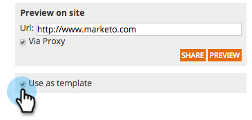

# キャンペーンをテンプレートとして保存する {#save-your-campaign-as-a-template}

完璧な web キャンペーンの作成に時間を費やしたら、 後で簡単に再利用できるよう、テンプレートとして保存できます。

1. **[!UICONTROL Web キャンペーン]**&#x200B;に移動します。

   

1. テンプレートとして保存するキャンペーンを検索します。

   

1. 編集アイコンをクリックします。

   

1. 「**[!UICONTROL テンプレートとして使用]**」をオンにして、「**[!UICONTROL 保存]**」をクリックします。

      

1. 次にキャンペーンを作成してテンプレートを選択する際に、保存されたテンプレートがキャンペーンを設定ページの「[!UICONTROL マイテンプレート]」に表示されます。

   
