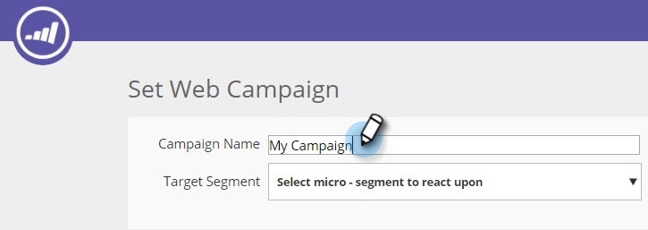
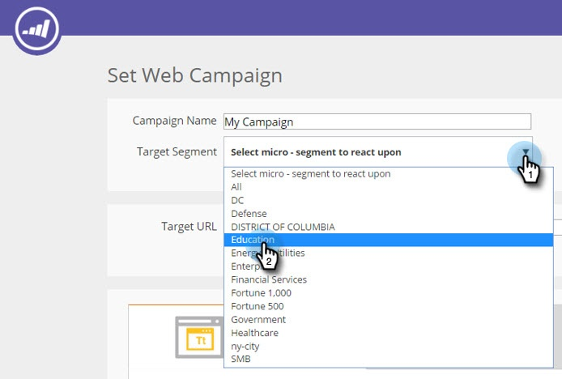

# テンプレートを使用した web キャンペーンの作成 {#using-templates-to-create-web-campaigns}

組み込みのテンプレートを使用するか、[独自のテンプレートを保存](save-your-campaign-as-a-template.md)して、web キャンペーンを加速かつ簡易化できます。

>[!NOTE]
>
>テンプレートは、デスクトップと Mobile の両方で、すべてのデバイスとブラウジングエクスペリエンスに合わせて最適化されています。

1. **[!UICONTROL Web キャンペーン]**&#x200B;に移動します。

   

1. 「**[!UICONTROL Web キャンペーンを新規作成]**」をクリックします。

   

1. キャンペーンに名前を付けます。

   

1. 「[!UICONTROL ターゲットセグメント]」を選択します。

   

1. 「**[!UICONTROL テンプレート]**」をクリックします。

   

1. キャンペーンの適切な領域を選択して、目的のテンプレートを選択します。

   >[!NOTE]
   >
   >素晴らしいテンプレートがいくつかあります。テンプレートは今後もさらに追加されます。

   

   >[!TIP]
   >
   >モバイルキャンペーンの場合、**モバイル**&#x200B;セクションのテンプレートを選択します。

1. テンプレートをカスタマイズします。

   

1. 「**[!UICONTROL 保存]**」をクリックします。

   

これで完了です。 テンプレートを使用すると、どれだけ時間を節約できるかおわかりいただけたと思います。

>[!MORELIKETHIS]
>
>[キャンペーンをテンプレートとして保存](/help/marketo/product-docs/web-personalization/using-templates/save-your-campaign-as-a-template.md)
