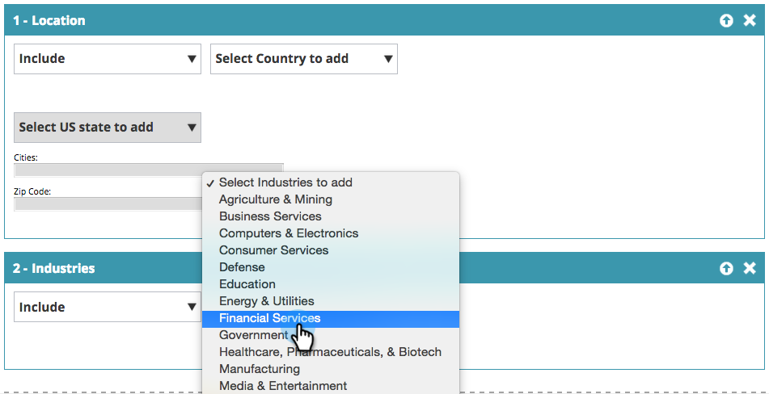

# 基本的な web セグメントの作成 {#create-a-basic-web-segment}

米国および金融サービス業界のすべての web 訪問者をターゲットにした基本的なセグメントを作成します。

1. 「**セグメント**」に移動します。

   

1. 「**新規作成**」をクリックします。

   

1. セグメント名を入力します。

   

1. 「**場所**」を右側のメニューからセグメントエディターにドロップします。

   

1. 追加する国をドロップダウンから選択します。「**米国**」を選択します。

   

   >[!NOTE]
   >
   >都市の数は、セグメントあたり 300 に制限されています。

1. 右側のメニューから「**業界**」をドラッグして、セグメントエディターにドロップします。

   

1. ドロップダウンから追加する業種を選択します。「**金融サービス業界**」を選択します。

   

   これで、米国および金融業界からウェブサイトを訪問するすべての見込み客向けの基本セグメントが設定されました。

1. 「**保存**」をクリックしてセグメントを保存するか、「**保存してキャンペーンを設定**」をクリックしてキャンペーンページに移動します。

   

米国からの訪問者をセグメント化し、金融サービス業界を追加しました。

>[!MORELIKETHIS]
>
>[Web セグメント](/help/marketo/product-docs/web-personalization/using-web-segments/web-segments.md)
