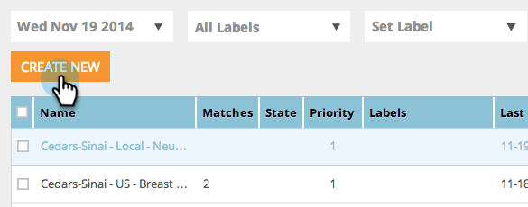
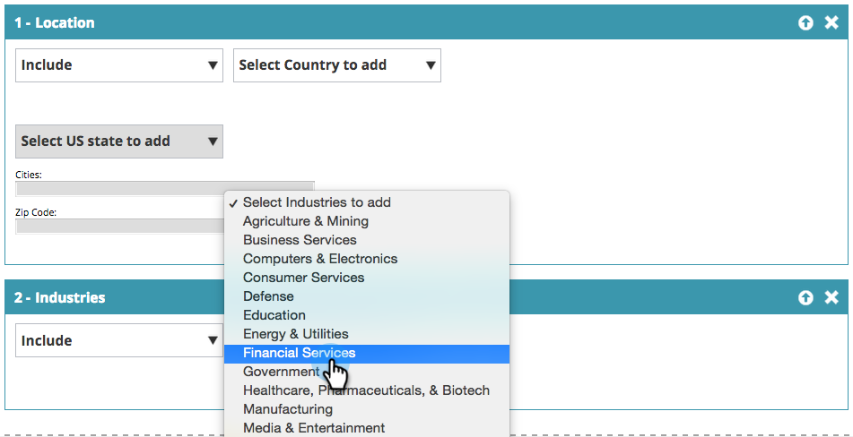
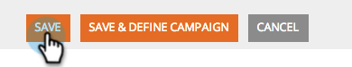

# 基本的な web セグメントの作成 {#create-a-basic-web-segment}

米国および金融サービス業界のすべての web 訪問者をターゲティングする基本的なセグメントを作成します。

1. 「**[!UICONTROL セグメント]**」に移動します。

   

1. 「**[!UICONTROL 新規作成]**」をクリックします。

   

1. セグメント名を入力します。

   

1. 「**[!UICONTROL 場所]**」を右側のメニューからセグメントエディターにドロップします。

   

1. 追加する国をドロップダウンから選択します。 「**米国**」を選択します。

   

   >[!NOTE]
   >
   >都市の数は、セグメントあたり 300 に制限されています。

1. 右側のメニューから「**[!UICONTROL 業界]**」をドラッグして、セグメントエディターにドロップします。

   

1. ドロップダウンから追加する[!UICONTROL 業種]を選択します。 「**[!UICONTROL 金融サービス]業界**」を選択します。

   

   これで、米国および金融業界からウェブサイトを訪問するすべての見込み客向けの基本セグメントが設定されました。

1. 「**[!UICONTROL 保存]**」をクリックしてセグメントを保存するか、「**[!UICONTROL 保存してキャンペーンを設定]**」をクリックしてキャンペーンページに移動します。

   

米国からの訪問者をセグメント化したので、続けて金融サービス業界を追加します。

>[!MORELIKETHIS]
>
>[Web セグメント](/help/marketo/product-docs/web-personalization/using-web-segments/web-segments.md)
