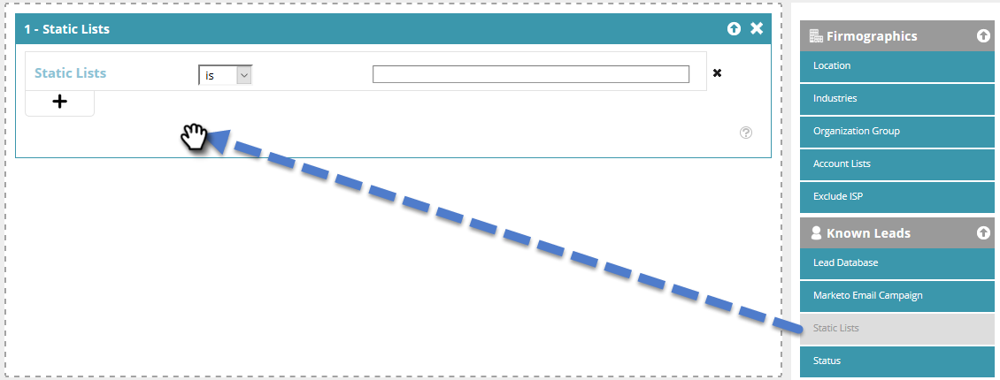

# 静的リストを使用したセグメントの作成 {#create-a-segment-using-a-static-list}

いずれかの Marketo [静的リスト](/help/marketo/product-docs/core-marketo-concepts/smart-lists-and-static-lists/static-lists/understanding-static-lists.md)にあるかないかに基づき、既知の web 訪問者をウェブサイト訪問時にセグメント化します。

1. 「**[!UICONTROL セグメント]**」に移動します。

   

1. 「**[!UICONTROL 新規作成]**」をクリックします。

   

1. セグメントの「名前」を入力します。

   

1. 「既知のリード」で、「**[!UICONTROL 静的リスト]**」をキャンバスに移動します。

   

1. ドロップダウンをクリックして、**[!UICONTROL is]** または **[!UICONTROL is not]**&#x200B;を選択し（必要に応じて）、静的リストの名前を入力します。

   

1. 複数のリストを追加する場合は、「**+**」をクリックして各リストに対して新しい行を作成する必要があります。 リストが 1 つだけの場合は、[手順 8](#eight) にスキップします。

   

1. 複数のリスト（または複数の「is not」リスト）に対して、[手順 5](#five).で説明した手順を繰り返します。

   

   >[!NOTE]
   >
   >And/or ドロップダウンは、それだけです。 クリックして **[!UICONTROL and]**、**[!UICONTROL or]**、**[!UICONTROL and/or]** のいずれかを選択します。

1. 「**[!UICONTROL 保存]**」をクリックしてセグメントを保存するか、「**[!UICONTROL 保存してキャンペーンを設定]**」をクリックして保存し、[!UICONTROL キャンペーン]ページに移動します。

   
