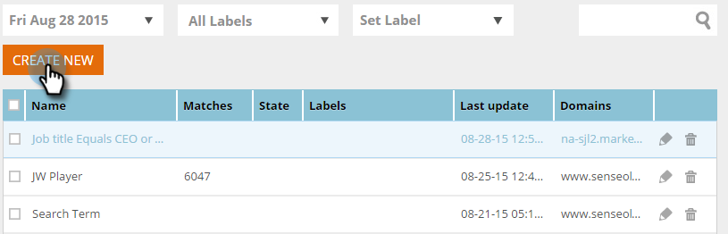
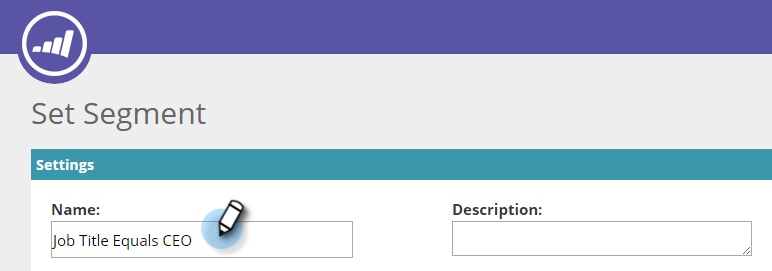
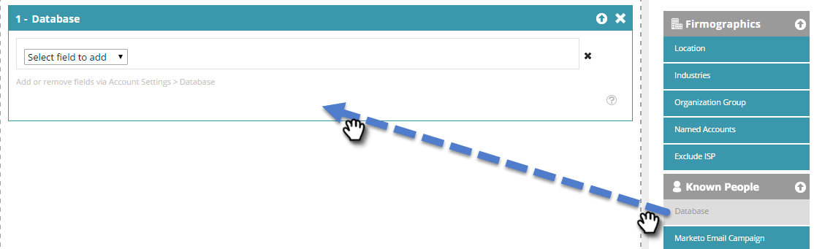
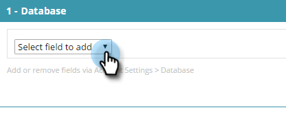
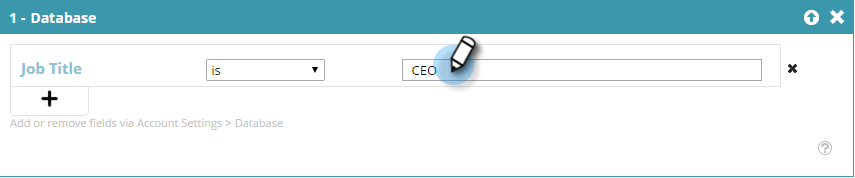
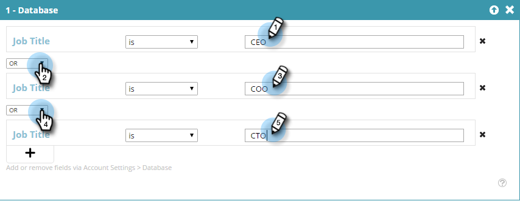
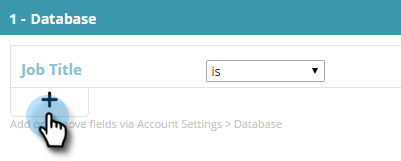
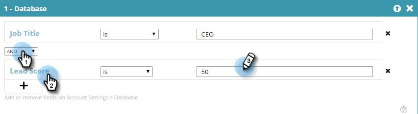

# 認識済み顧客データを使用したセグメントの作成 {#create-a-segment-using-known-person-data}

認識済み顧客データの値を使用してセグメントを作成する方法は、次のとおりです。

>[!PREREQUISITES]
>
>[リードデータの管理](/help/marketo/product-docs/web-personalization/using-web-segments/manage-person-data.md)

1. 「**[!UICONTROL セグメント]**」に移動します。

   

1. 「**[!UICONTROL 新規作成]**」をクリックします。

   

1. セグメントの「名前」を入力します。

   

1. 「プロファイルのセグメント化」で、「**[!UICONTROL データベース]**」をキャンバスまでドラッグします。

   

1. ドロップダウンからリードデータフィールドを選択します。

   

1. リードデータの値を入力します。

   

   各フィールドには 1 つの値のみ指定できます。 例えば、「役職」フィールドに複数の値を追加する場合は、各値に同じフィールド名を持つ新しい行を作成する必要があります。 どの値でも一致するように、必ず OR 値を使用してください。

   

## 複数の人物データフィールドを選択する {#selecting-multiple-person-data-fields}

1. リードデータフィールドを追加するには「**+**」をクリックします。

   

1. [!UICONTROL AND] または [!UICONTROL OR] 演算子を選択します。 追加するフィールドを選択します。 人物データフィールドを選択します。 人物データの値を入力します。

   

1. 「**[!UICONTROL 保存]**」をクリックしてセグメントを保存するか、「**[!UICONTROL 保存してキャンペーンを設定]**」をクリックして保存し、[!UICONTROL キャンペーン]ページに移動します。

   

   これで、認識済み顧客のデータをターゲティングするセグメントが設定されました。
