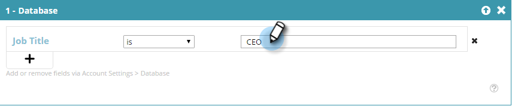

# 既知のリードデータを使用してセグメントを作成する {#create-a-segment-using-known-person-data}

既知のリードデータ値を使用してセグメントを作成する方法は、以下のとおりです。

>[!PREREQUISITES]
>
>[リードデータの管理](/help/marketo/product-docs/web-personalization/using-web-segments/manage-person-data.md)

1. 「**セグメント**」に移動します。

   

1. 「**新規作成**」をクリックします。

   

1. セグメントの「名前」を入力します。

   

1. 「プロファイルのセグメント化」で、「**データベース**」をキャンバスまでドラッグします。

   

1. ドロップダウンからリードデータフィールドを選択します。

   

1. リードデータの値を入力します。

   

   各フィールドには 1 つの値のみ指定できます。例えば、「役職」フィールドに複数の値を追加する場合は、各値に同じフィールド名を持つ新しい行を作成する必要があります。どの値でも一致するように、必ず OR 値を使用してください。

   

## 複数のリードデータフィールドを選択する {#selecting-multiple-person-data-fields}

1. リードデータフィールドを追加するには「**+**」をクリックします。

   

1. AND または OR 演算子を選択します。追加するフィールドを選択します。複数のリードデータフィールドを選択します。リードデータの値を入力します。

   

1. 「**保存**」をクリックしてセグメントを保存するか、「**保存してキャンペーンを設定**」をクリックして保存し、キャンペーンページに移動します。

   

   これで、既知のリードのデータをターゲットにするセグメントが設定されました。
