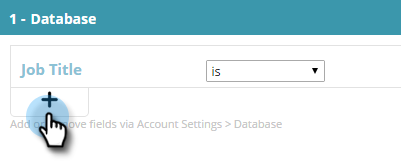

# 既知の人物データを使用したセグメントの作成{#create-a-segment-using-known-person-data}

次に、既知の人物データ値を使用してセグメントを作成する方法を示します。

>[!PREREQUISITES]
>
>[個人データの管理](manage-person-data.md)

1. **セグメント**&#x200B;に移動します。

   

1. 「**新規作成**」をクリックします。

   

1. セグメント名を入力します。

   

1. 「プロファイルのセグメント化」で、**Database **をキャンバスにドラッグします。

   

1. ドロップダウンから個人データフィールドを選択します。

   

1. 「個人データ」の値を入力します。

   

   各フィールドには1つの値しか指定できません。 例えば、ジョブタイトルフィールドに複数の値を追加する場合は、各値に同じフィールド名を持つ行を新しく作成する必要があります。 OR値を使用して、すべての値が一致を取り込むようにしてください。

   

## 複数の人物データフィールドの選択{#selecting-multiple-person-data-fields}

1. **+**&#x200B;をクリックして、別の個人データフィールドを追加します。

   

1. AND/OR演算子を選択します。 追加するフィールドを選択します。 「個人データ」フィールドを選択します。 「個人データ値」を入力します。

   

1. 「**保存**」をクリックしてセグメントを保存します。**保存してキャンペーンを定義**すると、保存してキャンペーンページに移動します。

   

   既知の人のデータをターゲットにするセグメントを設定しました。

