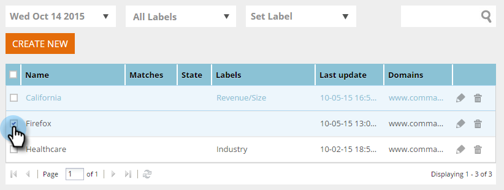

# セグメントのラベル付け {#label-your-segment}

多くのセグメントがあるので、スクロールが面倒になっているか。 ラベルを使用してセグメントにタグを付け、セグメントをすばやく見つけることができます。

## セグメントのタグ付け {#tag-a-segment}

1. Webパーソナライゼーションにログインし、「 **セグメント**」に移動します。

   

1. ラベルにタグ付けするセグメントを選択します。

   

1. 既存のラベルを使用するには、「ラベルを **設定**」をクリックし、チェックボックスをオンにして「 **適用**」をクリックします。

   

1. または、新しいラベルを作成するには、「ラベルを **設定**」をクリックし、新しいラベル名を入力して「新規 **作成**」をクリックします。

   

   >[!NOTE]
   >
   >「新規作成」ボタンに、新しいラベルの名前が表示されます。 ラベルが長すぎると、「新規作成」が表示されない場合があります。

クール！ セグメントのラベルの割り当ておよび作成方法を理解できました。
