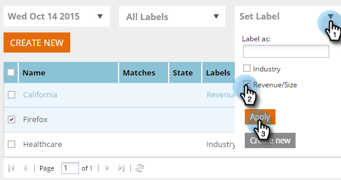

# セグメントのラベル付け {#label-your-segment}

多くのセグメントがあってスクロールが面倒になっている場合、 ラベルを使用してセグメントにタグを付けると、セグメントをすばやく見つけることができます。

## セグメントのタグ付け {#tag-a-segment}

1. [!DNL Web Personalization] にログインし、「**[!UICONTROL セグメント]**」に移動します。

   

1. ラベルでタグを付けるセグメントを選択します。

   

1. 既存のラベルを使用するには、「**[!UICONTROL ラベルを設定]**」をクリックし、チェックボックスをオンにして、「**[!UICONTROL 適用]**」をクリックします。

   

1. または、新しいラベルを作成するには、「**[!UICONTROL ラベルを設定]**」をクリックして、新しいラベル名を入力し、「**新規作成**」をクリックします。

   

   >[!NOTE]
   >
   >「新規作成」ボタンに、新しいラベルの名前が表示されます。 ラベルが長すぎると、「新規作成」が表示されない場合があります。

これで完了です。 これで、セグメントのラベルを割り当てて作成する方法がわかりました。
