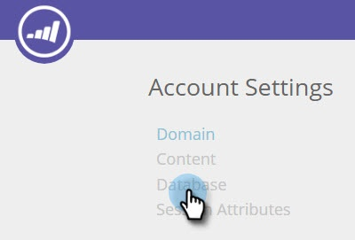
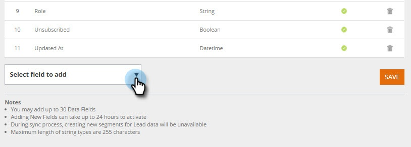
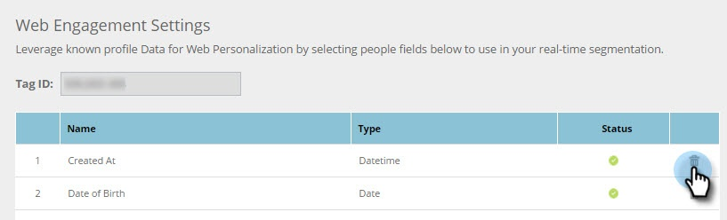

# 個人データの管理 {#manage-person-data}

セグメントで使用する個人フィールドを選択して、Webパーソナライゼーションで人物データを活用します。

1. 「 **アカウント設定**」に移動します。\
   

1. 「 **Database**」に移動します。\
   

## 新しい人物フィールドの追加 {#adding-a-new-person-field}

1. 「 **フィールド」を選択して、ドロップダウンから** 、個人データフィールドをリストに追加します。

   

   >[!NOTE]
   >
   >
   >    
   >    
   >    * 新しいフィールドが保留中の状態で追加され、アクティブにするのに最大24時間かかる場合があります。

## Personフィールドの削除 {#deleting-a-person-field}

1. 削除アイコン( )をクリックして、リストからフィールドを削除します。 「 **はい** 」をクリックして、フィールドを削除することを確認します。

   

   >[!NOTE]
   >
   >**個人データフィールドの管理**
   >
   >    
   >    
   >    * 個人データフィールドのみを含めることができます
   >    * 最大30個の個人データフィールドを追加できます
   >    * 新しいフィールドの追加が有効になるまでに最大24時間かかる場合があります
   >    * 文字列型の最大長は255文字です
   >    * 非表示のフィールドは自動的に削除されます

<table> 
 <tbody> 
  <tr> 
   <th>
REST API名
</th> 
   <th>
SOAP API名
</th> 
   <th>
わかりやすい名前
</th> 
  </tr> 
  <tr> 
   <td>
department
</td> 
   <td>
分野
</td> 
   <td>
分野
</td> 
  </tr> 
  <tr> 
   <td>
title
</td> 
   <td>
タイトル
</td> 
   <td>
肩書
</td> 
  </tr> 
  <tr> 
   <td>
評価
</td> 
   <td>
評価
</td> 
   <td>
評価
</td> 
  </tr> 
  <tr> 
   <td>
leadScore
</td> 
   <td>
LeadScore
</td> 
   <td>
スコア
</td> 
  </tr> 
  <tr> 
   <td>
leadStatus
</td> 
   <td>
LeadStatus
</td> 
   <td>
ステータス
</td> 
  </tr> 
  <tr> 
   <td>
priority
</td> 
   <td>
優先度
</td> 
   <td>
優先度
</td> 
  </tr> 
  <tr> 
   <td>
leadRole
</td> 
   <td>
LeadRole
</td> 
   <td>
役割
</td> 
  </tr> 
  <tr> 
   <td>
未登録
</td> 
   <td>
登録解除
</td> 
   <td>
登録解除
</td> 
  </tr> 
 </tbody> 
</table>

次のリードフィールドは、新しいWebパーソナライゼーションアカウント用にあらかじめ用意されています。

>[!MORELIKETHIS]
>
>* [既知の人物データを使用したセグメントの作成](create-a-segment-using-known-person-data.md)

>

