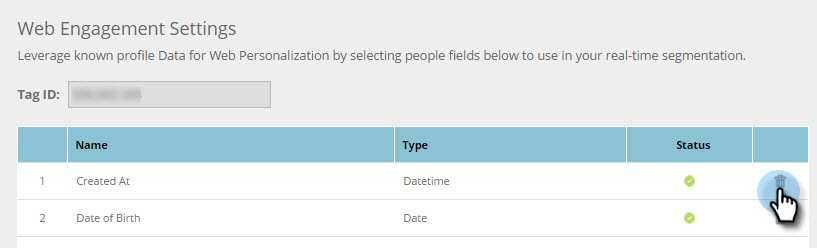

# リードデータの管理 {#manage-person-data}

セグメントで使用する人物のフィールドを選択して、[!DNL Web Personalization] で人物のデータを活用します。

1. 「**[!UICONTROL アカウント設定]**」に移動します。

   

1. **[!UICONTROL データベース]**&#x200B;に移動します。

   

## 新しいリードフィールドの追加 {#adding-a-new-person-field}

1. **追加するフィールド**&#x200B;をドロップダウンから選択して、リードデータフィールドをリストに追加します。

   

   >[!NOTE]
   >
   >新しいフィールドが保留状態で追加されます。アクティブ化には最大 24 時間かかる場合があります。

## リードフィールドの削除 {#deleting-a-person-field}

1. 削除アイコン（）をクリックして、リストからフィールドを削除します。 「**[!UICONTROL はい]**」をクリックして、フィールドの削除を確認します。

   

   >[!NOTE]
   >
   >**リードデータフィールドの管理**
   >
   >* リードデータフィールドのみを含めることができます
   >* リードデータフィールドは最大 30 個まで追加できます
   >* 新規フィールドを追加した場合、アクティベーションには最大で 24 時間かかります
   >* 文字列タイプの上限は 255 文字です
   >* 非表示のフィールドは自動的に削除されます

<table>
 <tbody>
  <tr>
   <th>
REST API 名
</th>
   <th>
SOAP API 名
</th>
   <th>
フレンドリ名
</th>
  </tr>
  <tr>
   <td>
department
</td>
   <td>
部門
</td>
   <td>
部門
</td>
  </tr>
  <tr>
   <td>
title
</td>
   <td>
役職
</td>
   <td>
役職
</td>
  </tr>
  <tr>
   <td>
rating
</td>
   <td>
評価
</td>
   <td>
評価
</td>
  </tr>
  <tr>
   <td>
leadScore
</td>
   <td>
LeadScore
</td>
   <td>
スコア
</td>
  </tr>
  <tr>
   <td>
leadStatus
</td>
   <td>
LeadStatus
</td>
   <td>
ステータス
</td>
  </tr>
  <tr>
   <td>
優先度
</td>
   <td>
優先度
</td>
   <td>
優先度
</td>
  </tr>
  <tr>
   <td>
leadRole
</td>
   <td>
LeadRole
</td>
   <td>
役割
</td>
  </tr>
  <tr>
   <td>
unsubscribed
</td>
   <td>
配信停止完了
</td>
   <td>
配信停止完了
</td>
  </tr>
 </tbody>
</table>

新しい [!DNL Web Personalization] アカウント用に、次のリードフィールドが標準で提供されています。

>[!MORELIKETHIS]
>
>[認識済み顧客のデータを使用したセグメントの作成](/help/marketo/product-docs/web-personalization/using-web-segments/create-a-segment-using-known-person-data.md)
