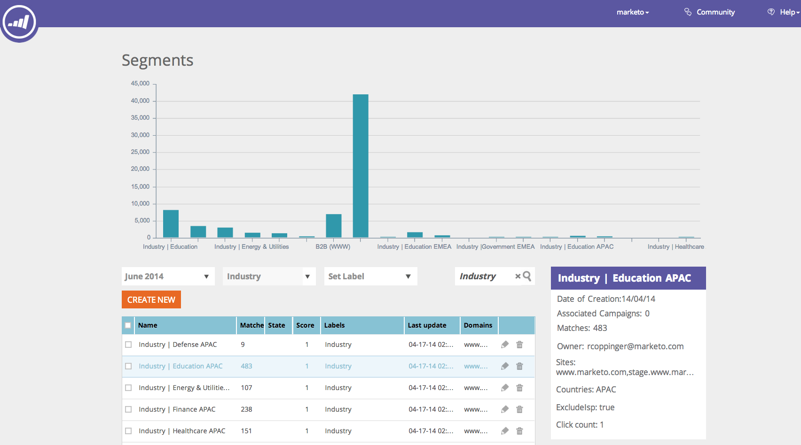
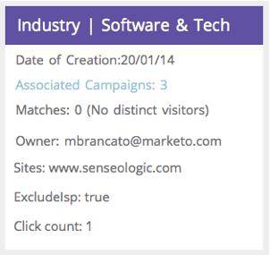

# Webセグメント {#web-segments}

## 表示セグメント {#view-segment}

「セグメント」タブには、様々な属性に基づいて設定したカスタム定義セグメントがすべて表示されます。  **セグメントは、「セグメントを設定」ページで定義された指定された条件を満たす訪問者の集まりです。**  セグメントは、特定の業界、場所の訪問者、または訪問者のオンサイトアクティビティに基づく業界の訪問者です。

Webパーソナライゼーションでは、訪問者は複数のセグメントと一致できます。 例えば、米国の訪問者用のセグメントと財務会社用のセグメントがある場合、米国銀行のWeb訪問者は **、米国訪問者用のセグメントと財務会社用のセグメントの** 両方と一致します。

**グラフ：** セグメントページには、セグメント（Y軸）の訪問者数とセグメント名（X軸）に従って、選択したセグメントの棒グラフが表示されます。

<table> 
 <thead> 
  <tr> 
   <th colspan="1" rowspan="1">名前</th> 
   <th colspan="1" rowspan="1">説明</th> 
  </tr> 
 </thead> 
 <tbody> 
  <tr> 
   <td colspan="1" rowspan="1"><strong>名前</strong></td> 
   <td colspan="1" rowspan="1">セグメントのタイトル</td> 
  </tr> 
  <tr> 
   <td colspan="1" rowspan="1">
<strong>一致</strong>
</td> 
   <td colspan="1" rowspan="1">セグメントのカスタマイズされた定義された条件を満たす訪問者の数</td> 
  </tr> 
  <tr> 
   <td colspan="1" rowspan="1"><strong>キャンペーンの設定</strong></td> 
   <td colspan="1" rowspan="1">選択した検索用語に関連付けられたキャンペーンCTAを設定できます。</td> 
  </tr> 
  <tr> 
   <td colspan="1"><strong>訪問者</strong></td> 
   <td colspan="1">選択した検索語句に関連付けられた訪問者テーブルのプレビュー</td> 
  </tr> 
  <tr> 
   <td colspan="1" rowspan="1"><strong>Clickstream</strong></td> 
   <td colspan="1" rowspan="1">訪問者のアクティビティとサイト上のURLパス、および各ページの訪問時間の表を表示します </td> 
  </tr> 
 </tbody> 
</table>

セグメントラベルの作成 [方法と表示方法を参照してください。](label-your-segment.md)

**セグメント — 右側のパネル**

表でセグメントを選択すると、右側のパネルにそのセグメントに関する詳細情報が表示されます。

次の内容が詳しく説明されています。

* セグメント名
* セグメントの作成日
* セグメントで操作しているキャンペーンを示す関連キャンペーン。 反応数をクリックすると、セグメントのキャンペーンCTA(誘い文句(CTA)を表示するキャンペーンページが表示されます
* セグメントに対する一致数(セグメント条件に一致した訪問者数)と、セグメントに一致した個別（一意）訪問者数。 [個別訪問者]リンクをクリックすると、訪問者のページが開き、セグメントの結果が表示されます
* セグメントの所有者/ユーザー作成者
* セグメントに関連付けられたドメインサイト
* セグメントで選択した条件の短い概要

## セグメントの有効化または無効化 {#enable-or-disable-a-segment}

セグメントを有効または無効にするには、表でそのセグメントのチェックボックスを選択し、表の下部にある「アクションを選択」ドロップダウンボックスで「有効」または「無効」を選択します。 セグメントが無効になっている場合は、「状態」列に「無効」という単語が表示されます。

## セグメントの作成 {#create-segments}

作成したセグメントは、「セグメントを **設定** 」ページで定義した特定の条件を満たします。 また、キャンペーン内の特定のオーディエンスをターゲットにして、条件の組み合わせに基づいてセグメントをカスタマイズすることもできます。

新しいセグメントを作成するには

セグメント **ページで、グラフの** 下にある「新規作成 **** 」をクリックします。 次の画面が表示されます。

セグメントに対する一般的なパラメーターを定義します。

1. 

   * **名前：** セグメントに名前を付けます。
   * **説明：** セグメント条件の詳細を入力します。
   * **ドメイン：** セグメントに含めるドメインを選択します。
   * **セグメントルールのロジック：** AND/ORロジックを選択して、各セグメント属性を作成します
   * **タイミング：** キャンペーンで必要な訪問者エンゲージメントのレベルを定義します。

      * **参加者**:訪問者がWebサイトに到達したときのソーシャル管理
      * **1回目から9回目のクリック後**:Webサイトでの特定のクリック数の後に訪問者の関与を促す

>[!TIP]
>
>**セグメントルールのロジック**
>
>次の3つのフィルターオプションがあります。
>
>1. すべてのフィルター（1と2と3...）を使用
>1. 任意のフィルター(1、2、3...)を使用
>1. 詳細フィルター(および/または式を使用) >
   >    1. >    
   >       

      >アドバンスフィルターでは、セグメント条件を制御できます。 「and」と「or」で区切ったフィルター番号を入力します。  >
      >        * 1と2と3
      >        * 1、2または3

      >
      「and」と「or」を混ぜると、論理的な意図を明確にするために括弧が必要です。 例えば「1 or 2 and 3」は、次のいずれかとして記述する必要があります。 >
      * 1 and （2または3）
      * （1及び2）又は(3)

      入れ子の括弧は、より複雑なロジックに対して使用できます。例えば、 >
      * （1及び2）又は（3及び4）
      * 1 and (2 or (3 and 4))

      挿入、削除、並べ替えの後で、ロジックを確認します。

右側の列のセグメント属性を左側のセグメントエディターにドラッグ&amp;ドロップします。

### Firmographics {#firmographics}

**場所**

「**ロケーション」を「**ロケーション」としてセグメントエディターにドラッグ&amp;ドロップします。

* 次のパラメーターから選択します。

   * **Include **-キャンペーンに場所を含めるか除外するかを選択します。
   * **追加する国を選択** — ドロップダウンボックスから、セグメントに含める国を選択します。 右側に国名が表示されます。 複数の国を選択できます。

国を追加したら、セグメントの州、市区町村、郵便番号も指定できます。

* **追加する都道府県を選択します** — ドロップダウンボックスから、含める米国またはカナダの州を選択します。 複数の選択を行うことができます。
* **郵便番号** — セグメントに含める郵便番号を入力します。
* **市区町村** — 含める市区町村を入力します。 市区町村の間には、セミコロンを使用します。

>[!TIP]
>
>**選択するセグメント条件 「AND」または「OR」? **ORは、各フィールド内の追加のオプションとして機能します。 見込み客は、セグメントに適格性を持たせるために、各フィールドで選択した複数の条件の1つの条件のみを満たす必要があります。 (例えば、見込み客は米国から、 *または国防業界から* )。 ANDは、このセグメントで満たす必要がある追加の必須パラメーターとして機能します。 (例えば、見込み客は米国からも国防界からも来る必要がある)。 各セグメントプロファイルでは、選択したセグメント条件に応じて、個別の各フィールドを「AND」または「OR」のいずれかの両方として機能させます。

**[業種** ] [ **プロファイルセグメント** ]セクションで、[ **業種**]の横のボックスをオンにします。

* 次のパラメーターから選択します。

   * **次を含む** — セグメントに業種を含めるか除外するかを選択します。
   * **追加する業種の選択** — セグメントに含める業種を選択します。 ドロップダウンボックスの下に業種が表示されます。 複数の業種を選択できます。

**組織グループ**

「 **プロファイルセグメント** 」セクションで、「 **組織グループ」の横のボックスをオンにします。**

* ドロップダウンボックスで、次の選択肢から選択します。

   * Fortune 500：このセグメントにはFortune 500会社のみが含まれます。
   * Fortune 1000：このセグメントにはFortune 1000会社のみが含まれます。
   * グローバル2000 — このセグメントにグローバル2000会社が含まれます。
   * 企業 — 従業員数が1,000人を超え、売上高が$250Mを超える組織を含む
   * SMB — このセグメントには、中小企業のみが含まれます。

**名前付きアカウント**

**組織**

* 

   * **これらの会社（特定の名前）から**

      * 「追加する会社を選択」ドロップダウンから、ターゲットへの会社を選択します。
      * ターゲットする組織名を正確に入力できます。 *一致を確実にするために、名前を手動で入力する代わりに、「アカウント名」リストを常に使用することを *お勧めします（以下を参照）。*

**固有のアカウントリスト**

「 [指定されたアカウント」リストから選択して](../../../product-docs/web-personalization/account-based-web-marketing/create-a-new-account-list.md) 、ターゲットアカウントの主要なセグメントを作成します。

>[!NOTE]
>
>名前付きアカウントリスト名の横の括弧内の数字は、Webパーソナライゼーション [読み取りAPIのリストのインデックス参照として使用され](http://developers.marketo.com/documentation/websites/rtp-js-api/)ます。

**ISPの除外**

インターネットサービスプロバイダー(ISP)をセグメントから除外します。

### 既知の人 {#known-people}

**データベース**

Webパーソナライゼーションは、Marketo Databaseと統合されており、既知の人物の属性やデータに基づいてキャンペーンをセグメント化し、パーソナライズできます。

「Database」を選択し、ドロップダウンから個人データフィールドを選択します。 「 **+」を選択** して、ドロップダウンからフィールドを追加します。

アカウントの設定/データベースから、個人データフィールドを追加または削除できます

>[!TIP]
>
>役職など、マーケティング担当者からのすべての個人データフィールドに従って、セグメント条件を作成します。スコア；役割；等
>
>例： 「役職がCMOに等しい」および「スコアが50以下」

**マーケティング担当者の電子メールキャンペーン** :訪問者がマーケティング担当者の電子メールをクリックしてサイトに到着した場合の電子メールの照会によって、キャンペーンをセグメント化およびパーソナライズします。 マーケティング担当者のプログラム名またはキャンペーン名でセグメント化し、電子メールからWebへの会話を続行します。 「+」を選択して、ドロップダウンからフィールドを追加します。

**ステータス**

見込み客のステータスに従ってセグメントを定義します。既知または匿名。

* 

   * 既知 — 既知の訪問者のドロップダウンボックスからこのオプションを選択します。 訪問者がWebサイト上でフォームを送信し、Webパーソナライゼーションのユーザーページに表示されるときに知られます。
   * 匿名 — 匿名訪問者のドロップダウンボックスからこのオプションを選択します。

### 行動 {#behavioral}

**訪問回数 —** 訪問者の行動または識別に従ってセグメントを定義します。

* 

   * 訪問回数 — このドロップダウンボックスから選択し、Webサイト上の見込み客の訪問回数を指定します。

      * ドロップダウンボックスから、「次と等しい」、「次よりも大きい」、「次と等しい」または「次よりも小さい」を選択します。
   * 特定の訪問回数 — ドロップダウンボックスからこのオプションを選択して、特定の訪問者を指定します。

      * 右側のテキストボックスに、追跡する訪問者番号を入力します。 一意のWebパーソナライゼーション訪問者ID番号は、(訪問者ページで)訪問者をクリックし、右側のパネルの「設定」キャンペーンをクリックすると表示されます。 訪問者IDは、「詳細設定」セクションにあります。 訪問者IDはURLでも確認できます(例：訪問者=JZZJIFJNUI60PZ8Y97BHTY9BL8PKWS)。

**検索用語** -見込み客の検索用語に従ってセグメントを定義します。

* 

   * 訪問者が検索した語句 — ドロップダウンリストで、訪問者検索から追跡する語句を選択するか、独自の検索語句を追加します。 （検索語句の*ワイルドカードは、検索語句を含むフレーズを含むデフォルトとして設定されるので、必ずしも必要ではありません）。

**照会** -訪問者が追加参照したURL。

* 

   * 追加する照会を選択 — ドロップダウンリストから、自分の照会を追跡または追加する照会サイトを選択します。 選択すると、下のボックスに照会が表示されます。 （ワイルドカードとして*を使用できます）。

**ページを含める** - Webサイトで訪問した特定のページを見込み客が追跡します。

* 

   * URLの一致 —追加追跡する特定のWebページのURL。 複数のURLを追加する場合は、セミコロンで区切ります。 （ワイルドカードとして*を使用できます）。

**ページを除外** — セグメント内で一致させない特定のページを除外します。 （ワイルドカードとして*を使用できます）。

* 

   * 

      * URLが一致しま追加せん — 追跡から除外する特定のWebページのURL。 複数のURLを追加する場合は、セミコロンで区切ります

### デバイス/ブラウザー {#device-browser}

**モバイルOS**

Mobile OSをセグメントエディターにドラッグ&amp;ドロップします

* **訪問者タイプ**
   **モバイルOS** — ドロップダウンボックスから、一覧から1つ以上のモバイルOSを選択します。 選択したモバイルOSが下に表示されます。

   * 訪問者は任意のモバイルデバイスを使用しています** **
   * 訪問者がこの特定のデバイス/OSを使用しています
   * 訪問者がどのモバイルデバイスも使用していません

* **デバイス** — ドロップダウンリストから、1つ以上のデバイス（Apple、Samsung、LG、HTC、Nexus、Blackberryなど）を選択します。 選択したデバイスが下に表示されます。

**ブラウザー**

特定のターゲットータイプまたはバージョンを使用するブラウザー訪問者。

* 

   * ブラウザータイプ — ドロップダウンボックスから1つ以上のインターネットブラウザーを選択します。 選択したブラウザが下に表示されます。
   * ブラウザーのバージョン — セグメントに追加するブラウザーのバージョンを入力します。 複数のバージョンを選択するには、それぞれをコンマで区切ります。 （ワイルドカードとして*を使用できます）。

### API {#api}

**データイベント** — 特定のカスタムデータイベントをトリガーするセグメント訪問者

イベント追加の値をターゲットします。 サードパーティのデータソースからの場合など。

**ユーザーコンテキストAPI**

WebパーソナライゼーションAPIの呼び出しにつ [いて詳しくは、こちらを参照してください。](http://developers.marketo.com/documentation/websites/rtp-user-context-api/)

>[!TIP]
>
>**ワイルドカードの使用 — **検索語句やURLに何かを含める場合。「 [google.com](http://google.com)」または「search term product」と呼ぶ場合は、ワイルドカードと呼ばれ、両端にアスタリスク（この小さな男性*）が付いている必要があります。 したがって、 [google.comから来るものは](http://google.com) 、すべて* [google.com](http://google.com)*と入力する必要があります。

## セグメントの編集 {#edit-segments}

作成済みのセグメントを編集できます。

1. セグメントを編集するには、「 **セグメント**」に移動します。

   

1. 「 **セグメント** 」(Segments )テーブルで、編集するセグメントの編集アイコン()をクリックします。 選択したセグメントが表示された状態で **「セグメントを設定** 」ページが開きます。
1. セグメントに対して行う編集や変更を適用します。
1. 「 **保存**」をクリックします。

## セグメントの削除 {#delete-segments}

自分で作成したセグメントを削除できます。

1. 上の[ **セグメント** ]ページで、セグメントを選択します。
1. 削除するセグメントの削除アイコン(  )をクリックします** ***。
1. セグメントを削除しようとしていることを確認する確認メッセージが表示され **ます**。

>[!NOTE]
キャンペーンに関連付けられているセグメントは削除できません。 最初にキャンペーンを削除し、次にセグメントを削除する必要があります。

素晴らしい！ 「セグメント」セクションを理解したら、キャンペーンについて学びましょう。

>[!MORELIKETHIS]
* [基本Webセグメントの作成](create-a-basic-web-segment.md)
* [新しいダイアログWebキャンペーンの作成](../../../product-docs/web-personalization/working-with-web-campaigns/create-a-new-dialog-web-campaign.md)
* [ゾーン内の新しいWebキャンペーンの作成](../../../product-docs/web-personalization/working-with-web-campaigns/create-a-new-in-zone-web-campaign.md)
* [新しいウィジェットWebキャンペーンの作成](../../../product-docs/web-personalization/working-with-web-campaigns/create-a-new-widget-web-campaign.md)

