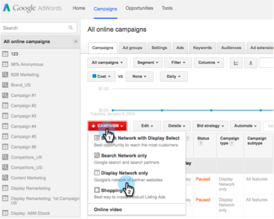

# Googleでのパーソナライズされたリマーケティング{#personalized-remarketing-in-google}

Personalized Remarketingを使用すると、RTPデータを使用し、Google Display Networkの到達に応じてGoogle Analyticsの能力を活用して、ユーザーと再び関わりを持つことができます。

>[!PREREQUISITES]
>
>* [Webパーソナライゼーションデータ](retargeting-with-web-personalization-data.md)の構成を実行します。
>* [Google Analyticsとのリマーケティングのヘルプ](https://support.google.com/analytics/topic/2611283?hl=en&amp;ref_topic=3413645)ドキュメントを確認

>

## Googleでのリマーケティングオーディエンスの作成{#creating-a-remarketing-audience-in-google}

1. Google Analyticsにログインします。 **管理者**、**アカウント**、**プロパティ**&#x200B;の順にクリックします。 **オーディエンス定義**&#x200B;と&#x200B;**オーディエンス**&#x200B;をクリックします。

   

1. 「**+新規オーディエンス**」をクリックします。

   

1. **リンクの設定**:Google Adwordsアカウントへのリンク
1. **オーディエンスの定義**:「新規 **作成**」をクリックします。

   

1. オーディエンスビルダーで、「カスタムDimension、カスタム変数、イベント」の下の「**シーケンス**」と「**RTPデータ**&#x200B;を検索します」をクリックします。

>[!TIP]
>
>AnalyticsでRTPデータを見つけてオーディエンスを構築する方法
>
>Google Analytics内：
>
>* カスタム変数：組織、業界
>* イベントカテゴリ:セグメント、Insightera-CTA、RTP-Remarketing
>* イベントラベル：セグメント名、キャンペーン名、セグメント化されたオーディエンス名

>
>
Google Universal Analytics:
>
>* カスタムDimension:組織、業界、カテゴリ(Fortune 500,1000、Global 2000)、グループ(Enterprise、SMB)、ABMリスト(固有のアカウントリスト)
>* イベントカテゴリ:RTPセグメント、RTPキャンペーンRTPリマーケティング
>* イベントラベル：セグメント名、キャンペーン名、セグメント化されたオーディエンス名

>

**RTPセグメント化オーディエンスデータからのリマーケティングオーディエンスの例**

1. **シーケンス**&#x200B;をクリックします。
1. 「**イベントのラベル」を選択します。**
1. **セグメント化されたオーディエンスの名前**&#x200B;を入力します（RTPに表示される）。
1. 「**適用**」をクリックします。

**RTP Industry Dataからのオーディエンスの例**

1. 「**シーケンス**」をクリックします。
1. 「** RTP-Industry**」を選択します。
1. **業界名**&#x200B;を入力します(例： 金融サービス、教育機関…)
1. 「**適用**」をクリックします。
1. **オーディエンス名**&#x200B;を入力します。 「**保存**」をクリックします。

## Google Adwordsでのリマーケティング広告キャンペーンの作成{#create-a-remarketing-ad-campaign-in-google-adwords}

1. **Google Adwords**&#x200B;にログインします。 「**キャンペーン**」をクリックし、「**ネットワークのみを表示**」を選択します。

   

1. **キャンペーン名**&#x200B;を入力し、**再マーケティングを入力します。**

   

1. 「**広告グループ名を入力**」に&#x200B;**強化CPC**&#x200B;を入力&#x200B;**再マーケティングリスト**&#x200B;を選択します。

   

1. 「保存」をクリックして続行します。
1. 画像またはテ追加キスト広告を作成し、リマーケティングキャンペーンを開始します。

   

>[!NOTE]
>
>**関連記事**
>
>* [Webパーソナライゼーションデータを使用した再ターゲティング](retargeting-with-web-personalization-data.md)
>* [Facebookでのパーソナライズされたリマーケティング](personalized-remarketing-in-facebook.md)

