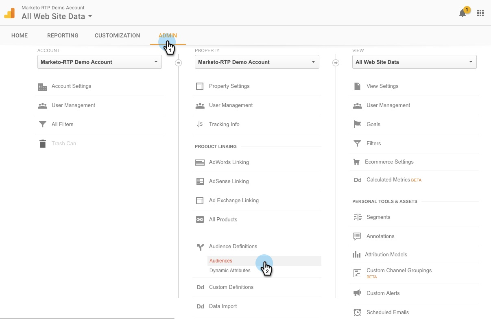
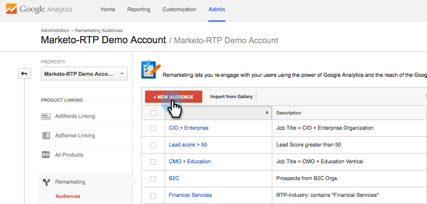
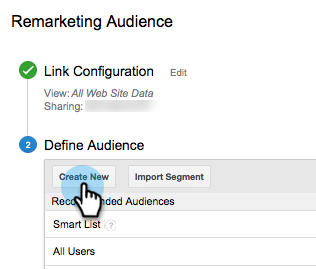
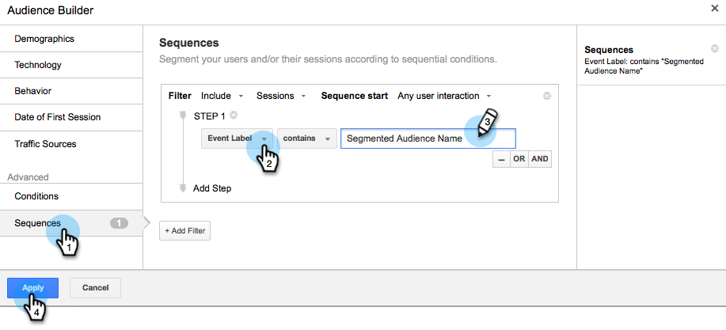
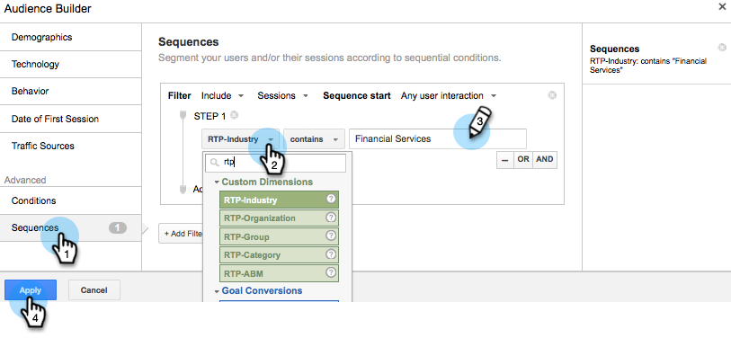
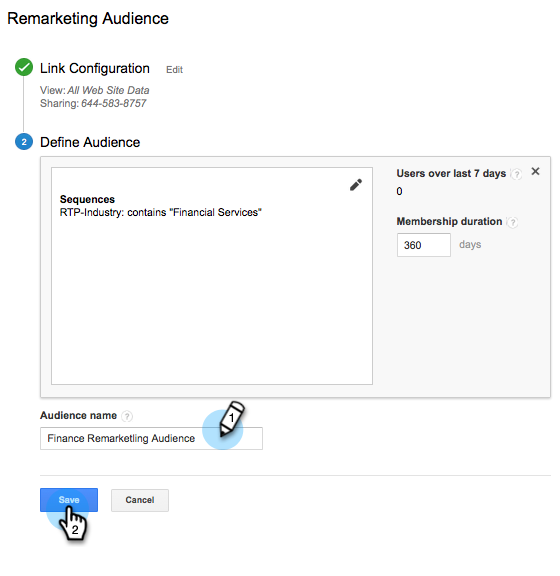
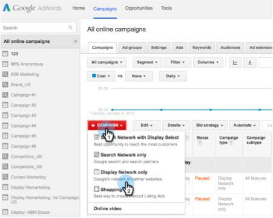
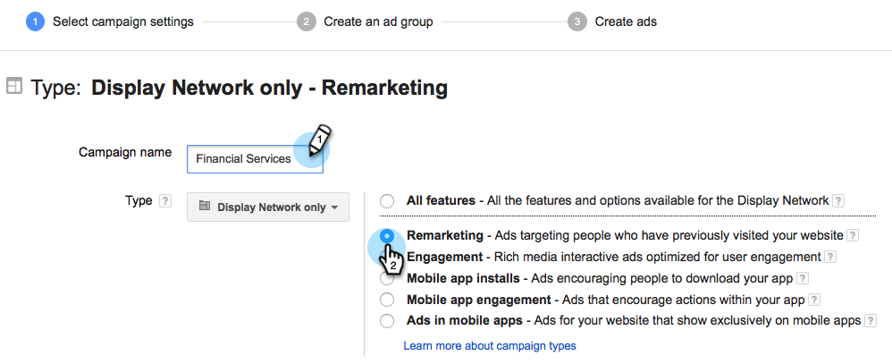
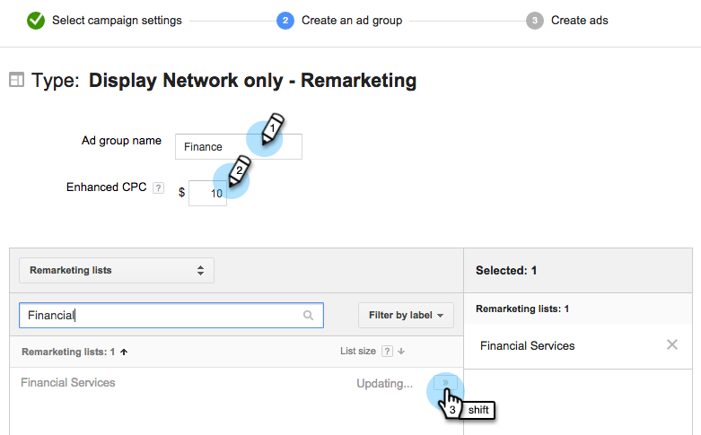
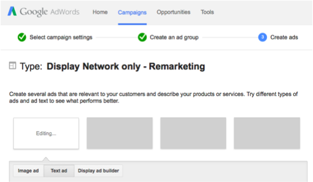

# Google でのパーソナライズリマーケティング {#personalized-remarketing-in-google}

パーソナライズリマーケティングを使用すると、RTP データと  Google Analytics の力と Google ディスプレイネットワークのリーチを利用した利用して、ユーザーと再びエンゲージできます。

>[!PREREQUISITES]
>
>* [&#x200B; [!DNL Web Personalization]  データを使用したリターゲティング](/help/marketo/product-docs/web-personalization/website-retargeting/retargeting-with-web-personalization-data.md)の設定の完了
>* [リマーケティングと Google Analytics のヘルプ](https://support.google.com/analytics/topic/2611283?hl=en&ref_topic=3413645)ドキュメントを確認してください。

## Google でのリマーケティングオーディエンスの作成 {#creating-a-remarketing-audience-in-google}

1. Google Analytics にログインします。 **[!UICONTROL 管理者]**／**[!UICONTROL アカウント]**／**[!UICONTROL プロパティ]**&#x200B;をクリックします。 **[!UICONTROL オーディエンス定義]**／**[!UICONTROL オーディエンス]**&#x200B;をクリックします。

   

1. 「**[!UICONTROL +新規オーディエンス]**」をクリックします。

   

1. **[!UICONTROL リンク設定]**：[!DNL Google Adwords] アカウントにリンクします。 **[!UICONTROL オーディエンスを定義]**：「**[!UICONTROL 新規作成]**」をクリックします。

   

1. オーディエンスビルダーで、[!UICONTROL &#x200B; カスタムディメンション &#x200B;]、[!UICONTROL UICONTROL [ !] カスタム変数]、[!UICONTROL &#x200B; イベント &#x200B;]の下の&#x200B;**[!UICONTROL シーケンス]**&#x200B;と&#x200B;**[!UICONTROL RTP データ]**&#x200B;をクリックします。

>[!TIP]
>
>以下は、オーディエンスを構築するために Analytics で RTP データを見つける方法です。
>
>Google Analytics の場合：
>
>* カスタム変数：組織、業界
>* イベントカテゴリ：セグメント、Insightera-CTA、RTP-Remarketing
>* イベントラベル：セグメント名、キャンペーン名、セグメント化されたオーディエンス名
>
>Google Universal Analytics の場合：
>
>* カスタムディメンション：組織、業界、カテゴリ（Fortune 500、1000、グローバル 2000）、グループ（エンタープライズ、中小企業）、ABM リスト（アカウントリスト）
>* イベントカテゴリ：RTP-Segment、RTP-Campaign、RTP-Remarketing
>* イベントラベル：セグメント名、キャンペーン名、セグメント化されたオーディエンス名

**RTP セグメント化されたオーディエンスデータからのリマーケティングオーディエンスの例**

1. 「**[!UICONTROL シーケンス]」をクリックします。**
1. 「**[!UICONTROL イベントラベル]」を選択します。**
1. **[!UICONTROL セグメント化されたオーディエンス名]**&#x200B;を入力します（RTP で表示されるように）。
1. 「**[!UICONTROL 適用]**」をクリックします。

**RTP 業界データからのオーディエンスの例**

1. 「**[!UICONTROL シーケンス]**」をクリックします。
1. 「**[!UICONTROL RTP-Industry]**」を選択します。
1. **業界名**&#x200B;を入力します（例： [!UICONTROL 金融サービス]、[!UICONTROL 教育]…）。
1. 「**[!UICONTROL 適用]**」をクリックします。
1. **[!UICONTROL オーディエンス名]**&#x200B;を入力します。 「**[!UICONTROL 保存]**」をクリックします。

## [!DNL Google Adwords] でのリマーケティング広告キャンペーンの作成 {#create-a-remarketing-ad-campaign-in-google-adwords}

1. **[!DNL Google Adwords]** にログインします。 「**[!UICONTROL キャンペーン]**」をクリックして、「**[!UICONTROL ネットワークのみを表示]**」を選択します。

   

1. **[!UICONTROL キャンペーン名]**&#x200B;を入力して、「**[!UICONTROL タイプリマーケティング]」を選択します。**

   

1. **[!UICONTROL 広告グループ名]を入力し、**&#x200B;**[!UICONTROL 拡張 CPC]** を入力して、「**[!UICONTROL リマーケティングリスト]**」を選択します。

   

1. 「**[!UICONTROL 保存]**」をクリックして続行します。
1. 画像またはテキスト広告を追加し、リマーケティングキャンペーンを開始します。

   

>[!MORELIKETHIS]
>
>* [&#x200B; [!DNL Web Personalization]  データを使用したリターゲティング](/help/marketo/product-docs/web-personalization/website-retargeting/retargeting-with-web-personalization-data.md)
>* [&#x200B; [!DNL Facebook]](/help/marketo/product-docs/web-personalization/website-retargeting/personalized-remarketing-in-facebook.md) でのパーソナライズリマーケティング
