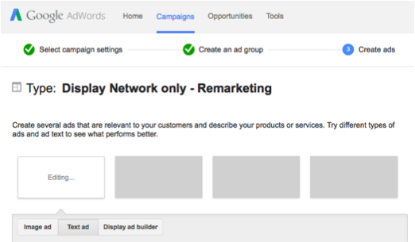

# Google でのパーソナライズリマーケティング {#personalized-remarketing-in-google}

パーソナライズリマーケティングを使用すると、RTP データと  Google Analytics の力と Google ディスプレイネットワークのリーチを利用した利用して、ユーザーと再びエンゲージできます。

>[!PREREQUISITES]
>
>* [ データを使用したリターゲティング  [!DNL Web Personalization]  設定を完了 ](/help/marketo/product-docs/web-personalization/website-retargeting/retargeting-with-web-personalization-data.md) ます
>* [リマーケティングと Google Analytics のヘルプ](https://support.google.com/analytics/topic/2611283?hl=en&ref_topic=3413645)ドキュメントを確認してください。

## Google でのリマーケティングオーディエンスの作成 {#creating-a-remarketing-audience-in-google}

1. Google Analytics にログインします。**[!UICONTROL 管理者]**／**[!UICONTROL アカウント]**／**[!UICONTROL プロパティ]**&#x200B;をクリックします。**[!UICONTROL オーディエンス定義]**／**[!UICONTROL オーディエンス]**&#x200B;をクリックします。

   

1. 「**[!UICONTROL +新規オーディエンス]**」をクリックします。

   

1. **[!UICONTROL リンク設定]**:[!DNL Google Adwords] アカウントにリンクします。 **[!UICONTROL オーディエンスを定義]**：「**[!UICONTROL 新規作成]**」をクリックします。

   

1. Audience Builder で、「**[!UICONTROL カスタムディメンション]**」の下の **[!UICONTROL シーケンス]** と [!UICONTROL RTP データを検索 ] をクリックします [!UICONTROL [!]UICONTROL カスタム変数 ]、[!UICONTROL  イベント ]。

>[!TIP]
>
>以下は、オーディエンスを構築するために Analytics で RTP データを見つける方法です。
>
>Google Analytics の場合：
>
>* カスタム変数：組織、業界
>* イベントカテゴリ：セグメント、Insightera-CTA、RTP-Remarketing
>* イベントラベル：セグメント名、キャンペーン名、セグメント化されたオーディエンス名
>
>Google Universal Analytics の場合：
>
>* カスタムディメンション：組織、業界、カテゴリ（Fortune 500、1000、グローバル 2000）、グループ（エンタープライズ、中小企業）、ABM リスト（アカウントリスト）
>* イベントカテゴリ：RTP-Segment、RTP-Campaign、RTP-Remarketing
>* イベントラベル：セグメント名、キャンペーン名、セグメント化されたオーディエンス名

**RTP セグメント化されたオーディエンスデータからのリマーケティングオーディエンスの例**

1. **[!UICONTROL シーケンス ].** をクリックします
1. **[!UICONTROL イベントラベル ].** を選択
1. **[!UICONTROL セグメント化されたオーディエンス名]**&#x200B;を入力します（RTP で表示されるように）。
1. 「**[!UICONTROL 適用]**」をクリックします。

**RTP 業界データからのオーディエンスの例**

1. 「**[!UICONTROL シーケンス]**」をクリックします。
1. 「**[!UICONTROL RTP-Industry]**」を選択します。
1. **業界名**&#x200B;を入力します（例：[!UICONTROL  金融機関 ]、[!UICONTROL  教育 ]...）。
1. 「**[!UICONTROL 適用]**」をクリックします。
1. **[!UICONTROL オーディエンス名]**&#x200B;を入力します。「**[!UICONTROL 保存]**」をクリックします。

## [!DNL Google Adwords] でのリマーケティング広告キャンペーンの作成 {#create-a-remarketing-ad-campaign-in-google-adwords}

1. **[!DNL Google Adwords]** にログインします。 「**[!UICONTROL キャンペーン]**」をクリックして、「**[!UICONTROL ネットワークのみを表示]**」を選択します。

   

1. **[!UICONTROL キャンペーン名]** を入力し、**[!UICONTROL リマーケティング ] タイプを選択します。**

   

1. **[!UICONTROL 広告グループ名 ] を入力**、**[!UICONTROL 拡張 CPC]** を入力し、**[!UICONTROL リマーケティングリスト]** を選択します。

   

1. 「**[!UICONTROL 保存]**」をクリックして続行します。
1. 画像またはテキスト広告を追加し、リマーケティングキャンペーンを開始します。

   

>[!MORELIKETHIS]
>
>* [ データを使用したリタ  [!DNL Web Personalization]  ゲティング ](/help/marketo/product-docs/web-personalization/website-retargeting/retargeting-with-web-personalization-data.md)
>* [ パーソナライズされたリマーケティング  [!DNL Facebook]](/help/marketo/product-docs/web-personalization/website-retargeting/personalized-remarketing-in-facebook.md)
