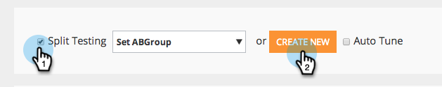

# Web キャンペーンで A/B テストを実施する {#ab-test-your-web-campaign}

テストは、エンゲージメント向上のためにリアルタイムパーソナライゼーション Web キャンペーンを最適化する絶好の機会です。使い方は以下のとおりです。

パーソナライズしたキャンペーンに A/B テストを実施するには、複数のキャンペーンを選択して同じ **A/B テスト**&#x200B;グループに関連付け、「**自動チューニング**」を選択して自動的に最適なパフォーマンスのキャンペーンを続行します。

>[!TIP]
>
>手動で計算し、どのキャンペーンのパフォーマンスが良いかを確認する場合は、自動チューニングを有効にしないでください。

## 分割 A/B テストを設定する方法 {#how-to-set-up-a-split-a-b-test}

1. 「Web キャンペーン」に移動します

   

   >[!NOTE]
   >
   >目的のキャンペーンを見つけやすくするには、[フィルター機能](/help/marketo/product-docs/web-personalization/working-with-web-campaigns/filter-web-campaigns.md)を使用します。

1. A/B テストの対象にする 1 つ目のキャンペーンを選択します。「**編集**」をクリックします。

   

1. キャンペーンのページで「**A/B テスト**」を選択し、「**新規作成**」をクリックします。

   

1. 「**A/B テストグループ名**」に入力し、「**作成**」をクリックします。「**自動チューニング**」を選択します。

   

1. キャンペーンを&#x200B;**保存**&#x200B;または&#x200B;**起動**&#x200B;します。

   >[!TIP]
   >
   >「**自動チューニング**」を選択すると、パフォーマンスの高い A/B テストキャンペーンを Web パーソナライゼーションプラットフォームで自動的に認識させ、最もコンバージョン率の高いキャンペーンを続行して残りを一時停止させることができます。

1. 上の手順を、2 つ目のキャンペーンについても繰り返します。

1. A/B テストの対象にする 1 つ目のキャンペーンを選択します。「**編集**」をクリックします。

   

1. **キャンペーンの設定**&#x200B;ページで「**A/B テスト**」を選択し、ドロップダウンから&#x200B;**グループ**&#x200B;を選択します。「**自動チューニング**」を選択します。

   

1. キャンペーンを&#x200B;**保存**&#x200B;または&#x200B;**起動**&#x200B;します。

1. テストする 3 つ目または 4 つ目のキャンペーンに対して、この手順を繰り返します。

1. **Web キャンペーン**&#x200B;には、A/B アイコンで示す A/B テストキャンペーンが表示されます。

   

>[!TIP]
>
>1. キャンペーンはいくつでもテストできます。ベストプラクティスは 2 ～ 3 キャンペーンです
>1. 各 A/B テストグループは、同じセグメントに関連付けられている必要があります。同じオーディエンスを対象としてテストするからです。
>1. 様々なコンテンツを試して（ケーススタディ A とケーススタディ B）、メッセージングとクリエイティブ、色、サイズ、アクションの呼び出しを変更します。
>1. パーソナライズされたコンテンツを最適化して楽しんでください。

>[!MORELIKETHIS]
>
>* [ダイアログキャンペーンを作成する](/help/marketo/product-docs/web-personalization/working-with-web-campaigns/create-a-new-dialog-web-campaign.md)
>* [RTP ゾーン内キャンペーンを作成する](/help/marketo/product-docs/web-personalization/working-with-web-campaigns/create-a-new-in-zone-web-campaign.md)
>* [RTP ウィジェットキャンペーンを作成する](/help/marketo/product-docs/web-personalization/working-with-web-campaigns/create-a-new-widget-web-campaign.md)

