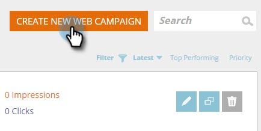
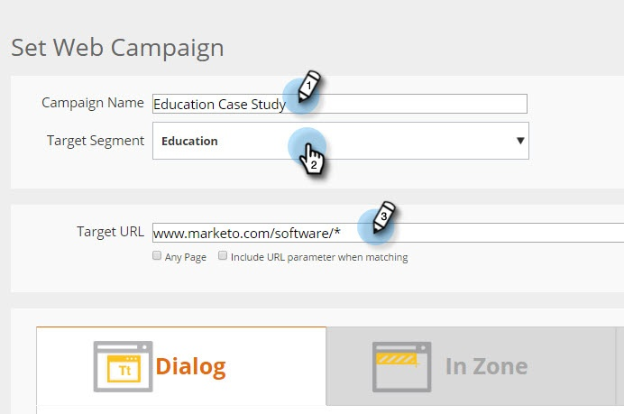
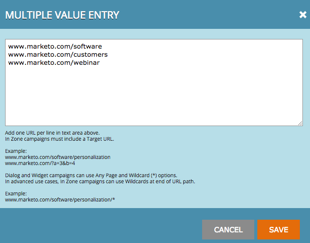
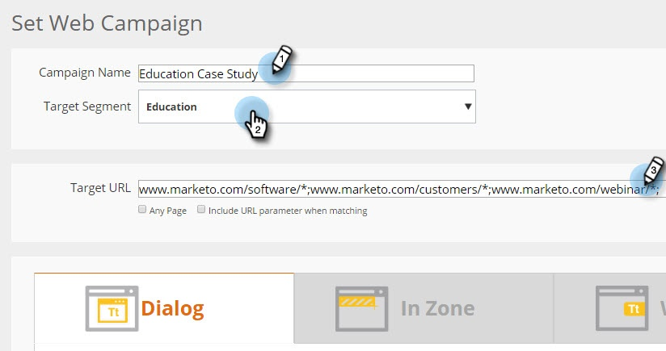

# Web キャンペーンへのターゲット URL の追加 {#adding-a-target-url-to-a-web-campaign}

ターゲット URL は、キャンペーン設定ページ内にあり、web キャンペーンを表示する特定の URL（複数可）を定義します。

## ダイアログまたはウィジェット web キャンペーン用のターゲット URL の追加 {#adding-a-target-url-for-dialog-or-widget-web-campaigns}

1. 「**[!UICONTROL Web キャンペーン]**」に移動します。

   

1. 「**[!UICONTROL Web キャンペーンの新規作成]**」を選択します。

   

1. **[!UICONTROL キャンペーン名]**&#x200B;を追加します。 **[!UICONTROL ターゲットセグメント]**&#x200B;を選択します。 **[!UICONTROL ターゲット URL]** を追加します。

   

<table>
 <thead>
  <tr>
   <th colspan="1" rowspan="1">名前</th>
   <th colspan="1" rowspan="1">説明</th>
  </tr>
 </thead>
 <tbody>
  <tr>
   <td colspan="1" rowspan="1"><strong>[!UICONTROL 任意のページ]</strong></td>
   <td colspan="1" rowspan="1">
任意のページにキャンペーンを表示できるようにします。
</td>
  </tr>
  <tr>
   <td colspan="1" rowspan="1">
<strong>[!UICONTROL 一致時に URL パラメーターを含める]</strong>
</td>
   <td colspan="1" rowspan="1">URL パラメーターを追加して、一致させ、このパラメーターを含む URL でキャンペーンを表示します。 例： campaign=cpc</td>
  </tr>
 </tbody>
</table>

## ターゲット URL への複数の URL の追加 {#adding-multiple-urls-to-target-url}

プラスアイコン（）をクリックすると、[!UICONTROL 複数の値を入力]ダイアログが開き、複数の URL を追加できます。 1 行に 1 つの URL を追加します。

>[!NOTE]
>
>* ダイアログおよびウィジェット web キャンペーンでは任意のページとワイルドカード（&#42;）オプションを使用できます。
>* 高度なユースケースでは、In Zone web キャンペーンで URL パスの末尾にワイルドカードを使用できます。 例：[www.marketo.com/software/personalization/*](https://www.marketo.com/software/web-personalization/)
>* URL では大文字と小文字が区別されます

## In Zone web キャンペーン用のターゲット URL の追加 {#adding-a-target-url-for-in-zone-web-campaigns}

1. 「**[!UICONTROL Web キャンペーン]**」に移動します。

   

1. 「**[!UICONTROL Web キャンペーンの新規作成]**」を選択します。

   

1. **[!UICONTROL キャンペーン名]**&#x200B;を追加します。 **[!UICONTROL ターゲットセグメント]**&#x200B;を選択します。 **[!UICONTROL ターゲット URL]** を追加します。

   >[!NOTE]
   >
   >ゾーン内のターゲット URL は、特定の URL を 1 つ以上定義する必要があります。 高度なユースケースでは、In Zone web キャンペーンで URL パスの末尾にワイルドカードを使用できます。 例：[www.marketo.com/software/personalization/*](https://www.marketo.com/software/web-personalization/)

   

>[!MORELIKETHIS]
>
>* [ダイアログキャンペーンを作成する](/help/marketo/product-docs/web-personalization/working-with-web-campaigns/create-a-new-dialog-web-campaign.md)
>* [RTP ゾーン内キャンペーンを作成する](/help/marketo/product-docs/web-personalization/working-with-web-campaigns/create-a-new-in-zone-web-campaign.md)
>* [RTP ウィジェットキャンペーンを作成する](/help/marketo/product-docs/web-personalization/working-with-web-campaigns/create-a-new-widget-web-campaign.md)
