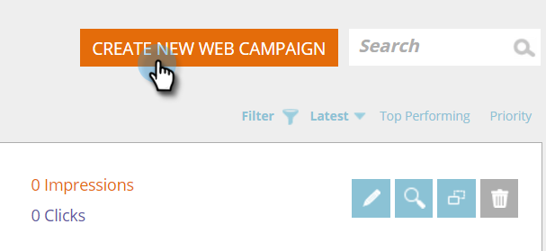

# 新しいゾーン内 Web キャンペーンを作成する {#create-a-new-in-zone-web-campaign}

Web キャンペーンとは、特定のセグメントに関連付けてカスタマイズされたリアクションで、Web サイト上の[ダイアログボックス](/help/marketo/product-docs/web-personalization/working-with-web-campaigns/create-a-new-dialog-web-campaign.md)、ゾーン内置換、[ウィジェット機能](/help/marketo/product-docs/web-personalization/working-with-web-campaigns/create-a-new-widget-web-campaign.md)、メールアラートのいずれかです。ゾーン内 Web キャンペーンは、 ゾーン ID に基づいて、Web サイトの要素をコンテンツやグラフィカルバナーに置き換えます。

## ゾーン内 Web キャンペーンを作成する {#create-an-in-zone-web-campaign}

1. 「**Web キャンペーン**」に移動します

   

1. 「**Web キャンペーンの新規作成**」を選択します。

   

1. キャンペーンタイプとして「**ゾーン内**」を選択します。**ゾーン ID をカスタマイズして追加します。**&#x200B;キャンペーンを「**固定**」に設定し、エディターでクリエイティブを追加します。プレビューするページの URL を追加して「**プレビュー**」をクリックし、このキャンペーンがサイトでどう応答するかを確認します。

   

   >[!NOTE]
   >
   >**ゾーン ID とは**
   >
   >ゾーン ID とは、「ゾーン内」 Web キャンペーンをサイトのどこに配置するかを示す情報です。ゾーン ID は、Web サイトに移動して Web キャンペーンで置き換えたいエリアを選択して右クリックするだけで見つけることができます。Chrome の場合、「要素の検証」を使いますが、他のブラウザーでは異なる場合があります。
   >
   >次に、Web サイトで該当するセクションの「id」を探します。検証中の要素なので、ハイライトされます。たとえば、Chrome で右クリックして、ハイライトされたテキストが `
` であれば、ゾーン ID セクションで入力するのは「featured-slider」です。通常、「div id」が使用されますが、「h1 id」、「p id」などの任意の ID が使用されることもあります。

<table> 
 <thead> 
  <tr> 
   <th colspan="1" rowspan="1">名前</th> 
   <th colspan="1" rowspan="1">説明</th> 
  </tr> 
 </thead> 
 <tbody> 
  <tr> 
   <td colspan="1" rowspan="1"><strong> ゾーン ID </strong></td> 
   <td colspan="1" rowspan="1">
キャンペーンで置き換えたい Web サイト要素の HTML コードで見つかった id の名前を入力します。
</td> 
  </tr> 
  <tr> 
   <td colspan="1" rowspan="1">
<strong> 固定 </strong>
</td> 
   <td colspan="1" rowspan="1">ゾーン内キャンペーンでは、「固定」チェックボックスがデフォルトで選択されており、ゾーン内キャンペーンは、Web サイトでの訪問者のセッション中ずっとゾーン ID の位置に固定されます。ゾーン内の設定は常に「固定」にしておくことをお勧めします。</td> 
  </tr> 
  <tr> 
   <td colspan="1" rowspan="1">
<strong> フェーディング</strong> 
</td> 
   <td colspan="1" rowspan="1">「効果の使用」チェックボックスと「フェード」を選択すると、Web サイトでゾーン ID のエリアにフェード効果が設定されます。ゾーン内がグラフィックバナーの場合は、ページがまず読み込まれてから、フェード効果付きでキャンペーンがアクティブになります。</td> 
  </tr> 
  <tr> 
   <td colspan="1"><strong>スライディング</strong></td> 
   <td colspan="1">「効果の使用」チェックボックスと「スライド」オプションを選択すると、Web サイトでゾーン ID のエリアにスライド効果が設定されます。ゾーン内がグラフィックバナーの場合は、ページがまず読み込まれてから、左から右へのスライド効果付きでキャンペーンがアクティブになります。</td> 
  </tr> 
  <tr> 
   <td colspan="1"><strong> リッチテキストエディター  </strong></td> 
   <td colspan="1">リッチテキストエディターを使うと、テキストの書式設定、リンク指定、画像の挿入が可能です。詳細は<a href="/help/marketo/product-docs/web-personalization/working-with-web-campaigns/using-the-web-personalization-rich-text-editor.md">こちら</a>をご覧ください。</td> 
  </tr> 
  <tr> 
   <td colspan="1"><strong> オンサイトのプレビュー   </strong></td> 
   <td colspan="1">公開する前にキャンペーンをプレビューします。  
    <ul> 
     <li> URL - キャンペーンを実行するサンプルの URL を入力し、キャンペーンがどのように見えるか、サンプルをプレビューします。</li> 
     <li>デバイス - デスクトップ、モバイル（縦置き）、モバイル（横置き）、タブレット（縦置き）、タブレット（横置き）の各デバイスでキャンペーンがどのように表示されるかをプレビューします。</li> 
     <li> プレビュー -「<strong>プレビュー</strong>」をクリックすると、サンプル URL の新しいウィンドウが開き、キャンペーンの応答を確認できます。</li> 
     <li> 共有 -「共有」ボタンを使用すると、プロキシキャンペーンを表示するリンクが記載されたメールを同僚に送信できます。</li> 
    </ul></td> 
  </tr> 
 </tbody> 
</table>

>[!TIP]
>
>[組み込みのテンプレート](/help/marketo/product-docs/web-personalization/using-templates/using-templates-to-create-web-campaigns.md)を使うか、[既存のキャンペーンをテンプレートとして保存](/help/marketo/product-docs/web-personalization/using-templates/using-templates-to-create-web-campaigns.md)して再利用すると、キャンペーン作成の時間を短縮したり、プロセスを簡略化したりできます。

>[!NOTE]
>
>**Web キャンペーンの A/B テストを実施する最適な結果を得るために、1 つ以上の Web キャンペーンの** A/B テスト[を実施できます。](/help/marketo/product-docs/web-personalization/working-with-web-campaigns/ab-test-your-web-campaign.md)自動チューニング機能によって、パフォーマンスの良いキャンペーンが自動的に認識され、最もコンバージョンの高いキャンペーンが続行されて他のキャンペーンは一時停止されます。

## Web キャンペーンを編集する {#edit-a-web-campaign}

**Web キャンペーン**&#x200B;ページで、キャンペーンの「**編集**」をクリックします。

>[!NOTE]
>
>目的のキャンペーンを見つけやすくするには、[フィルター機能](/help/marketo/product-docs/web-personalization/working-with-web-campaigns/filter-web-campaigns.md)を使用します。

## Web キャンペーンをプレビューする {#preview-a-web-campaign}

1. Web キャンペーンページで、確認したい Web キャンペーンの「**プレビュー**」をクリックします。

   

## Web キャンペーンを複製する {#clone-a-web-campaign}

[Web キャンペーンを複製する](/help/marketo/product-docs/web-personalization/working-with-web-campaigns/clone-a-web-campaign.md)を参照してください。

## Web キャンペーンを削除する {#delete-a-web-campaign}

1. Web キャンペーンページで、確認したい Web キャンペーンの「**削除**」をクリックします。

   

1. キャンペーンを削除するかどうかを確認する確認メッセージが表示されます。

>[!MORELIKETHIS]
>
>* [新しいウィジェット Web キャンペーンを作成する](/help/marketo/product-docs/web-personalization/working-with-web-campaigns/create-a-new-widget-web-campaign.md)
>* [新しいダイアログ Web キャンペーンを作成する](/help/marketo/product-docs/web-personalization/working-with-web-campaigns/create-a-new-dialog-web-campaign.md)

