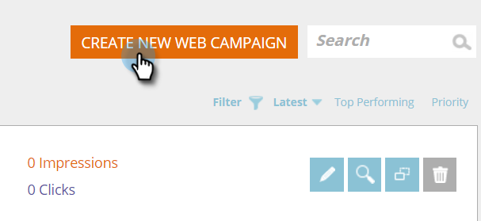
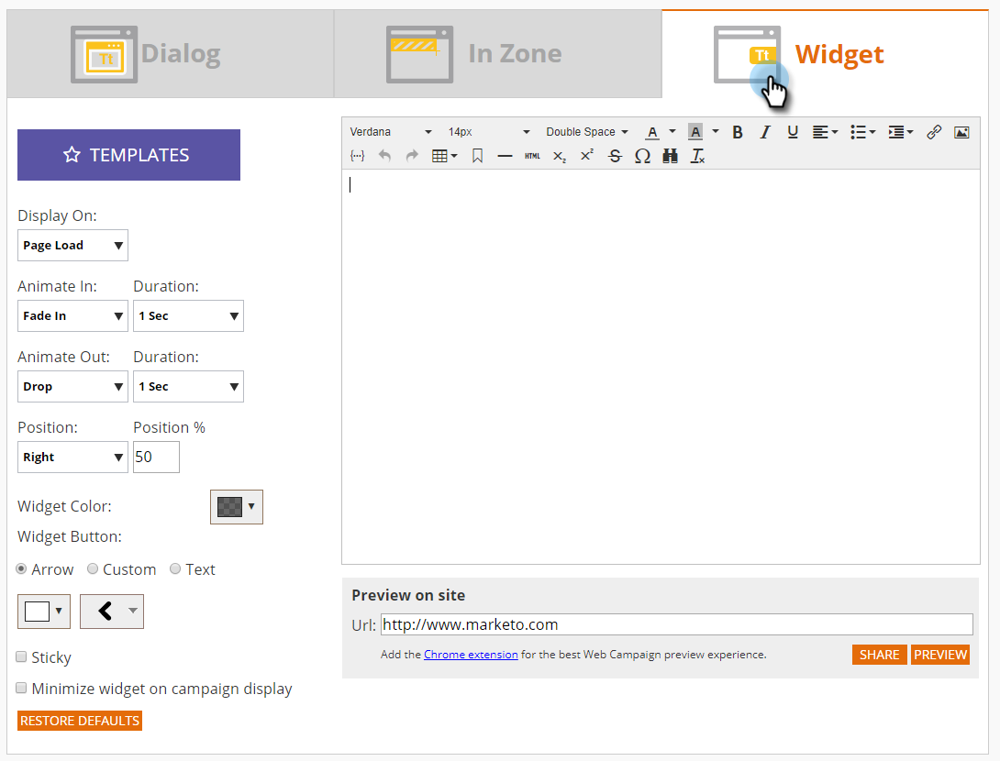
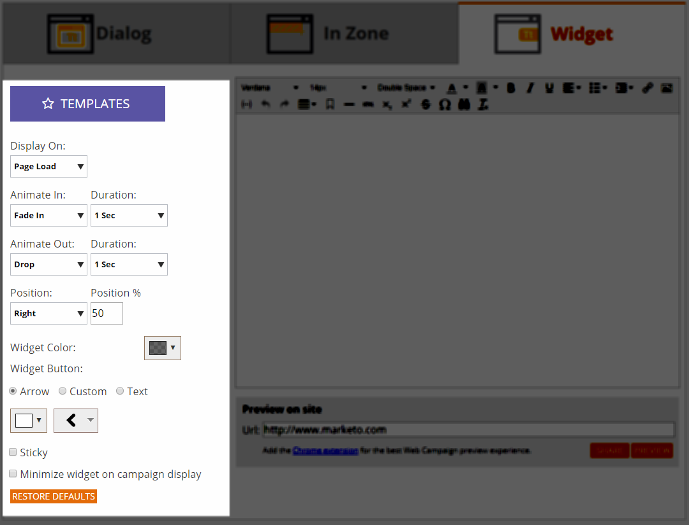
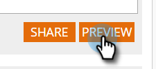
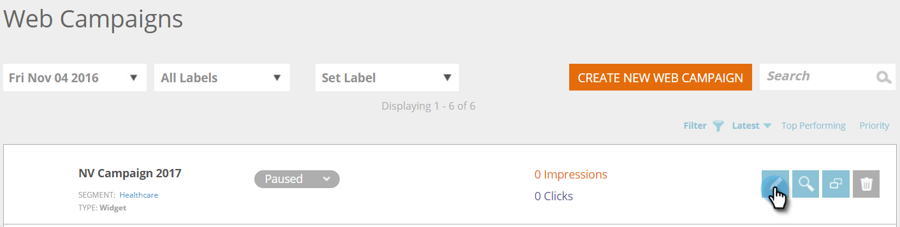
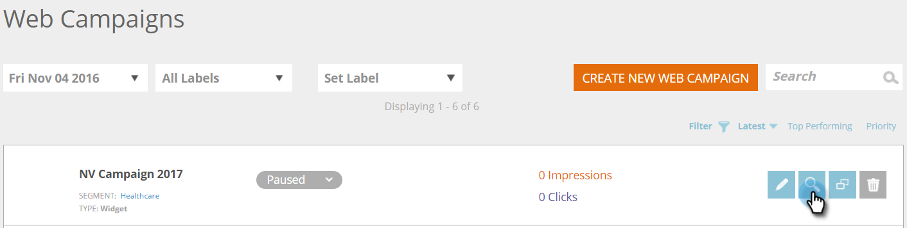
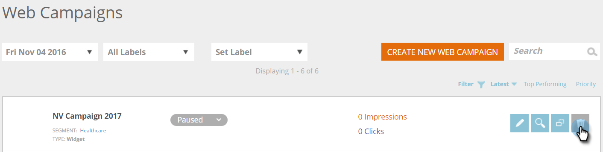

# 新しいウィジェット Web キャンペーンを作成する {#create-a-new-widget-web-campaign}

Web キャンペーンとは、特定のセグメントに関連付けてカスタマイズされたリアクションで、ウェブサイト上の[ダイアログボックス](/help/marketo/product-docs/web-personalization/working-with-web-campaigns/create-a-new-dialog-web-campaign.md)、[ゾーン内置換](/help/marketo/product-docs/web-personalization/working-with-web-campaigns/create-a-new-in-zone-web-campaign.md)、ウィジェット機能、メールアラートのいずれかです。 ウィジェット Web キャンペーンは、Web ページの縦枠に表示されるテキストまたはバナーで、拡張と縮小は可能ですが、訪問している間ずっと ウェブサイトのページ上に固定されたままです。

## ウィジェット Web キャンペーンを作成する {#create-a-widget-web-campaign}

1. **[!UICONTROL Web キャンペーン]**&#x200B;に移動します。

   

1. 「**[!UICONTROL Web キャンペーンの新規作成]**」を選択します。

   

1. キャンペーンタイプとして「**[!UICONTROL ウィジェット]**」を選択します。

   

1. 複数のオプションからウィジェットをカスタマイズします。

   

1. 「**[!UICONTROL プレビュー]**」をクリックして、この Web キャンペーンがサイトでどう応答するかを確認します。

   

<table>
 <thead>
  <tr>
   <th colspan="1" rowspan="1">名前</th>
   <th colspan="1" rowspan="1">説明</th>
  </tr>
 </thead>
 <tbody>
  <tr>
   <td colspan="1"><strong>テンプレート</strong></td>
   <td colspan="1">事前作成済みのテンプレートの中から 1 つを選択します。</td>
  </tr>
  <tr>
   <td colspan="1"><strong>表示場所</strong></td>
   <td colspan="1">Web キャンペーンを表示する<a href="/help/marketo/product-docs/web-personalization/working-with-web-campaigns/set-how-your-web-campaign-displays.md" rel="nofollow">タイミングと方法をカスタマイズ</a>できます。</td>
  </tr>
  <tr>
   <td colspan="1"><strong>アニメートイン／アウト</strong></td>
   <td colspan="1">ダイアログの入力時や終了時に設定します。 効果（ドロップ、ブラインド、スライド、フェード、効果なし）、時間（秒）、方向（上下左右）を選択します。</td>
  </tr>
  <tr>
   <td colspan="1"><strong>位置</strong></td>
   <td colspan="1">ページ上でのウィジェットの位置に関する 4 つのオプション（上下左右）のいずれかを選択します。 位置 % は、ウィジェットがブラウザーページで表示される位置を示す割合です（例：「50% 下」ではウィジェットをページの下半分に表示し、「10% 左」ではウィジェットをページの左上近くに表示します）。 </td>
  </tr>
  <tr>
   <td colspan="1" rowspan="1"><strong>ウィジェット色</strong></td>
   <td colspan="1" rowspan="1">
ウィジェットの色を、カラーチャートから選択するか、RGB の色コードで入力します。 下部にあるバーをいずれかの方向に動かして、ウィジェット背景の透明性も選択できます。
</td>
  </tr>
  <tr>
   <td colspan="1" rowspan="1">
<strong>ウィジェットボタン</strong> 
</td>
   <td colspan="1" rowspan="1">ウィジェットボタン自体をカスタマイズします。 矢印：右のドロップダウンメニューで、複数の異なるアイコンから選択できます。 左側のドロップダウンで色が決まります。  カスタム：ホストされている画像のURLを挿入します。 使用可能なファイル形式 – .JPEG、.GIF（アニメーションを含む）、.PNG、.APNG、.SVG、.BMP。  テキスト：ウィジェットはテキストにできます。色、サイズ、フォントをカスタマイズできます。</td>
  </tr>
  <tr>
   <td colspan="1"><strong>固定</strong></td>
   <td colspan="1">これを選択すると、訪問者のセッションを通じて、すべての Web ページにウィジェットが表示されます。</td>
  </tr>
  <tr>
   <td colspan="1"><strong>キャンペーンディスプレイ上のウィジェットを最小化</strong></td>
   <td colspan="1">ウィジェットを挿入しますが、最小化したままにします。最大化するには、ウィジェットをクリックする必要があります。</td>
  </tr>
  <tr>
   <td colspan="1"><strong>既定値に戻す </strong></td>
   <td colspan="1">ウィジェットの設定をオリジナルの設定に戻し、ウィジェットの色もデフォルトの透明灰色にします。</td>
  </tr>
  <tr>
   <td colspan="1"><strong>オンサイトのプレビュー </strong></td>
   <td colspan="1">キャンペーンを開始する前に、キャンペーンをプレビューします。 
    <ul>
     <li>URL - キャンペーンを実行するサンプルの URL を入力し、キャンペーンがどのように見えるか、サンプルをプレビューします。</li>
     <li>プレビュー -「<strong>プレビュー</strong>」をクリックすると、サンプル URL の新しいウィンドウが開き、キャンペーンの応答を確認できます（最高の Web キャンペーンプレビューエクスペリエンスのために <a href="https://chrome.google.com/extensions/detail/ldiddonjplchallbngbccbfdfeldohkj?hl=en" rel="nofollow">Chrome 拡張機能</a>を追加します）。 </li>
     <li>共有 -「共有」ボタンを使用すると、プロキシキャンペーンを表示するリンクが記載されたメールを同僚に送信できます。</li>
    </ul></td>
  </tr>
 </tbody>
</table>

>[!NOTE]
>
>**web キャンペーンのA/B テストを行いますか？** 1つ以上のweb キャンペーンを[A/B テストして最適な結果を得ることができます](/help/marketo/product-docs/web-personalization/working-with-web-campaigns/ab-test-your-web-campaign.md)。 [!UICONTROL 自動チューニング]機能によって、パフォーマンスの良いキャンペーンが自動的に認識され、最もコンバージョンの高いキャンペーンが続行されて他のキャンペーンは一時停止されます。

## Web キャンペーンを編集する {#edit-a-web-campaign}

[!UICONTROL Web キャンペーン]ページで、キャンペーンの「**[!UICONTROL 編集]**」をクリックします。

>[!NOTE]
>
>目的のキャンペーンを見つけやすくするには、[フィルター機能](/help/marketo/product-docs/web-personalization/working-with-web-campaigns/filter-web-campaigns.md)を使用します。

## Web キャンペーンを複製する {#clone-a-web-campaign}

[Web キャンペーンを複製する](/help/marketo/product-docs/web-personalization/working-with-web-campaigns/clone-a-web-campaign.md)を参照してください。

## Web キャンペーンをプレビューする {#preview-a-web-campaign}

[!UICONTROL Web キャンペーン]ページで、確認する web キャンペーンの「**[!UICONTROL プレビュー]**」をクリックします。

## Web キャンペーンの削除 {#delete-a-web-campaign}

1. [!UICONTROL Web キャンペーン]ページで、削除する web キャンペーンの「**[!UICONTROL 削除]**」をクリックします。

   

1. Web キャンペーンを削除するかどうかを確認する確認メッセージが表示されます。

>[!MORELIKETHIS]
>
>* [新しいゾーン内 Web キャンペーンを作成する](/help/marketo/product-docs/web-personalization/working-with-web-campaigns/create-a-new-in-zone-web-campaign.md)
>* [新しいダイアログ Web キャンペーンを作成する](/help/marketo/product-docs/web-personalization/working-with-web-campaigns/create-a-new-dialog-web-campaign.md)
