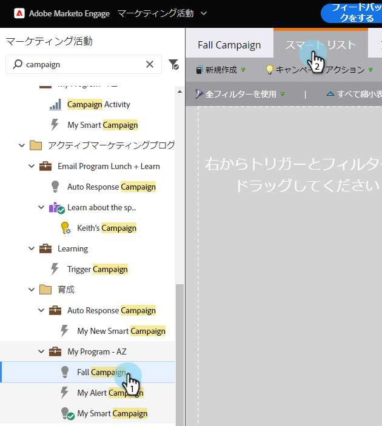
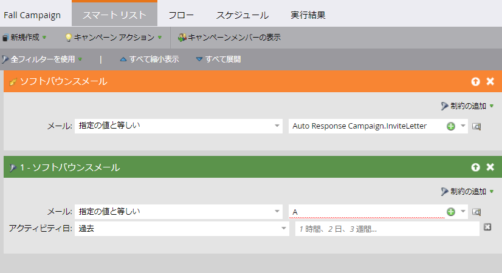

# Webパーソナライゼーションアクティビティ用のスマートリストの定義 {#define-a-smart-list-for-web-personalization-activities}

スマートキャンペーンでスマートリストを定義している場合、フィルターでWebパーソナライゼーションアクティビティを使用し、トリガーを実行できます。 ここでは、ウェブパーソナライゼーションの誘い文句(キャンペーン)をクリックした人をすべてキャプチャする必要があります。

トリガーを使用して、電子メールやアラートを送信したり、ウェブパーソナライゼーションの誘い文句（CTA：コールトゥアクション）をクリックしてアクションを実行した訪問者に基づいて値やスコアを変更したりします。 また、ウェブパーソナライゼーションの誘い文句（CTA、コールトゥアクション）をクリックしたリードをフィルタリングし、表示することもできます。

1. スマートキャンペーンで、「 **スマートリスト** 」タブをクリックします。

   

   >[!NOTE]
   >
   >**ディープダイブ**
   >
   >
   >賢いリストは素晴らしい事をできます 詳しくは、 [スマートリストの詳細](../../../product-docs/core-marketo-concepts/smart-campaigns/understanding-smart-campaigns.md)。

1. トリガーを検索し、トリガーをキャンバスにドラッグ&amp;ドロップします。

   

   >[!NOTE]
   >
   >トリガーを持つスマートキャンペーンは、トリガーモードで実行されます。 このイベントは、トリガーされたイベントと追加されたフィルターに基づいて、一度に1人のユーザーに対して実行されます。

1. ドロップダウンをクリックし、演算子を選択します。

   

   >[!CAUTION]
   >
   >赤い波線はエラーを示します。 修正しない場合は、キャンペーンが無効になり、実行されません。

1. トリガーを定義します。

   

1. 必要に応じて追加フィルターが表示されます。

   

   >[!TIP]
   >
   >トリガーとフィルターの両方を備えたスマートキャンペーンでは、トリガーが一番上に表示されます。 トリガーされると、フィルター条件を満たすユーザーのみがフローを通過します。

   >[!NOTE]
   >
   >複数のトリガーを使用する場合、いずれかのトリガーがアクティブ化されると、個人がフローに入ります。

   [スマートキャンペーンのスマートリストの定義 |バッチ](../../../product-docs/core-marketo-concepts/smart-campaigns/creating-a-smart-campaign/define-smart-list-for-smart-campaign-batch.md)

   >[!NOTE]
   >
   >**関連記事**
   >
   >    
   >    
   >    * [スマートキャンペーンのスマートリストの定義 |バッチ](../../../product-docs/core-marketo-concepts/smart-campaigns/creating-a-smart-campaign/define-smart-list-for-smart-campaign-batch.md)
   >    * [スマ追加ートキャンペーンへのフローステップ](../../../product-docs/core-marketo-concepts/smart-campaigns/flow-actions/add-a-flow-step-to-a-smart-campaign.md)
   >    * [予測コンテンツアクティビティのためのスマートリストの定義](../../../product-docs/predictive-content/define-a-smart-list-for-predictive-content-activities.md)

一連のユーザーに対してキャンペーンを同時に実行するには、の方法を学習します。