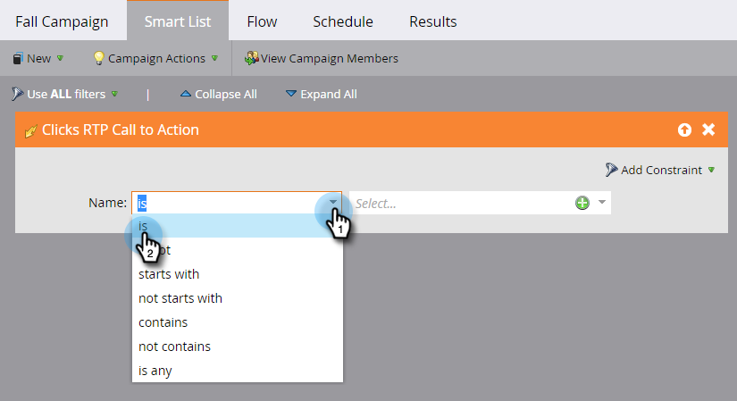

# [!DNL Web Personalization] アクティビティのスマートリストを定義 {#define-a-smart-list-for-web-personalization-activities}

スマートキャンペーンでスマートリストを定義する際に、フィルターおよびトリガーで [!DNL Web Personalization] アクティビティを使用できます。ここでは、[!DNL Web Personalization] のコールトゥアクション（キャンペーン）をクリックしたすべてのユーザを取り込みます。

トリガーを使用して、メールやアラートを送信したり、[!DNL Web Personalization] のコールトゥアクションにエンゲージした訪問者に基づいて値やスコアを変更したりします。また、[!DNL Web Personalization] のコールトゥアクションをクリックしたリードをフィルタリングして表示することもできます。

1. スマートキャンペーンで、「**[!UICONTROL スマートリスト]**」タブをクリックします。

   

   >[!NOTE]
   >
   >スマートリストはとても便利です。詳しくは、[スマートリストの詳細](/help/marketo/product-docs/core-marketo-concepts/smart-campaigns/understanding-smart-campaigns.md)を参照してください。

1. トリガーを検索し、キャンバスにドラッグ&amp;ドロップします。

   

   >[!NOTE]
   >
   >トリガーを使用したスマートキャンペーンは、トリガーモードで実行されます。トリガーされたイベントと追加されたフィルターに基づいて、1 人につき一度ずつ実行されます。

1. ドロップダウンをクリックし、演算子を選択します。

   

   >[!CAUTION]
   >
   >赤い波線は、エラーを示します。修正されない場合、キャンペーンは無効になり、実行されません。

1. トリガーを定義します。

   

1. 必要に応じて、フィルターを追加します。

   

   >[!TIP]
   >
   >トリガーとフィルターの両方を含むスマートキャンペーンでは、トリガーが一番上に表示されます。トリガーされると、フィルター条件を満たす人のみがフローを通過します。

   >[!NOTE]
   >
   >複数のトリガーを使用する場合、いずれかのトリガーが有効化されると、フローに進みます。

   一連のリードに対してキャンペーンを同時に実行するには、[スマートキャンペーンのスマートリストを定義する | バッチ](/help/marketo/product-docs/core-marketo-concepts/smart-campaigns/creating-a-smart-campaign/define-smart-list-for-smart-campaign-batch.md)を参照してください。

   >[!MORELIKETHIS]
   >
   >* [スマートキャンペーン用スマートリストの定義 | バッチ](/help/marketo/product-docs/core-marketo-concepts/smart-campaigns/creating-a-smart-campaign/define-smart-list-for-smart-campaign-batch.md)
   >* [スマートキャンペーンへのフローステップの追加](/help/marketo/product-docs/core-marketo-concepts/smart-campaigns/flow-actions/add-a-flow-step-to-a-smart-campaign.md)
   >* [予測コンテンツアクティビティのスマートリストの定義](/help/marketo/product-docs/predictive-content/define-a-smart-list-for-predictive-content-activities.md)
