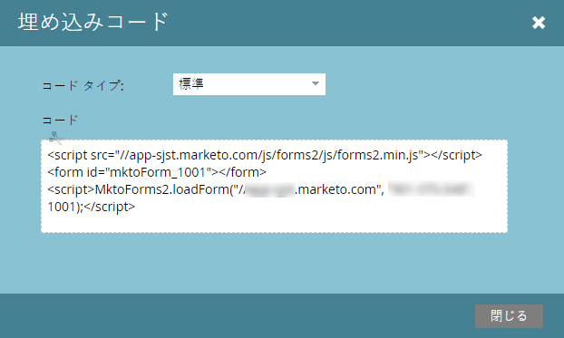

# Web キャンペーンにフォームを埋め込む {#embed-a-form-into-a-web-campaign}

Web キャンペーン（ダイアログ、ゾーン内、ウィジェット）に Marketo のフォームを埋め込む手順は、以下のとおりです。

1. 承認済みフォームを右クリックします。**コードを埋め込む**&#x200B;を選択します。

   

1. コードをコピーします。

   

1. Web パーソナライゼーションで、**Web キャンペーン**&#x200B;に移動します。

   

1. 「**Web キャンペーンの新規作成**」をクリックします。

   

1. リッチテキストエディターで、HTML アイコンをクリックします。

   

1. フォーム埋め込みコードを HTML ソースエディターにペーストします。「**更新**」をクリックします。

   

1. フォームはエディタービューには表示されませんが、プレビューしてキャンペーンでのレンダリング方法を確認することができます。

1. 「**起動**」をクリックすると、キャンペーンが始まります。

   >[!NOTE]
   >
   >フォームのフィールドに対する変更は、フォームの「ドラフトを編集」の「Marketo のマーケティングアクティビティ」でおこなう必要があります。

## フォームに背景画像を追加する 3 つの方法 {#three-ways-to-add-a-background-image-to-a-form}

フォームにバックグラウンド画像を追加するには、3 通りの方法があります。

* フォームテーマの CSS を編集する
* 「キャンペーンの設定」でダイアログまたはウィジェットの色を変更する
* スクリプトに CSS コードを追加する

フォームのテーマの CSS を編集する場合は、[こちら](/help/marketo/product-docs/demand-generation/forms/form-design/edit-the-css-of-a-form-theme.md)を参照してください。

「キャンペーンの設定」でダイアログまたはウィジェットの色を変更する手順は次のとおりです。

1. リッチテキストエディターで、ダイアログキャンペーンのタイプ、ダイアログのスタイル、ヘッダー色、背景色を選択し、フォームの背景色をカスタマイズします。「**保存**」をクリックします。

   

1. 「ダイアログスタイル」で「モダントリム」を選択し、ヘッダーと背景色を薄紫に設定した場合は、次のようになります。

   

スクリプトに CSS コードを追加する手順は、次のとおりです。

1. リッチテキストエディターで、HTML アイコンをクリックします。

   

1. フォーム埋め込みコードを背景スタイルコードと共に HTML ソースエディターにペーストします。「**更新**」をクリックします。

   

1. 「**プレビュー**」をクリックして、キャンペーンでのレンダリング方法を確認します（フォームはエディタービューには表示されません）。背景画像を含むキャンペーンで、上記のフォームコードがどのようにレンダリングされるかの例を以下に示します。

   

>[!MORELIKETHIS]
>
>* [フォームテーマの CSS を編集する](/help/marketo/product-docs/demand-generation/forms/form-design/edit-the-css-of-a-form-theme.md)
>* [フォローアップのランディングページなしで感謝メッセージを表示する](https://developers.marketo.com/blog/show-thank-you-message-without-a-follow-up-landing-page/)
>* [フォーム 2.0](https://developers.marketo.com/documentation/websites/forms-2-0/)

