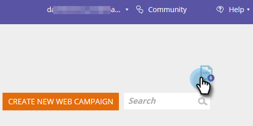

# Web キャンペーンデータをエクスポートする {#export-web-campaign-data}

次の簡単な手順に従って、Web キャンペーンデータをエクスポートします。

1. 「**Web キャンペーン**」に移動します

   

1. ページの右上にある  CSV を書き出しアイコンをクリックします。

   

1. ファイルを開くか、保存します。

   

1. 役に立つ統計を確認するには、ファイルを表示します。

   
