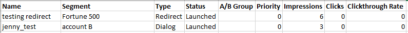

# Webキャンペーンデータのエクスポート{#export-web-campaign-data}

Webキャンペーンーデータを書き出すには、次の簡単な手順に従います。

1. **Webキャンペーン**&#x200B;に移動します。

   

1. ページの右上で、「CSVを書き出し」アイコンをクリックします。

   

1. ファイルを開くか、保存します。

   

1. ファイルに表示を付け、役立つ統計情報を確認します。

   
