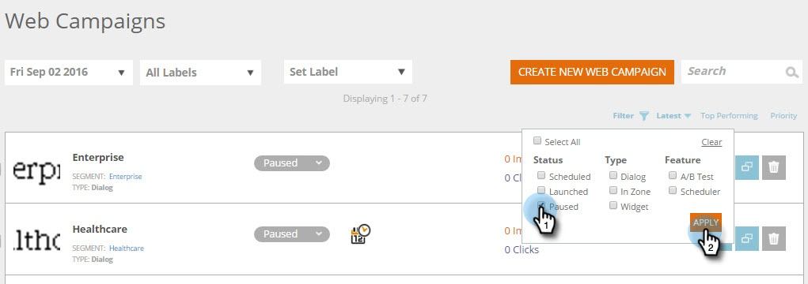

# Web キャンペーンのフィルター {#filter-web-campaigns}

何百もの[!DNL Web Personalization] キャンペーンを作成した後は、フィルターを使用して、興味のあるキャンペーンのみを表示できるようにすると非常に役立ちます。

1. **[!UICONTROL Web キャンペーン]**&#x200B;に移動します。

   

1. [!UICONTROL Web キャンペーン]ページで、「**[!UICONTROL フィルター]**」をクリックします。

   

1. フィルタリングするキャンペーンのステータスやタイプのチェックボックス（例：「**[!UICONTROL 一時停止]**」または「**[!UICONTROL ダイアログ]**」）をオンにします。 「**[!UICONTROL 適用]**」をクリックします。

   

   >[!TIP]
   >
   >「**[!UICONTROL すべてを選択]**」チェックボックスを使用してすべてを選択するまたは「**[!UICONTROL クリア]**」リンクを使用してすべてのチェックボックスをオフにします。

1. フィルターに一致するキャンペーンのみが表示されるようになります。

   

   簡単でしたね。
