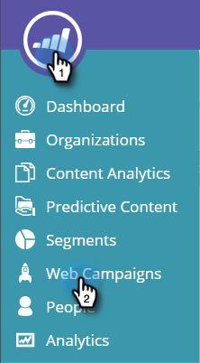
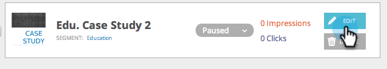

# Web キャンペーンの起動／一時停止 {#launch-pause-a-web-campaign}

Web キャンペーンとは、特定のセグメントに関連付けてカスタマイズされたリアクションで、ウェブサイト上の[ダイアログボックス](/help/marketo/product-docs/web-personalization/working-with-web-campaigns/create-a-new-dialog-web-campaign.md)、[ゾーン内置換](/help/marketo/product-docs/web-personalization/working-with-web-campaigns/create-a-new-in-zone-web-campaign.md)、ウィジェット機能、メールアラートのいずれかです。

Web キャンペーンは web キャンペーンページまたは web キャンペーンの設定ページからの 2 つの方法で起動または一時停止できます。

1. 「**ウェブパーソナライズ**」をクリックします

   

1. **Web キャンペーン**&#x200B;に移動します。

   

1. キャンペーンが開始されている場合は、「**起動済み**」をクリックして、キャンペーンのステータスを「**一時停止**」に変更してキャンペーンを一時停止します。

   

1. キャンペーンが一時停止している場合は、「**一時停止**」をクリックしてキャンペーンのステータスを「**起動済み**」に変更します。これにより、キャンペーンがアクティベートされ、開始されます。

   

   >[!NOTE]
   >
   >キャンペーンステータスは、キャンペーンを設定ページでも変更できます。

1. キャンペーンで、「**編集**」をクリックします。

   

1. 「**保存**」をクリックして、キャンペーンを保存して一時停止します。「**起動**」をクリックすると、キャンペーンが起動してアクティベートします。

   

>[!MORELIKETHIS]
>
>* [ダイアログキャンペーンを作成する](/help/marketo/product-docs/web-personalization/working-with-web-campaigns/create-a-new-dialog-web-campaign.md)
>* [RTP ゾーン内キャンペーンを作成する](/help/marketo/product-docs/web-personalization/working-with-web-campaigns/create-a-new-in-zone-web-campaign.md)
>* [RTP ウィジェットキャンペーンを作成する](/help/marketo/product-docs/web-personalization/working-with-web-campaigns/create-a-new-widget-web-campaign.md)

