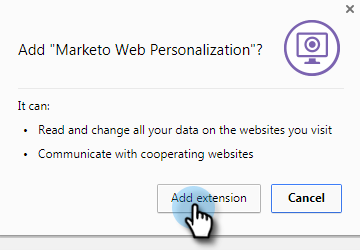

# Webキャンペーンのプレビューとテスト {#preview-and-test-a-web-campaign}

この記事では、Web キャンペーンの様々なプレビュー方法と、Web サイト上のサンドボックスセグメントを使用したキャンペーンのテスト方法について説明します。

>[!NOTE]
>
>プレビューは、選択したサイトでのキャンペーンの表示のみを示します。 リンクとウィジェットは、分析で誤ったクリックやビューを避けるため、機能しません。

## 作成ページでの Web キャンペーンのプレビュー {#preview-a-web-campaign-on-the-creation-page}

1. **Web キャンペーン**&#x200B;に移動します。

   

1. 「**新しい Web キャンペーンを作成**」またはアイコンをクリックして、既存のキャンペーンを編集します。

   

1. 「サイトでのプレビュー」で、ページの URL を追加し、「**プレビュー**」をクリックします。 新しいウィンドウ/タブが開き、キャンペーンのプレビューが表示されます。

   

   >[!TIP]
   >
   >「**共有**」をクリックして、キャンペーンプレビューの固定 URL を含む E メールを開きます。

   >[!NOTE]
   >
   >また、キャンペーンをプレビューする際に最適なエクスペリエンスを得るために、ブラウザープラグイン（[Chrome](https://chrome.google.com/webstore/detail/marketo-web-personalizati/ldiddonjplchallbngbccbfdfeldohkj) または [Firefox](https://rtp-static.marketo.com/rtp/libs/mwp-0.0.0.8.xpi)）をインストールすることもできます。 以下の節を参照してください。

## ブラウザープラグインを使用した作成ページでの Web キャンペーンのプレビュー {#preview-a-web-campaign-on-the-creation-page-using-the-browser-plug-in}

1. 上記の節の手順 1 および 2 に従います。

1. ブラウザープラグインへのリンクをクリックします（この場合は Chrome を使用します）。

   

1. 新しいウィンドウ/タブが開きます。 「**Chrome に追加**」をクリックします。

   

1. 「**拡張機能を追加**」をクリックします。

   

1. Marketoに戻る。 ページ URL を追加し、「**プレビュー**」をクリックします。

   

1. 新しいウィンドウ/タブが開き、デスクトップ、電話、タブレットでのキャンペーンの外観をプレビューできます。

   

## Web キャンペーンページでの Web キャンペーンのプレビュー {#preview-a-web-campaign-on-the-web-campaigns-page}

1. Web キャンペーンのリストを確認する際は、キャンペーンを選択し、**プレビュー** アイコンをクリックします。

   

   簡単です。

## Web サイトでの Web キャンペーンのプレビュー {#preview-a-web-campaign-on-your-website}

サンドボックスセグメントとキャンペーンを作成します。

1. 「**セグメント**」に移動します。

   

1. 「**新規作成**」をクリックします。

   

1. セグメントに名前を付けます。

1. 「行動」で、「ページを含める」をキャンバスにドラッグします。 値*sandbox=1*を追加します。 「**キャンペーンを保存して定義**」をクリックします。

   

1. Web キャンペーンを設定ページで、リストから選択して、ターゲットセグメントをサンドボックスセグメントに変更します。

   

1. キャンペーンのクリエイティブを完了し、「**起動**」をクリックします。

   

1. Web サイトに移動し、URL の末尾に URL パラメーター&quot;?sandbox=1&quot;を追加します。 例: `www.marketo.com?sandbox=1`.

1. Web サイトでキャンペーンの React を確認する。

>[!NOTE]
>
>キャンペーンは、訪問者セッション中に 1 回だけ反応します。 キャンペーンを再度表示するには、ブラウザーの Cookie を消去します。

>[!NOTE]
>
>リダイレクトキャンペーンをプレビューできない。 これらをテストする唯一の方法は、（特定のページによってターゲット設定される）サンドボックスセグメントを使用することです (*sandbox=redirect*)。
