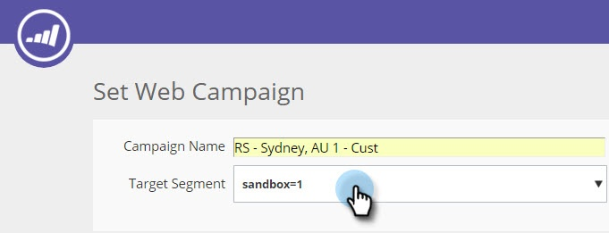

# Web キャンペーンのプレビューとテスト {#preview-and-test-a-web-campaign}

この記事では、web キャンペーンの様々なプレビュー方法と、ウェブサイト上にあるサンドボックスセグメントを使用してキャンペーンをテストする方法について説明します。

>[!NOTE]
>
>プレビューは、選択したサイトでのキャンペーンの表示のみを示します。分析での誤ったクリック数や表示数を防ぐため、リンクとウィジェットは機能しなくなります。

## Web キャンペーンの作成ページでのプレビュー {#preview-a-web-campaign-on-the-creation-page}

1. **Web キャンペーン**&#x200B;に移動します。

   

1. 「**Web キャンペーンを新規作成**」または既存のキャンペーンを編集するアイコンをクリックします。

   

1. 「サイトでのプレビュー」で、ページの URL を追加し、「**プレビュー**」をクリックします。新しいウィンドウまたはタブが開き、キャンペーンのプレビューが表示されます。

   

   >[!TIP]
   >
   >「**共有**」をクリックして、キャンペーンプレビューの固定 URL を持つメールを開きます。

   >[!NOTE]
   >
   >また、キャンペーンをプレビューする際のエクスペリエンスを最大限に高めるには、ブラウザープラグイン（[Chrome](https://chrome.google.com/webstore/detail/marketo-web-personalizati/ldiddonjplchallbngbccbfdfeldohkj) または [Firefox](https://rtp-static.marketo.com/rtp/libs/mwp-0.0.0.8.xpi)）をインストールすることもできます。以下の節を参照してください。

## ブラウザープラグインを使用した作成ページでの web キャンペーンのプレビュー {#preview-a-web-campaign-on-the-creation-page-using-the-browser-plug-in}

1. 上記の節の手順 1 および 2 に従います。

1. ブラウザープラグインへのリンクをクリックします（この場合は Chrome を使用）。

   

1. 新しいウィンドウ／タブが開きます。「**Chrome に追加**」をクリックします。

   

1. 「**拡張機能を追加**」をクリックします。

   

1. Marketo に戻ります。ページ URL を追加し、「**プレビュー**」をクリックします。

   

1. 新しいウィンドウ／タブが開き、デスクトップ、スマートフォン、タブレットでのキャンペーンの表示をプレビューできます。

   

## Web キャンペーンページでの web キャンペーンのプレビュー {#preview-a-web-campaign-on-the-web-campaigns-page}

1. Web キャンペーンのリストを見る場合は、キャンペーンを選択し、**プレビュー**&#x200B;アイコンをクリックします。

   

   簡単です。

## ウェブサイト上での web キャンペーンのプレビュー {#preview-a-web-campaign-on-your-website}

サンドボックスセグメントとキャンペーンを作成します。

1. 「**セグメント**」に移動します。

   

1. 「**新規作成**」をクリックします。

   

1. セグメントに名前を付けます。

1. 「行動」の下で、「ページを含める」をキャンバスにドラッグします。値 *sandbox=1* を追加します。「**キャンペーンの保存と定義**」をクリックします。

   

1. Web キャンペーンを設定ページで、リストから選択して、ターゲットセグメントをサンドボックスセグメントに変更します。

   

1. キャンペーンのクリエイティブを完了し、「**起動**」をクリックします。

   

1. ウェブサイトに移動し、URL の末尾に URL パラメーター「?sandbox=1」を追加します。例: `www.marketo.com?sandbox=1`.

1. ウェブサイトでキャンペーンの反応を確認します。

>[!NOTE]
>
>キャンペーンの反応は、訪問者セッション中に 1 回だけ発生します。キャンペーンを再度表示するには、ブラウザーの Cookie を消去します。

>[!NOTE]
>
>リダイレクトキャンペーンをプレビューすることはできません。これらをテストする唯一の方法は、（特定のページでターゲットにする）サンドボックスセグメントを使用することです（*sandbox=redirect*）
