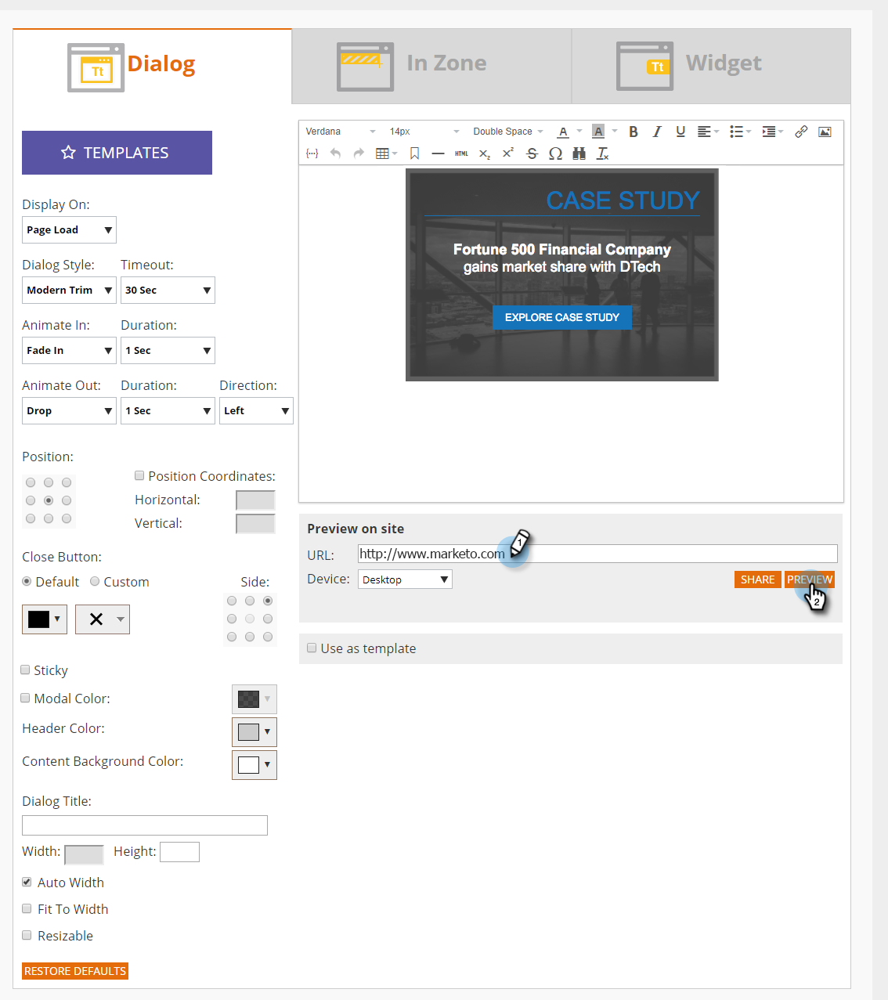

# Webキャンペーンのプレビューとテスト{#preview-and-test-a-web-campaign}

この記事では、Webキャンペーンーをプレビューする様々な方法と、Webサイト上でライブなサンドボックスセグメントを使用してWebーをテストする方法について説明します。

## 作成ページでのWebキャンペーンのプレビュー{#preview-a-web-campaign-on-the-creation-page}

1. **Web** **キャンペーン**&#x200B;に移動します。

   

1. 「**新規Webキャンペーンを作成**** **」をクリックするか、既存のキャンペーンを編集するアイコンをクリックします。

   

1. サイトのプレビューで、ページURLを追加し、**プレビュー**&#x200B;をクリックします。 新しいウィンドウ/タブが開き、キャンペーンプレビューが表示されます。

   

   >[!TIP]
   >
   >「**共有**」をクリックして、キャンペーンプレビューの固定URLを含む電子メールを開きます。

   >[!NOTE]
   >
   >また、キャンペーンのプレビューを最適に行うために、ブラウザープラグイン（[Chrome](https://chrome.google.com/webstore/detail/marketo-web-personalizati/ldiddonjplchallbngbccbfdfeldohkj)または[Firefox](http://docs.marketo.com/display/docs/assets/mwp-0.0.0.8.xpi)）をインストールすることもできます。 以下の節を参照してください。

## ブラウザプラグイン{#preview-a-web-campaign-on-the-creation-page-using-the-browser-plug-in}を使用した作成ページでのWebキャンペーンのプレビュー

1. `section above`の手順1と2に従います。
1. ブラウザープラグインへのリンクをクリックします（この場合はChromeを使用します）。

   

1. 新しいウィンドウ/タブが開きます。 Chrome **追加をクリックして**&#x200B;します。

   

1. 「**拡張追加子**」をクリックします。

   

1. Marketoに戻ります。 追加ページのURLを入力し、「**プレビュー**」をクリックします。

   

1. 新しいウィンドウ/タブが開き、デスクトップ、スマートフォン、タブレットでのキャンペーンの見え方をプレビューできます。

   

## ウェブキャンペーンページでのウェブキャンペーンのプレビュー{#preview-a-web-campaign-on-the-web-campaigns-page}

1. Webキャンペーンーの一覧を見ながら、キャンペーンーを選択し、**プレビュー**&#x200B;アイコンをクリックします。

   

   簡単！

## WebサイトにWebキャンペーンをプレビューする{#preview-a-web-campaign-on-your-website}

サンドボックスセグメントとキャンペーンを作成します。

1. **セグメント**&#x200B;に移動します。

   

1. 「**新規作成**」をクリックします。

   

1. セグメントに名前を付けます。
1. 「行動」で、「ページを含める」をキャンバスにドラッグします。 値追加*sandbox=1*。 「キャンペーンの保存と定義」をクリックします。

   

1. Webキャンペーンを設定ページで、リストからターゲットセグメントを選択して、サンドボックスセグメントに変更します。

   

1. キャンペーンのクリエイティブを完了し、「**起動**」をクリックします。\
   

1. Webサイトにアクセスし、URLの末尾にURLパラメータ「?sandbox=1」を追加します。 例：[www.marketo.com?sandbox=1](http://www.marketo.com/?sandbox=1)
1. Webサイトに対するキャンペーンの反応を確認する。

>[!NOTE]
>
>キャンペーンは、訪問者セッション中に1回だけ反応します。 キャンペーンを再度表示するには、ブラウザーのCookieをクリアします。

>[!NOTE]
>
>リダイレクトキャンペーンはプレビューできません。 これらをテストする唯一の方法は、サンドボックスセグメントを使用することです(特定のページによるターゲット- *sandbox=redirect*)。

