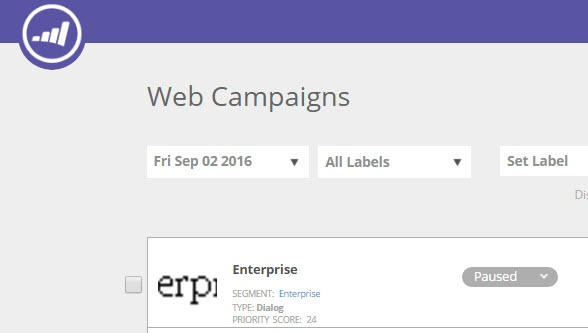

# Web キャンペーンの優先順位付け {#prioritizing-web-campaigns}

優先度スコアを設定して、2 つ以上の Web キャンペーンが重複する場合に Web キャンペーンを優先します。

>[!NOTE]
>
>**重複するキャンペーン**
>
>Web キャンペーンの重複は、以下の場合に発生します。
>
>* 複数のウィジェットキャンペーンやダイアログキャンペーンが、同じページで同時に応答した場合
>* 同じゾーン ID を持つ複数のゾーン内キャンペーンが、同じ Web ページで同時に応答した場合
>
>ゾーン内キャンペーンと（ウィジェットまたはダイアログ）キャンペーンが、同じページで応答することもあります。

1. **[!UICONTROL Web キャンペーン]**&#x200B;に移動します。

   

   >[!NOTE]
   >
   >目的の web キャンペーンを見つけやすくするには、[フィルター機能](/help/marketo/product-docs/web-personalization/working-with-web-campaigns/filter-web-campaigns.md)を使用します。

1. キャンペーンを編集ページで、「[!UICONTROL 優先度スコア]」（9999 =最も高い優先度、1 =最も低い優先度）を設定します。

   

   >[!TIP]
   >
   >キャンペーンの[!UICONTROL 優先度スコア]は、キャンペーンの重複が生じる可能性があり、いずれかのキャンペーンの重要度が高い場合にのみ使用することをお勧めします。 すべてのキャンペーンに優先度を設定する必要はありません。

1. キャンペーンを保存または起動します。

1. [!UICONTROL Web キャンペーン]ページに表示される[!UICONTROL 優先度スコア]を参照してください。

