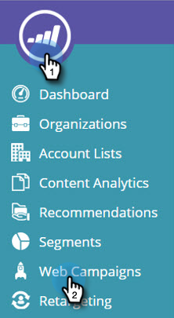
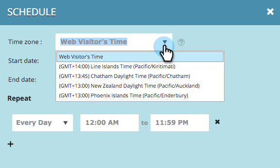

# Webキャンペーンのスケジュール{#schedule-a-web-campaign}

Webキャンペーンをいつ実行するかがわかっている場合は、事前にスケジュールを設定できます。 開始や停止日、繰り返し、複数日を簡単に設定できます。

Web訪問者の時刻または選択したタイムゾーンに基づいて、Webキャンペーンのスケジュールを設定できます。

>[!NOTE]
>
>**例**
>
>開始と停止日のスケジュール設定は、ウェビナーなど、特定の期間実行する予定イベントに適しています。 繰り返しは特定の日にのみ毎週実行する特別なオファーに最適です。

1. **Webキャンペーン**&#x200B;に移動します。

   

   >[!NOTE]
   >
   >必要なキャンペーンを見つけやすくするには、[フィルター機能](filter-web-campaigns.md)を使用します。

1. キャンペーンステータスメニューを開き、**スケジュール**&#x200B;を選択します。

   

1. [繰り返しのスケジュール]ダイアログで、キャンペーンのタイムゾーンを選択します

   

   >[!TIP]
   >
   >デフォルト設定では、Web訪問者ーのタイムゾーンでキャンペーンが実行されます。

1. 開始の日時と終了日時を選択します。

   

   >[!NOTE]
   >
   >ドロップダウンメニューとカレンダーから日時を選択するか、手動で入力することができます。 時刻は午前12時間/午後12時です。

1. デフォルトでは、キャンペーンは開始から終了日の間毎日実行されます。 特定の日または特定の時間にのみキャンペーンを実行する場合は、**繰り返し**&#x200B;設定を使用します。 キャンペーンを表示する日と開始および終了時間を選択します。 プラス記号+を使用して、日を追加します。

   

1. 「**スケジュール**」をクリックします。

   

1. キャンペーンページのキャンペーンのステータスが「**予定**」に変わり、時計/カレンダーアイコンが表示されます。 キャンペーンスケジュールを編集するには、このアイコンをクリックします。

   

   >[!NOTE]
   >
   >キャンペーンのステータスは、選択したスケジュールされた時間中にキャンペーンが実行中でも、**スケジュール済み**&#x200B;のままです。 スケジュールされた終了日が過ぎると、キャンペーンのステータスが&#x200B;**一時停止**&#x200B;に変わります。

