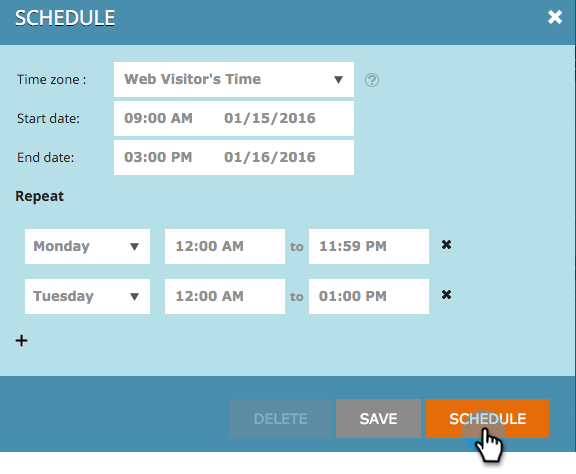

# Web キャンペーンのスケジュール設定 {#schedule-a-web-campaign}

Web キャンペーンを実行するタイミングがわかっている場合は、事前にスケジュールを設定できます。開始日と停止日、繰り返し、複数日間を簡単に設定できます。

Web 訪問者の時間や選択したタイムゾーンに基づいて、web キャンペーンのスケジュールを設定できます。

>[!NOTE]
>
>**例**
>
>開始日と終了日のスケジュール設定は、特定の期間に実行される、ウェビナーなどのスケジュール済みイベントに最適です。繰り返しは、特定の日に毎週実行される特別オファーに最適です。

1. **Web キャンペーン**&#x200B;に移動します。

   

   >[!NOTE]
   >
   >目的のキャンペーンを見つけやすくするには、[フィルター機能](/help/marketo/product-docs/web-personalization/working-with-web-campaigns/filter-web-campaigns.md)を使用します。

1. キャンペーンステータスメニューを開き、「**スケジュール**」を選択します。

   

1. 繰り返しのスケジュールダイアログで、キャンペーンのタイムゾーンを選択します

   

   >[!TIP]
   >
   >デフォルト設定では、web 訪問者のタイムゾーンでキャンペーンが実行されます。

1. 開始日時と終了日時を選択します。

   

   >[!NOTE]
   >
   >ドロップダウンメニューとカレンダーから日時を選択するか、手動で入力できます。時刻は 12 時間（午前／午後）で表されます。

1. デフォルトでは、キャンペーンは開始日から終了日まで毎日実行されます。キャンペーンを特定の日または特定の時間にのみ実行する場合は、**繰り返し**&#x200B;設定を使用します。キャンペーンを表示する日付と開始時刻および終了時刻を選択します。日数を追加するには、プラス記号 + を使用します。

   

1. 「**スケジュール**」をクリックします。

   

1. キャンペーンページでのキャンペーンのステータスが&#x200B;**スケジュール済み**&#x200B;に変更され、時計／カレンダーアイコンが表示されます。このアイコンをクリックして、キャンペーンスケジュールを編集します。

   

   >[!NOTE]
   >
   >選択したスケジュール時間にキャンペーンが実行されている場合も、キャンペーンのステータスは&#x200B;**スケジュール済み**&#x200B;のままになります。スケジュールされた終了日が過ぎると、キャンペーンステータスは&#x200B;**一時停止**&#x200B;に変更します。
