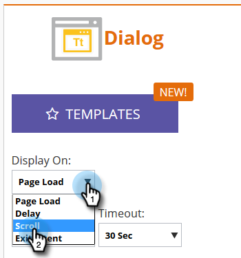

# Web キャンペーンの表示方法の設定 {#set-how-your-web-campaign-displays}

Web キャンペーンがいつ、どのように表示されるかに関して、いつ利用するかに関しては、いくつかの方法があります。

## ページ読み込み {#page-load}

デフォルトで選択されています。この選択では、ページの読み込み時にキャンペーンが表示されます。

## 遅延 {#delay}

ウェブサイト上で web キャンペーンが反応するまでの時間の遅延（合計秒数）を指定します。

1. **表示先**&#x200B;ドロップダウンをクリックして、「**遅延**」を選択します。

   

1. **待機**&#x200B;ドロップダウンをクリックして、目的の時間を選択します。

   

## スクロール {#scroll}

1. **表示先**&#x200B;ドロップダウンをクリックして「**スクロール**」を選択します。

   

1. **タイミング**&#x200B;ドロップダウンをクリックし、web キャンペーンを表示するタイミングを選択します。

   

<table> 
 <tbody> 
  <tr> 
   <td><strong>スクロールが必要な領域</strong></td> 
   <td>訪問者がスクロールしなければ見えない画面領域にまでスクロールすると、キャンペーンが表示されます。訪問者がスクロールしないで閲覧する事のできる画面領域に戻ると、キャンペーンは非表示になります。</td> 
  </tr> 
  <tr> 
   <td><strong>パーセント</strong></td> 
   <td>訪問者がページの事前に決定された割合にスクロールした場合に、キャンペーンが表示されます。</td> 
  </tr> 
  <tr> 
   <td><strong>ピクセル</strong></td> 
   <td>
訪問者がページの事前に指定された最上位ピクセルにスクロールすると、キャンペーンが表示されます。
</td> 
  </tr> 
 </tbody> 
</table>

## エグジットインテント {#exit-intent}

ブラウザーのマウスカーソル終了時に web キャンペーンが表示されます。

1. **表示先**&#x200B;ドロップダウンをクリックして「**エグジットインテント**」を選択します。

   

1. エグジットインテントがモバイルと互換性がないことを示すメッセージが表示されます。

   

>[!TIP]
>
>選択した効果がどう見えるかを事前に確認したい場合は、[web キャンペーンプレビュー](/help/marketo/product-docs/web-personalization/working-with-web-campaigns/preview-and-test-a-web-campaign.md)を使用して確認します。
