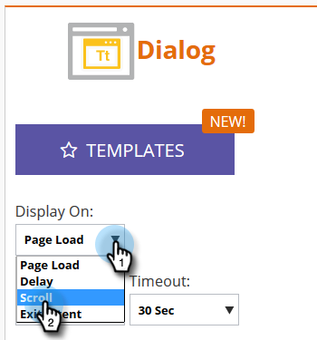
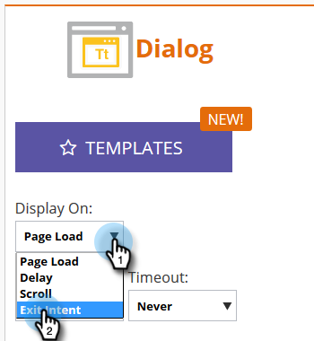

# Web キャンペーンの表示方法の設定 {#set-how-your-web-campaign-displays}

Web キャンペーンがいつ、どのように表示されるかに関して、いつ利用するかに関しては、いくつかの方法があります。

## ページ読み込み {#page-load}

デフォルトで選択されています。この選択では、ページの読み込み時にキャンペーンが表示されます。

## 遅延 {#delay}

ウェブサイト上で web キャンペーンが反応するまでの時間の遅延（合計秒数）を指定します。

1. **[!UICONTROL 表示先]**&#x200B;ドロップダウンをクリックして、「**[!UICONTROL 遅延]**」を選択します。

   

1. **[!UICONTROL 待機]**&#x200B;ドロップダウンをクリックして、目的の時間を選択します。

   

## スクロール {#scroll}

1. **[!UICONTROL 表示先]**&#x200B;ドロップダウンをクリックして「**[!UICONTROL スクロール]**」を選択します。

   

1. **[!UICONTROL タイミング]**&#x200B;ドロップダウンをクリックし、web キャンペーンを表示するタイミングを選択します。

   

<table>
 <tbody>
  <tr>
   <td><strong>[!UICONTROL 下の折り目]</strong></td>
   <td>訪問者がスクロールしなければ見えない画面領域にまでスクロールすると、キャンペーンが表示されます。 訪問者がスクロールしないで閲覧する事のできる画面領域に戻ると、キャンペーンは非表示になります。</td>
  </tr>
  <tr>
   <td><strong>[!UICONTROL パーセント]</strong></td>
   <td>訪問者がページの事前に決定された割合にスクロールした場合に、キャンペーンが表示されます。</td>
  </tr>
  <tr>
   <td><strong>[!UICONTROL ピクセル]</strong></td>
   <td>
訪問者がページの事前に指定された最上位ピクセルにスクロールすると、キャンペーンが表示されます。
</td>
  </tr>
 </tbody>
</table>

## エグジットインテント {#exit-intent}

ブラウザーのマウスカーソル終了時に web キャンペーンが表示されます。

1. **[!UICONTROL 表示先]**&#x200B;ドロップダウンをクリックして「**[!UICONTROL エグジットインテント]**」を選択します。

   

1. [!UICONTROL エグジットインテント]がモバイルと互換性がないことを示すメッセージが表示されます。

   

>[!TIP]
>
>選択した効果がどう見えるかを事前に確認したい場合は、 [web キャンペーンプレビュー](/help/marketo/product-docs/web-personalization/working-with-web-campaigns/preview-and-test-a-web-campaign.md)を使用して確認します。
