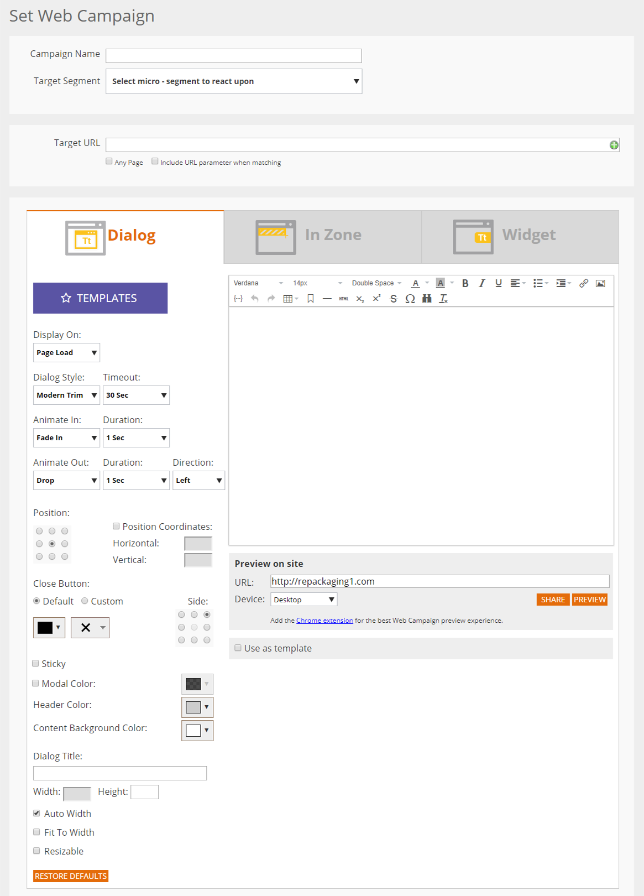

# Web パーソナライゼーションリッチテキストエディターを使用する {#using-the-web-personalization-rich-text-editor}

キャンペーン設定ページにある Web パーソナライゼーションリッチテキストエディターを使うと、テキストの書式設定、リンク指定、画像の挿入が可能です。標準的なワードプロセッサーソフトウェアと同じような書式設定のオプションもあります。

次は、リッチテキストエディターで重要なアイコンの一部です。

<table> 
 <tbody> 
  <tr> 
   <td colspan="1"></td> 
   <td colspan="1"><strong>HTML ソースの編集</strong></td> 
   <td colspan="1">HTML ソースコードを表示します</td> 
  </tr> 
  <tr> 
   <td colspan="1"></td> 
   <td colspan="1">
<strong>画像の挿入/編集</strong> 
</td> 
   <td colspan="1">エディターで表示されるグラフィック画像の画像 URL を挿入します</td> 
  </tr> 
  <tr> 
   <td colspan="1"></td> 
   <td colspan="1"><strong>Design Studio から画像を挿入します</strong></td> 
   <td colspan="1"><em></em> 画像を挿入／編集<strong>アイコン</strong>をクリックした後、このアイコンを使用して Marketo Design Studio から画像を選択します</td> 
  </tr> 
  <tr> 
   <td colspan="1"></td> 
   <td colspan="1">
<strong>リンクの挿入/編集</strong> 
</td> 
   <td colspan="1">テキストまたは画像にハイパーリンクを追加します</td> 
  </tr> 
  <tr> 
   <td colspan="1"></td> 
   <td colspan="1"><strong>挿入/編集トークン</strong></td> 
   <td colspan="1">会社トークンまたはユーザートークンを使用して Web キャンペーンをパーソナライズします</td> 
  </tr> 
 </tbody> 
</table>

>[!NOTE]
>
>Web トークンは、Web パーソナライゼーションのアカウント設定／データベースで管理される Marketo データベースの[リードデータ](/help/marketo/product-docs/web-personalization/using-web-segments/manage-person-data.md)を使用します。Web トークンが、アカウント設定／データベースにない新しいデータベースフィールドである場合、自動的に追加され、アクティブ化に最大 24 時間かかる場合があります。

>[!MORELIKETHIS]
>
>[リッチテキストエディターの使用](/help/marketo/product-docs/email-marketing/general/understanding-the-email-editor/using-the-rich-text-editor.md)
