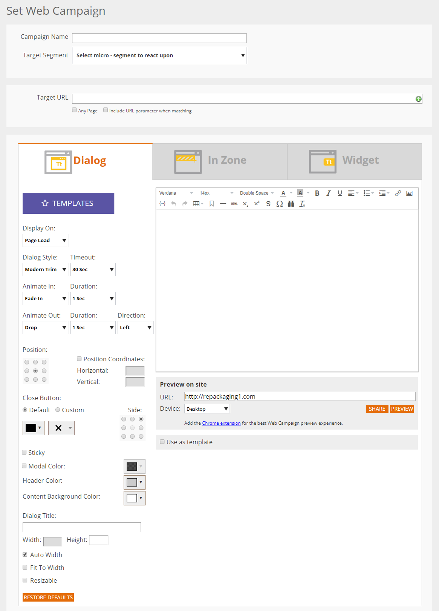
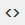
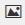
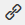
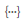

# [!DNL Web Personalization] リッチテキストエディターの使用 {#using-the-web-personalization-rich-text-editor}

[!UICONTROL キャンペーン設定]ページにある [!DNL Web Personalization] リッチテキストエディターを使うと、テキストの書式設定、リンク指定、画像の挿入ができます。 標準的なワードプロセッサーと同様の書式設定オプションが含まれています。

リッチテキストエディターで重要なアイコンには、次のものがあります。

<table>
 <tbody>
  <tr>
   <td colspan="1"></td>
   <td colspan="1"><strong>HTML ソースの編集</strong></td>
   <td colspan="1">HTML ソースコードを表示できるようにします</td>
  </tr>
  <tr>
   <td colspan="1"></td>
   <td colspan="1">
<strong>画像の挿入/編集</strong> 
</td>
   <td colspan="1">エディターに表示する画像の画像 URL を挿入します</td>
  </tr>
  <tr>
   <td colspan="1"></td>
   <td colspan="1"><strong>デザインスタジオから画像を挿入します</strong></td>
   <td colspan="1"><em></em> 画像を挿入／編集<strong>アイコン</strong>をクリックした後、このアイコンを使用して Marketo Design Studio から画像を選択します</td>
  </tr>
  <tr>
   <td colspan="1"></td>
   <td colspan="1">
<strong>リンクの挿入/編集</strong> 
</td>
   <td colspan="1">テキストまたは画像にハイパーリンクを追加します</td>
  </tr>
  <tr>
   <td colspan="1"></td>
   <td colspan="1"><strong>挿入/編集トークン</strong></td>
   <td colspan="1">会社トークンまたはユーザトークンを使用して web キャンペーンをパーソナライズします</td>
  </tr>
 </tbody>
</table>

>[!NOTE]
>
>Web トークンは、[!DNL Web Personalization] の[!UICONTROL アカウント設定]／[!UICONTROL データベース]で管理される [!DNL Marketo Database] の[人物データ](/help/marketo/product-docs/web-personalization/using-web-segments/manage-person-data.md)を使用します。 Web トークンが、[!UICONTROL アカウント設定]／[!UICONTROL データベース]にない新しいデータベースフィールドである場合、自動的に追加され、アクティブ化に最大 24 時間かかる場合があります。

>[!MORELIKETHIS]
>
>[リッチテキストエディターの使用](/help/marketo/product-docs/email-marketing/general/understanding-the-email-editor/using-the-rich-text-editor.md)
