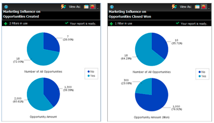

# リリースノート：2012年12月 {#release-notes-december}

12月のリリースには、予期される「 **友人に転送** 」機能やその他の機能が含まれています。 アスタリスク(*)が付いている機能は、Select EditionとRCA(Revenue Cycle Analytics)でのみ使用できます。

## フレンドに転送 {#forward-to-friend}

電子メールに「フレンドに **転送** 」リンクを含めて、他のユーザーとコンテンツを共有できるようにします。 新しいフィルターとトリガーを追加すると、電子メールを転送したユーザーおよび転送された電子メールを受信したユーザーを識別して、インフルエンサーを特定するのに役立ちます。

電子メールに「 **友達に転送** 」の招待を含めるには、エディターで招待を開き、トー `{{system.forwardToFriendLink}}` クンを挿入します。

対応するトリガーおよびフィルターを使用して、「フレンドに **転送** 」リンクを使用したユーザーおよび電子メールを受信したユーザーを識別します。

## 詳細な管理権限 {#granular-admin-permissions}

最新リリースでは、各ロールの「マーケティング担当者」領域の様々な機能へのアクセスを制御できるので、管理者ロールへのアクセスと制御を強化しています。 新しいロールを作成する場合、ロールがアクセスできる特定の管理機能を割り当てることができます。

>[!NOTE]
>
>デフォルトでは、「アクセス管理者」権限を持つ既存のロールは、変更されるまで、または変更されない限り、すべての管理機能にアクセスできます。

## BrightTALKアダプタ {#brighttalk-adapter}

Marketo BrightTALKアダプタを使用すると、ライブまたはオンデマンドのWebキャストからMarketoイベントに直接出席情報を取り込むことができます。

## Marketo Sales Insight for Microsoft Dynamics {#marketo-sales-insight-for-microsoft-dynamics}

Microsoft Dynamicsのお客様は、Sales Insightを利用できるようになりました。

## Dynamicsオポチュニティの同期 {#dynamics-opportunity-sync}

MarketoとMicrosoft Dynamicsの間でオポチュニティデータを同期します。

## マーケティングの影響を受けるオポチュニティレポート* {#marketing-influenced-opportunities-report}

貴社のマーケティングプログラムが会社のパイプラインおよび売上高に与えた影響の割合を表示します。 **売上高エクスプローラで**、Opportunity分析に新しい「Marketing Influced Opportunity」黄色い点を含むカスタムレポートを作成できるようになりました。 Standardフォルダーでは、次の2つのレポートを使用することもできます。

* 作成されたオポチュニティに対するマーケティングの影響
* 終了した勝者のオポチュニティに対するマーケティングの影響

## プログラムオポチュニティ分析のカスタムオポチュニティフィールド* {#custom-opportunity-fields-in-program-opportunity-analysis}

「追加カスタムオポチュニティ」フィールドを使用して、プログラムオポチュニティ分析レポートを売上高エクスプローラで拡張します。

## キャンペーン検査官 {#campaign-inspector}

スコアの変更やキャンペーンのリクエストなど、特定のフローアクションを使用しているキャンペーンを考えたことがありますか。 または、特定のフィルターが使用されている場所を教えてください。 新しいキャンペーン検査（宝庫から入手可能）では、これらのキャンペーン、アクティブなキャンペーン、エラーのあるキャンペーンを識別できます。

[ **管理者** ] > [ **財宝箱** ]に移動し、[**キャンペーンインスペクタ**]を有効にします。

